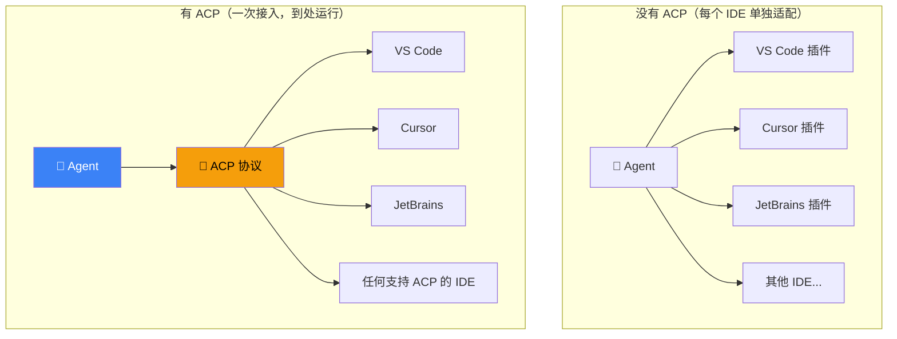
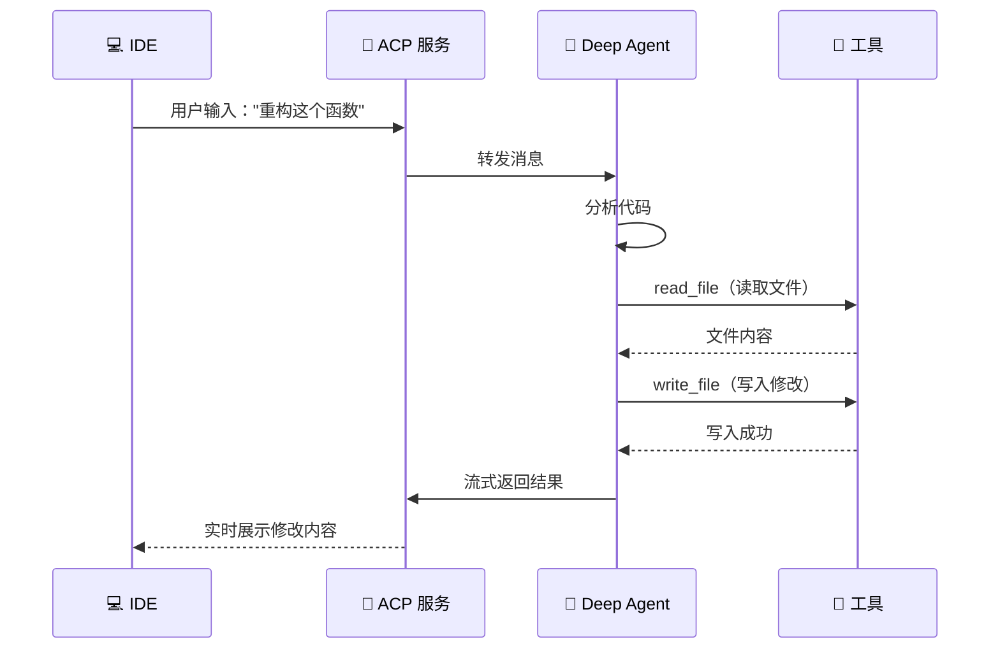

# ACP 协议集成

## 这是什么？

**ACP = Agent Client Protocol**，一个开放标准协议，让 Deep Agent 可以像插件一样接入各种 IDE 和编辑器。

打个比方：ACP 就像 **USB 接口**——不管你是插鼠标、键盘还是 U 盘，接口统一，即插即用。你的 Deep Agent 就是那个"USB 设备"，IDE 就是"电脑"。

## 为什么需要 ACP？

没有 ACP 的话，每个 IDE 都有自己的插件 API，你得为每个 IDE 写一套代码。有了 ACP，你写一次 Agent，所有支持 ACP 的 IDE 都能用。



## 快速上手

### 1. 安装依赖

```bash
npm install deepagents @langchain/core zod
```

### 2. 创建 Agent 并启动 ACP 服务

```typescript
import { createDeepAgent } from "deepagents";
import { serveACP } from "deepagents/acp";
import { tool } from "langchain";
import { z } from "zod";

// 定义工具
const readFile = tool(
  async ({ path }) => {
    const fs = await import("fs/promises");
    return await fs.readFile(path, "utf-8");
  },
  {
    name: "read_file",
    description: "读取指定路径的文件内容",
    schema: z.object({ path: z.string() }),
  }
);

const writeFile = tool(
  async ({ path, content }) => {
    const fs = await import("fs/promises");
    await fs.writeFile(path, content, "utf-8");
    return `文件 ${path} 写入成功`;
  },
  {
    name: "write_file",
    description: "将内容写入指定路径",
    schema: z.object({
      path: z.string(),
      content: z.string(),
    }),
  }
);

const runCommand = tool(
  async ({ command }) => {
    const { execSync } = await import("child_process");
    return execSync(command, { encoding: "utf-8" });
  },
  {
    name: "run_command",
    description: "执行 shell 命令",
    schema: z.object({ command: z.string() }),
  }
);

// 创建编程助手 Agent
const agent = createDeepAgent({
  tools: [readFile, writeFile, runCommand],
  system: `你是一个专业的编程助手。
规则：
1. 读取代码后先理解再修改
2. 修改前说明要改什么、为什么
3. 写完代码后建议运行测试`,
});

// 启动 ACP 服务
serveACP(agent, {
  port: 8080,
  host: "localhost",
});
```

### 3. 在 IDE 中连接

在 VS Code / Cursor 中打开 ACP 设置，填入：

```
ACP Server URL: http://localhost:8080
```

连接成功后，你就可以在 IDE 里直接和 Deep Agent 对话了。

## ACP 通信流程



## 高级配置

```typescript
import { serveACP } from "deepagents/acp";

serveACP(agent, {
  port: 8080,
  host: "0.0.0.0",          // 允许外部访问（远程开发）
  cors: true,                // 允许跨域
  auth: {                    // 可选：开启认证
    type: "token",
    token: process.env.ACP_TOKEN,
  },
  timeout: 60000,            // 请求超时 60 秒
  maxConnections: 10,        // 最大连接数
});
```

## 支持的客户端

| 客户端 | 连接方式 | 说明 |
|--------|----------|------|
| **VS Code** | ACP 扩展 | 安装 [Deep Agents ACP](https://marketplace.visualstudio.com/) 扩展 |
| **Cursor** | 原生支持 | Settings → ACP → 填入服务地址 |
| **JetBrains** | ACP 插件 | 安装插件后配置 |
| **Neovim** | 社区插件 | `deepagents.nvim` |
| **自定义客户端** | WebSocket | 按 ACP 协议规范实现 |

## 安全建议

| 实践 | 说明 |
|------|------|
| **开启认证** | 生产环境必须用 token 认证 |
| **限制访问** | 绑定 `localhost` 或用防火墙限制 |
| **限制工具** | 不要给 Agent 太多危险工具 |
| **日志审计** | 记录所有工具调用，方便排查 |
| **HTTPS** | 远程开发时使用 TLS 加密 |

## 常见问题

| 问题 | 原因 | 解决方案 |
|------|------|----------|
| IDE 连接不上 | 端口被占用或防火墙拦截 | 换端口或检查防火墙规则 |
| Agent 不响应 | 工具执行超时 | 增加 `timeout` 配置 |
| 工具执行报错 | 沙箱权限不足 | 检查工具权限，必要时用沙箱 |
| 流式输出断开 | 网络不稳定 | 检查网络，或增加重连逻辑 |

## 下一步

- [CLI 工具](/deepagents/cli) — 在终端使用 Deep Agent
- [前端集成](/deepagents/frontend) — 构建 Web UI
- [工具](/deepagents/tools) — 给 Agent 添加更多工具
- [生产部署](/deepagents/going-to-production) — 部署 ACP 服务
