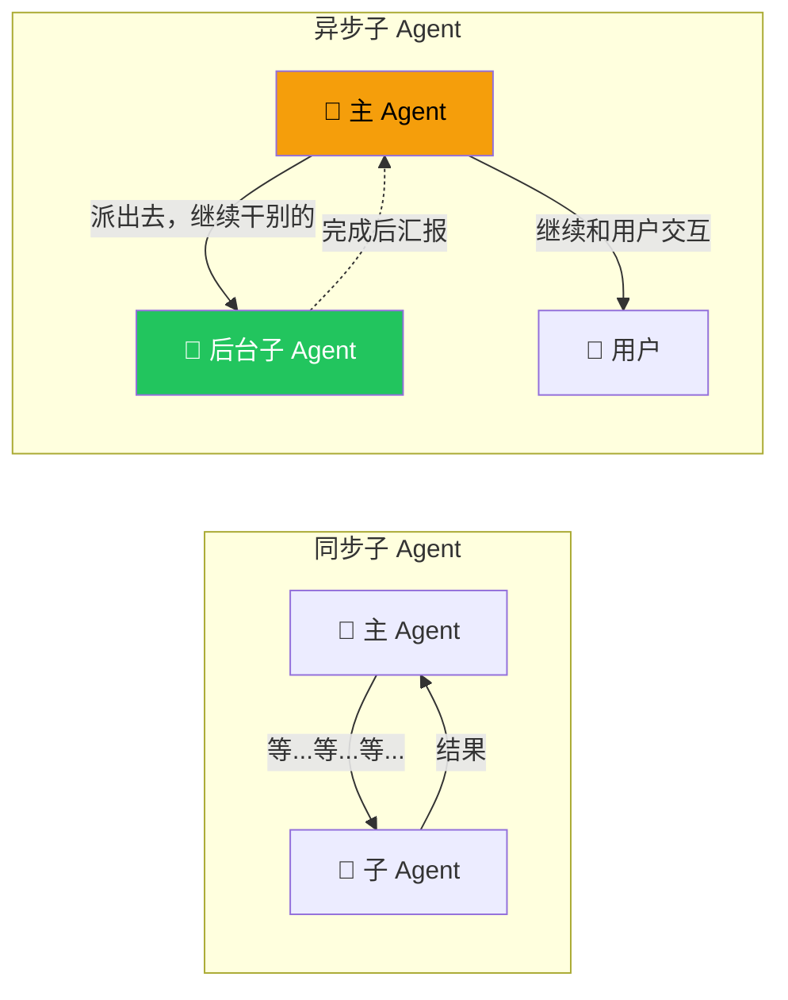
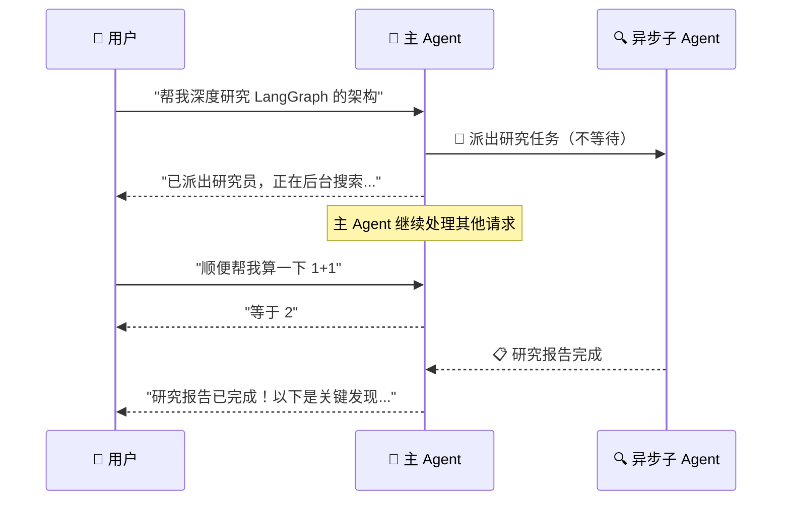
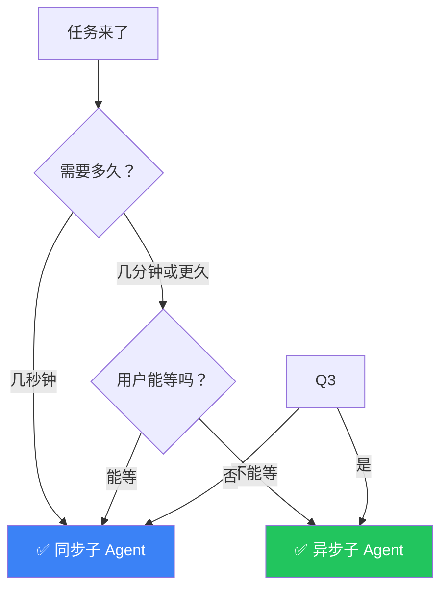

# 异步子 Agent

## 这是什么？

普通子 Agent：主 Agent 等它干完才能继续 → **同步阻塞**
异步子 Agent：主 Agent 派出去就不管了，继续干别的 → **后台执行**



## 类比

- **同步子 Agent** = 你打电话等对方接——占着线，干不了别的
- **异步子 Agent** = 你发个短信——发完就挂，对方稍后回复

## 使用方式

```typescript
import { createDeepAgent, createAsyncSubagent } from "deepagents";
import { tool } from "langchain";
import { z } from "zod";

// 搜索工具
const searchWeb = tool(
  async ({ query }) => {
    const res = await fetch(`https://api.search.example.com/search?q=${query}`);
    const data = await res.json();
    return data.results.map((r: any) => `- ${r.title}`).join("\n");
  },
  { name: "search_web", description: "搜索互联网", schema: z.object({ query: z.string() }) }
);

// 读文档工具
const readDocument = tool(
  async ({ url }) => `文档内容摘要：${url} 的主要内容...`,
  { name: "read_document", description: "读取在线文档", schema: z.object({ url: z.string() }) }
);

// ① 创建异步子 Agent
const backgroundResearcher = createAsyncSubagent({
  name: "researcher",
  description: "后台深度研究，完成后汇报结果",
  tools: [searchWeb, readDocument],
  system: `你是一个深度研究专家。
- 多来源搜索，验证信息可靠性
- 结构化总结发现
- 完成后生成研究报告`,
});

// ② 主 Agent 派出后继续交互
const agent = createDeepAgent({
  tools: [backgroundResearcher],
  system: `你是一个助手。
- 需要深入研究 → 派 researcher 后台处理
- 告诉用户"已派出研究员，完成后通知你"
- 简单问题直接回答`,
});
```

## 执行流程



## 适用场景

| 场景 | 为什么用异步 | 示例 |
|------|-------------|------|
| **长时间研究** | 搜索+分析可能要几分钟 | 深度市场调研 |
| **数据处理** | 下载→清洗→分析链路长 | 大数据集分析 |
| **内容生成** | 写文章需要时间 | 长篇报告撰写 |
| **批量操作** | 多个任务并行 | 同时爬取多个网站 |

## 同步 vs 异步选择



## 回调通知

```typescript
const researcher = createAsyncSubagent({
  name: "researcher",
  description: "后台研究",
  tools: [searchWeb],
  system: "深入研究后汇报。",
  onComplete: (result) => {
    console.log("研究完成！", result.summary);
    // 可以发通知、写数据库等
  },
});
```

## 最佳实践

| 实践 | 说明 |
|------|------|
| **告诉用户异步状态** | "已派出研究员，预计几分钟后有结果" |
| **设置超时** | 防止异步任务永远不回来 |
| **结果缓存** | 相同任务直接返回缓存结果 |
| **不要嵌套异步** | 异步子 Agent 再派异步子 Agent 容易失控 |

## 下一步

- [子 Agent](/deepagents/subagents) — 同步子 Agent 基础
- [流式输出](/deepagents/streaming) — 实时获取进度
