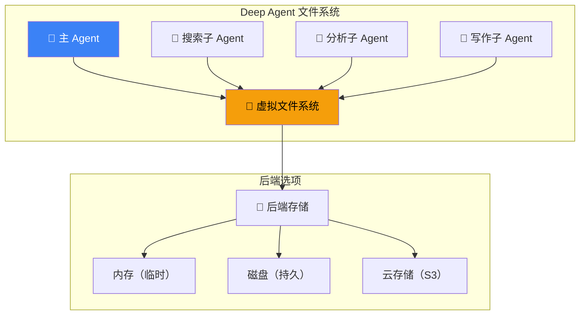
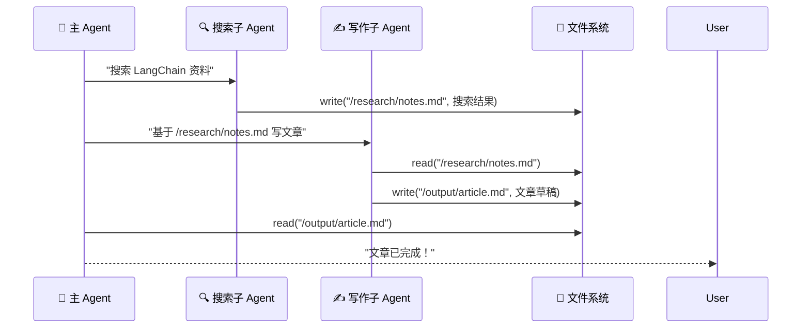
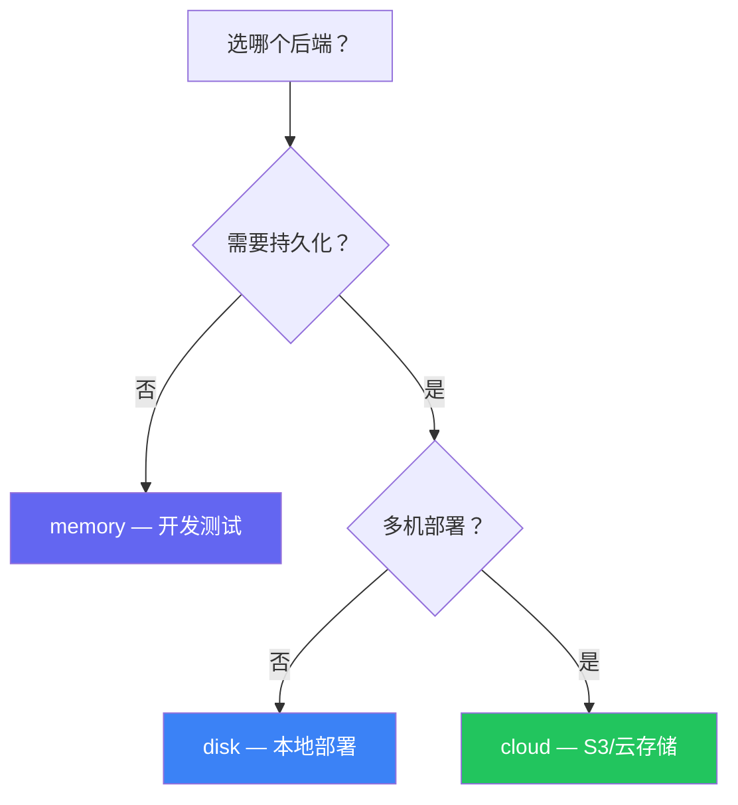

# 文件系统 & Backends

## 这是什么？

Deep Agent 的文件系统 = Agent 的"共享硬盘"。

子 Agent 写的文件，主 Agent 能读；主 Agent 的数据，子 Agent 能用。就像团队共享一个 Google Drive——每个人都能看到和修改共享文件。



## 内置后端

| 后端 | 说明 | 适用场景 |
|------|------|----------|
| `memory` | 内存中，进程结束就没了 | 开发测试 |
| `disk` | 本地磁盘持久化 | 本地部署、单机 |
| `cloud` | 云存储（S3 等） | 生产环境、分布式 |

## 使用方式

### 内存后端（开发用）

```typescript
import { createDeepAgent } from "deepagents";

const agent = createDeepAgent({
  filesystem: {
    backend: "memory",
  },
  system: "你可以读写文件来存储中间结果。",
});
```

### 磁盘后端（本地持久化）

```typescript
const agent = createDeepAgent({
  filesystem: {
    backend: "disk",
    rootDir: "./agent-files", // 文件存储目录
  },
});
```

### 云存储后端（生产环境）

```typescript
const agent = createDeepAgent({
  filesystem: {
    backend: "cloud",
    cloud: {
      provider: "s3",
      bucket: "my-agent-files",
      region: "us-east-1",
      credentials: {
        accessKeyId: process.env.AWS_ACCESS_KEY_ID,
        secretAccessKey: process.env.AWS_SECRET_ACCESS_KEY,
      },
    },
  },
});
```

## 文件操作工具

```typescript
import { tool } from "langchain";
import { z } from "zod";

// 读文件
const readFile = tool(
  async ({ path }) => {
    const content = await agent.filesystem.read(path);
    return content;
  },
  { name: "read_file", description: "读取文件内容", schema: z.object({ path: z.string() }) }
);

// 写文件
const writeFile = tool(
  async ({ path, content }) => {
    await agent.filesystem.write(path, content);
    return `文件 ${path} 写入成功`;
  },
  { name: "write_file", description: "写入文件", schema: z.object({ path: z.string(), content: z.string() }) }
);

// 列出目录
const listDir = tool(
  async ({ path }) => {
    const files = await agent.filesystem.list(path);
    return files.join("\n");
  },
  { name: "list_dir", description: "列出目录内容", schema: z.object({ path: z.string() }) }
);
```

## 子 Agent 文件共享



## 后端选择指南



## 最佳实践

| 实践 | 说明 |
|------|------|
| **开发用 memory** | 快速迭代，不怕文件残留 |
| **生产用 cloud** | 支持多实例，不怕单机故障 |
| **文件路径规范化** | 统一用 `/` 开头的绝对路径 |
| **控制文件大小** | 大文件用外部存储，文件系统存引用 |
| **定期清理** | 设置 TTL 自动清理临时文件 |

## 下一步

- [子 Agent](/deepagents/subagents) — 子 Agent 间文件共享
- [沙箱](/deepagents/sandboxes) — 安全的文件操作环境
- [记忆](/deepagents/memory) — Agent 的记忆存储
