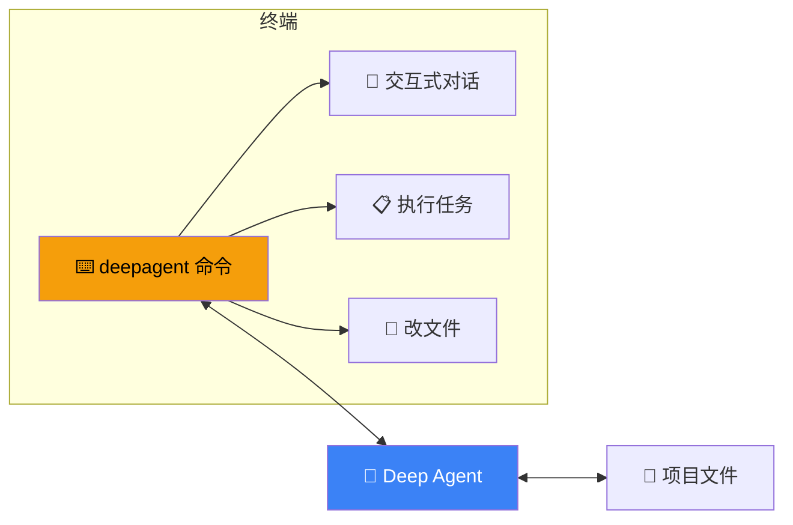
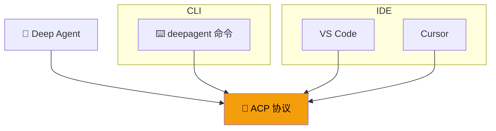

# Deep Agents CLI

## 这是什么？

**Deep Agents CLI** = 一个终端里的编程 Agent。

不用打开浏览器、不用配置前端——在命令行里直接和 AI 对话，让它帮你写代码、跑命令、改文件。



## 安装

```bash
npm install -g deepagents-cli
```

## 基本使用

```bash
# 启动交互式对话
deepagent

# 直接提问
deepagent "帮我写一个 Express 服务器"

# 指定工作目录
deepagent --cwd ./my-project "重构这个项目的目录结构"

# 非交互模式（一次性执行）
deepagent --no-interactive "生成 package.json"
```

## 交互式模式

```bash
$ deepagent
🪄 Deep Agent CLI v1.0
模型：openai:gpt-4o-mini
工作目录：/home/user/project

> 帮我给这个项目添加单元测试

🔧 调用工具：read_file("src/index.ts")
🔧 调用工具：write_file("src/__tests__/index.test.ts", ...)
✅ 已创建测试文件 src/__tests__/index.test.ts

> 运行一下测试

🔧 调用工具：run_command("npm test")
✅ 所有测试通过

> 退出
👋 再见！
```

## 命令行选项

| 选项 | 说明 | 示例 |
|------|------|------|
| `--model` | 指定模型 | `--model openai:gpt-4o` |
| `--cwd` | 工作目录 | `--cwd ./my-project` |
| `--no-interactive` | 非交互模式 | `--no-interactive "任务"` |
| `--verbose` | 详细输出 | `--verbose` |
| `--config` | 配置文件路径 | `--config ./agent.json` |

## 自定义模型

```bash
# 使用 OpenAI
deepagent --model openai:gpt-4o

# 使用 Anthropic
deepagent --model anthropic:claude-sonnet-4-20250514

# 使用本地 Ollama
deepagent --model ollama:llama3.1
```

## 配置文件

```json
// ~/.deepagent.json
{
  "model": "openai:gpt-4o",
  "system": "你是一个全栈开发助手。",
  "tools": ["read_file", "write_file", "run_command"],
  "sandbox": {
    "enabled": true,
    "type": "docker"
  }
}
```

```bash
# 使用配置文件
deepagent --config ~/.deepagent.json
```

## 与 ACP 的关系



CLI 底层使用 ACP 协议，所以你也可以把同一个 Agent 接入 IDE 使用。

## 常用工作流

### 代码重构

```bash
cd ./my-project
deepagent "把这个项目从 JavaScript 迁移到 TypeScript"
```

### Bug 修复

```bash
deepagent "运行测试，找出失败的测试并修复"
```

### 文档生成

```bash
deepagent "读取 src/ 目录下所有文件，为每个模块生成 API 文档"
```

### 代码审查

```bash
deepagent --no-interactive "审查 src/auth.ts 的安全性，生成报告"
```

## 最佳实践

| 实践 | 说明 |
|------|------|
| **用 `--cwd` 指定目录** | 避免 Agent 在错误目录操作 |
| **重要操作先预览** | 让 Agent 先说明要做什么，再执行 |
| **用配置文件** | 别每次都在命令行指定模型 |
| **搭配 Git** | Agent 改完文件后用 git diff 检查 |
| **沙箱执行** | 执行代码的场景开沙箱 |

## 下一步

- [ACP 协议](/deepagents/acp) — 接入 IDE 使用
- [快速开始](/deepagents/quickstart) — 创建你的第一个 Agent
- [工具](/deepagents/tools) — 给 Agent 添加更多工具
