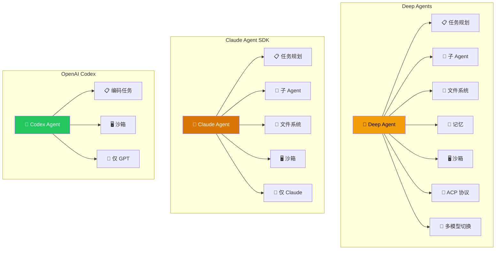
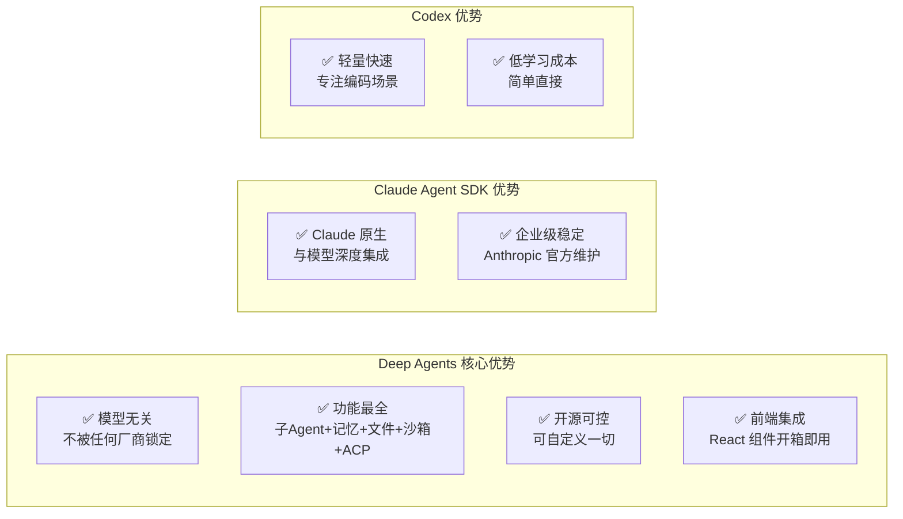
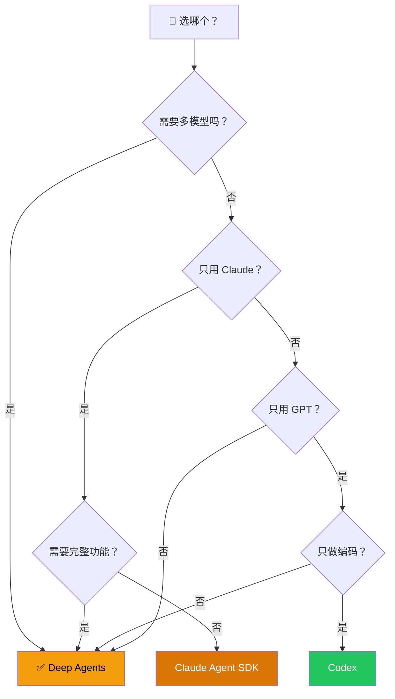

# 对比 Claude Agent SDK / Codex

## 这是什么？

市面上有三个主流的 Agent 框架——Deep Agents、Claude Agent SDK、OpenAI Codex。它们都能让 AI 自动完成复杂任务，但定位和能力差异很大。

打个比方：
- **Deep Agents** 像瑞士军刀——什么都能干，不挑模型
- **Claude Agent SDK** 像苹果全家桶——Claude 生态内的最优体验
- **Codex** 像 VS Code 内置终端——专注编码，轻量快速

## 一句话对比

| 产品 | 定位 | 绑定模型 |
|------|------|----------|
| **Deep Agents** | 模型无关的全功能 Agent 框架 | OpenAI / Anthropic / Google / Ollama 等 |
| **Claude Agent SDK** | Anthropic 官方 Agent 框架 | 仅 Claude |
| **OpenAI Codex** | OpenAI 官方编码 Agent | 仅 GPT |

## 架构对比

## 详细对比

| 维度 | Deep Agents | Claude Agent SDK | Codex |
|------|-------------|------------------|-------|
| **模型支持** | OpenAI / Anthropic / Google / Ollama 等 | 仅 Claude | 仅 GPT |
| **子 Agent** | ✅ 支持（同步+异步） | ✅ 支持 | ❌ 不支持 |
| **文件系统** | ✅ 内置（多后端） | ✅ 内置 | ⚙️ 有限 |
| **沙箱** | ✅ 支持（Docker/云） | ✅ 支持 | ✅ 支持 |
| **记忆** | ✅ 短期 + 长期 | ⚙️ 有限 | ❌ 不支持 |
| **技能系统** | ✅ 支持 | ❌ 不支持 | ❌ 不支持 |
| **前端集成** | ✅ React 组件 | ❌ 需自建 | ❌ 需自建 |
| **ACP 协议** | ✅ 支持 | ❌ 不支持 | ❌ 不支持 |
| **流式输出** | ✅ 全事件流 | ✅ 支持 | ✅ 支持 |
| **人工介入** | ✅ 支持 | ⚙️ 需自建 | ❌ 不支持 |
| **上下文管理** | ✅ 多种策略 | ⚙️ 依赖模型 | ⚙️ 依赖模型 |
| **开源** | ✅ 是 | ❌ 否 | ❌ 否 |

## 功能雷达图对比

## 怎么选？

| 你的需求 | 推荐 | 原因 |
|----------|------|------|
| 想灵活切换模型 / 多模型混用 | **Deep Agents** ✅ | 唯一支持多模型的框架 |
| 想要最完整的功能 | **Deep Agents** ✅ | 子 Agent + 记忆 + 文件系统 + 前端 + ACP |
| 只用 Claude 且要最佳体验 | **Claude Agent SDK** | 与 Claude 深度集成 |
| 只做编码辅助，要轻量 | **Codex** | 专注编码，上手快 |
| 想要开源、可自定义 | **Deep Agents** ✅ | 完全开源，社区活跃 |
| 需要前端实时展示 | **Deep Agents** ✅ | 提供 React 组件 |

## 选型决策流程

## 迁移成本

| 从 | 迁移到 Deep Agents | 难度 |
|----|---------------------|------|
| Claude Agent SDK | 替换 API 调用，调整配置 | ⭐⭐ 低 |
| OpenAI Codex | 重写 Agent 定义，添加工具和子 Agent | ⭐⭐⭐ 中 |
| 自建 Agent | 改用 `createDeepAgent`，保留工具逻辑 | ⭐⭐ 低 |

## 下一步

- [Deep Agents 概览](/deepagents/) — 了解 Deep Agents 的全部能力
- [快速开始](/deepagents/quickstart) — 几分钟创建你的第一个 Agent
- [产品关系与选型指南](/overview/product-comparison) — 更多产品对比
