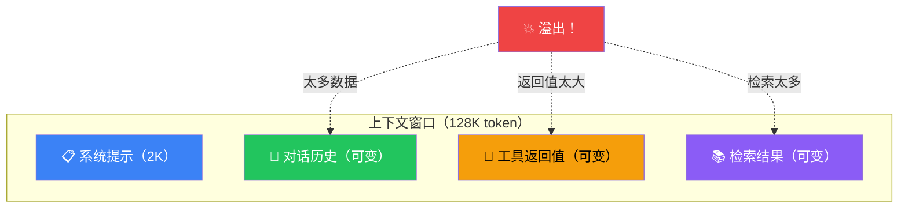
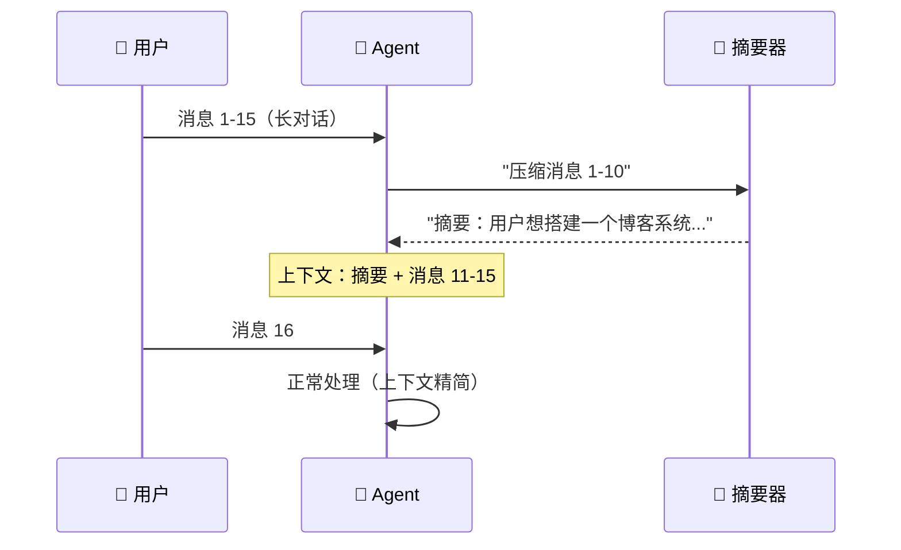
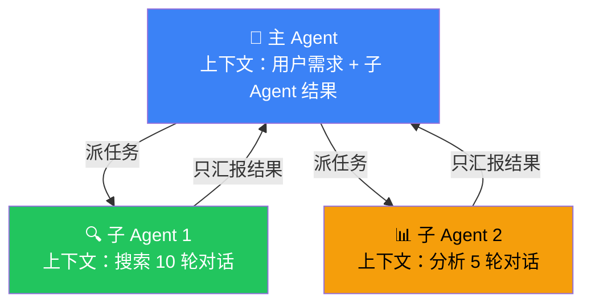

# 上下文工程（Context Engineering）

## 这是什么？

Agent 的"视野管理"——决定它在执行任务时能看到哪些信息。

模型的上下文窗口是有限的（比如 128K token）。对话太长、工具返回太多、检索结果太多……都会撑爆。上下文工程就是解决这个问题的。



## 常见策略

| 策略 | 说明 | 类比 | 适用场景 |
|------|------|------|----------|
| **滑动窗口** | 只保留最近 N 条消息 | "只记得最近聊了什么" | 日常对话 |
| **摘要压缩** | 把长对话压缩成摘要 | "用一句话总结刚才的讨论" | 长对话会话 |
| **重要性排序** | 保留重要的，丢掉不重要的 | "领导说的话要记住，闲聊可以忘" | 信息筛选 |
| **分层存储** | 热数据放内存，冷数据放磁盘 | "常用的放桌面，不常用的存文件柜" | 大量历史数据 |
| **按需检索** | 只在需要时从存储中拉取相关数据 | "用到的时候再去文件柜找" | RAG 场景 |

## 滑动窗口

最简单的策略——只保留最近 N 条消息，老的自动丢掉。

```typescript
const agent = createDeepAgent({
  context: {
    strategy: "sliding_window",
    maxMessages: 20,    // 最多保留 20 条消息（10 轮对话）
  },
});
```

```mermaid
graph LR
    M1["消息 1"] -->|"丢弃"| ❌
    M2["消息 2"] -->|"丢弃"| ❌
    M3["..."] -->|"丢弃"| ❌
    M17["消息 17"] -->|"保留"| ✅
    M18["消息 18"] -->|"保留"| ✅
    M19["消息 19"] -->|"保留"| ✅
    M20["消息 20"] -->|"保留"| ✅

    style ❌ fill:#ef4444,color:#fff
    style ✅ fill:#22c55e,color:#fff
```

> ⚠️ 滑动窗口会**丢失早期信息**。如果用户第 2 条消息说了重要偏好，第 25 条消息时 Agent 就忘了。

## 摘要压缩

当对话变长时，把早期的消息压缩成摘要，释放上下文空间。

```typescript
const agent = createDeepAgent({
  context: {
    strategy: "summarization",
    triggerAt: 0.8,        // 上下文占用 80% 时触发压缩
    keepRecent: 5,         // 保留最近 5 条原始消息
  },
});
```



## Token 估算

不同策略的实际 token 消耗：

| 策略 | 100 条消息后 | 500 条消息后 | 优缺点 |
|------|-------------|-------------|--------|
| **全量保留** | ~50K token | ~250K token ❌ | 完整但贵 |
| **滑动窗口（20）** | ~10K token | ~10K token | 省但丢信息 |
| **摘要压缩** | ~15K token | ~20K token | 平衡方案 |

## 自定义上下文策略

```typescript
const agent = createDeepAgent({
  context: {
    strategy: "custom",
    // 自定义压缩函数
    compress: async (messages) => {
      // 1. 识别重要消息（包含关键信息的）
      const important = messages.filter(m =>
        m.content.includes("记住") ||
        m.content.includes("偏好") ||
        m.role === "system"
      );

      // 2. 非重要消息压缩成摘要
      const unimportant = messages.filter(m => !important.includes(m));
      const summary = await generateSummary(unimportant);

      // 3. 返回：重要消息 + 摘要 + 最近 5 条
      const recent = messages.slice(-5);
      return [
        { role: "system", content: `之前的对话摘要：${summary}` },
        ...important,
        ...recent,
      ];
    },
  },
});
```

## 工具返回值控制

工具返回太多数据也是上下文爆炸的常见原因：

```typescript
// ❌ 返回 10000 行数据——Agent 直接撑爆
const badTool = tool(
  async () => {
    const data = await db.query("SELECT * FROM users");
    return JSON.stringify(data);  // 可能几 MB
  },
  { ... }
);

// ✅ 控制返回长度
const goodTool = tool(
  async ({ query, limit = 10 }) => {
    const data = await db.query(query);
    const results = data.slice(0, limit);  // 最多返回 10 条
    return results
      .map((r: any) => `- ${r.name}: ${r.email}`)
      .join("\n");
  },
  {
    name: "query_db",
    description: "查询数据库",
    schema: z.object({
      query: z.string(),
      limit: z.number().optional().describe("返回条数，默认 10，最大 50"),
    }),
  }
);
```

## 子 Agent 的上下文隔离

子 Agent 天然有独立的上下文窗口——这是它最大的好处之一：



> 主 Agent 只看到**结果**，不看到子 Agent 的完整执行过程。这就是上下文隔离。

## 最佳实践

1. **系统提示精简**——别写论文，控制在 500 字以内
2. **工具返回值截断**——超过 2000 字符就分页
3. **用子 Agent 隔离复杂任务**——别让主 Agent 做 10 轮搜索
4. **监控 token 用量**——开发时打印 token 消耗，及时发现问题
5. **选择合适的策略**——简单对话用滑动窗口，长会话用摘要压缩

## 下一步

- [记忆（Memory）](/deepagents/memory) — 短期和长期记忆管理
- [短期记忆](/langchain/short-term-memory) — LangChain 的短期记忆
- [长期记忆](/langchain/long-term-memory) — LangChain 的长期记忆
