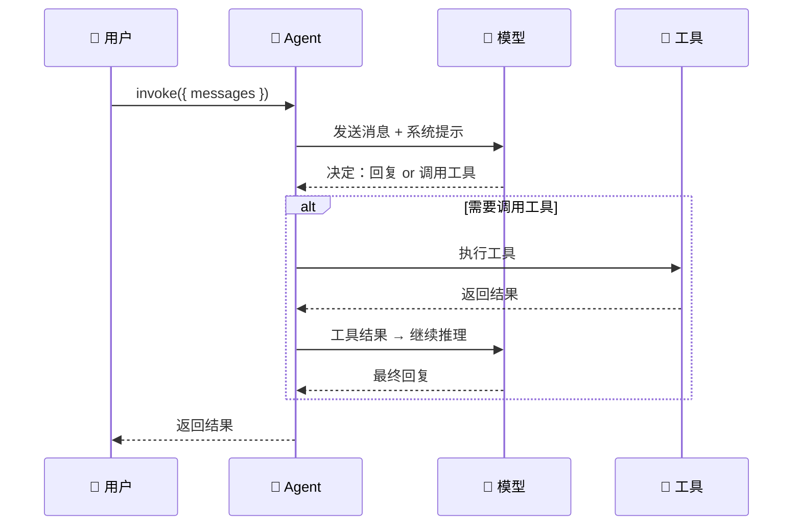

# 创建 Agent

## 基本用法

```typescript
import { createDeepAgent } from "deepagents";

const agent = createDeepAgent({
  system: "你是一个有帮助的助手",
});
```

就这么简单——一个最基础的 Deep Agent 就创建好了。接下来往里面加工具、模型、记忆。

## 完整配置

```typescript
import { createDeepAgent } from "deepagents";
import { tool } from "langchain";
import { z } from "zod";

const agent = createDeepAgent({
  // ① 模型：选哪个 LLM 驱动 Agent
  model: "openai:gpt-4o",

  // ② 系统提示：定义 Agent 的角色和行为规则
  system: `你是一个专业的研究助手。
规则：
1. 回答必须有据可查
2. 不确定的信息要说"我不确定"
3. 用中文回答`,

  // ③ 工具：Agent 能调用的外部能力
  tools: [search, calculator],

  // ④ 记忆：让 Agent 记住对话历史
  memory: { shortTerm: true, longTerm: true, store: "disk" },

  // ⑤ 上下文策略：控制上下文窗口管理
  context: { strategy: "sliding_window", maxMessages: 20 },
});
```

## 配置项详解

| 参数 | 类型 | 必填 | 说明 |
|------|------|------|------|
| `system` | `string` | 否 | 系统提示，定义 Agent 的角色和行为 |
| `model` | `string` | 否 | 模型标识，默认 `"openai:gpt-4o-mini"` |
| `tools` | `Tool[]` | 否 | 工具列表 |
| `memory` | `MemoryConfig` | 否 | 记忆配置 |
| `context` | `ContextConfig` | 否 | 上下文管理策略 |
| `skills` | `Skill[]` | 否 | 技能包（预封装的能力模块） |
| `sandbox` | `SandboxConfig` | 否 | 沙箱配置（安全执行代码） |
| `middleware` | `Middleware[]` | 否 | 中间件（日志、限流等） |

## 模型选择

```typescript
// OpenAI
const agent1 = createDeepAgent({ model: "openai:gpt-4o" });
const agent2 = createDeepAgent({ model: "openai:gpt-4o-mini" });      // 省成本
const agent3 = createDeepAgent({ model: "openai:o3-mini" });           // 推理模型

// Anthropic
const agent4 = createDeepAgent({ model: "anthropic:claude-sonnet-4-20250514" });
const agent5 = createDeepAgent({ model: "anthropic:claude-haiku-4-20250514" });  // 快+便宜

// Google
const agent6 = createDeepAgent({ model: "google:gemini-2.0-flash" });

// 本地模型（通过 Ollama）
const agent7 = createDeepAgent({ model: "ollama:llama3.1" });
```

> 💡 **新手建议**：开发阶段用 `gpt-4o-mini` 或 `claude-haiku` 省成本，上线前切换到更强的模型。

## 生命周期



## 调用方式

```typescript
// 基本调用
const result = await agent.invoke({
  messages: [{ role: "user", content: "帮我查一下今天的新闻" }],
});

// 获取回复
const reply = result.messages[result.messages.length - 1];
console.log(reply.content);

// 带上下文的连续对话
const result2 = await agent.invoke({
  messages: [
    ...result.messages,                    // 之前的对话历史
    { role: "user", content: "总结一下" },   // 新问题
  ],
});
```

## 流式输出

```typescript
// 实时输出，不等全部生成完
const stream = await agent.stream({
  messages: [{ role: "user", content: "写一篇关于 AI 的文章" }],
});

for await (const chunk of stream) {
  // 每个 chunk 是一个增量更新
  if (chunk.type === "token") {
    process.stdout.write(chunk.content);  // 逐字输出
  }
}
```

## 错误处理

```typescript
try {
  const result = await agent.invoke({
    messages: [{ role: "user", content: "帮我算一下" }],
  });
} catch (error) {
  if (error.code === "MODEL_RATE_LIMIT") {
    // 模型限流，等一会重试
    await sleep(5000);
    // 重试...
  } else if (error.code === "TOOL_EXECUTION_ERROR") {
    // 工具执行失败
    console.error("工具出错了：", error.message);
  } else {
    throw error;
  }
}
```

## 常见问题

| 问题 | 原因 | 解决方案 |
|------|------|----------|
| Agent 不回复 | 模型 API Key 无效 | 检查 `.env` 中的 API Key |
| Agent 不调用工具 | 工具描述太模糊 | 把 `description` 写具体 |
| 回复太慢 | 模型太大 | 开发阶段用 `mini` 版本 |
| 上下文溢出 | 对话太长 | 设置 `context.maxMessages` |
| TypeScript 报类型错误 | zod 版本不匹配 | 确保 zod v3.x |

## 下一步

- [工具（Tools）](/deepagents/tools) — 让 Agent 能执行操作
- [子 Agent（Subagents）](/deepagents/subagents) — 派生专门的子任务
- [自定义 Deep Agents](/deepagents/customization) — 高级配置
- [模型配置](/deepagents/models) — 更多模型选项
