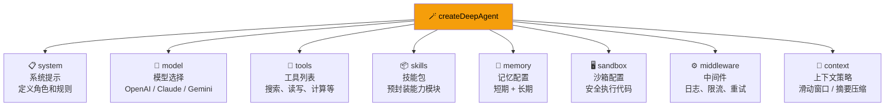

# 自定义 Deep Agents

## 这是什么？

`createDeepAgent` 的配置项就像汽车的配置单——你可以选引擎（模型）、装 GPS（记忆）、加装工具箱（工具）、雇副驾驶（子 Agent）。

## 可自定义的部分



## 配置项速查

| 配置项 | 类型 | 必填 | 说明 |
|--------|------|------|------|
| `system` | `string` | 否 | 系统提示，定义 Agent 角色 |
| `model` | `string \| ModelConfig` | 否 | 模型，默认 `openai:gpt-4o-mini` |
| `tools` | `Tool[]` | 否 | 工具列表 |
| `skills` | `Skill[]` | 否 | 技能包 |
| `memory` | `MemoryConfig` | 否 | 记忆配置 |
| `sandbox` | `SandboxConfig` | 否 | 沙箱配置 |
| `middleware` | `Middleware[]` | 否 | 中间件 |
| `context` | `ContextConfig` | 否 | 上下文管理策略 |
| `filesystem` | `FilesystemConfig` | 否 | 文件系统后端 |

## 完整示例：全栈开发助手

```typescript
import { createDeepAgent } from "deepagents";
import { tool } from "langchain";
import { z } from "zod";

// 工具
const readFile = tool(
  async ({ path }) => fs.promises.readFile(path, "utf-8"),
  { name: "read_file", description: "读取文件", schema: z.object({ path: z.string() }) }
);

const writeFile = tool(
  async ({ path, content }) => {
    await fs.promises.writeFile(path, content, "utf-8");
    return "写入成功";
  },
  { name: "write_file", description: "写入文件", schema: z.object({ path: z.string(), content: z.string() }) }
);

const runTests = tool(
  async () => "所有测试通过 ✅",
  { name: "run_tests", description: "运行测试", schema: z.object({}) }
);

// 中间件
const logger = async (ctx: any, next: () => Promise<any>) => {
  console.log(`[${new Date().toISOString()}] Agent 调用: ${ctx.action}`);
  return next();
};

const rateLimiter = async (ctx: any, next: () => Promise<any>) => {
  // 每分钟最多 60 次调用
  return next();
};

// 创建 Agent
const agent = createDeepAgent({
  model: "anthropic:claude-sonnet-4-20250514",

  system: `你是一个高级全栈开发助手。
规则：
1. 写代码必须带注释
2. 每次修改前先说明要改什么、为什么
3. 用 TypeScript，不用 JavaScript
4. 代码风格：简洁、可读、有测试`,

  tools: [readFile, writeFile, runTests],

  memory: {
    shortTerm: true,
    longTerm: true,
    store: "disk",
    path: "./agent-memory",
  },

  sandbox: {
    enabled: true,
    type: "docker",
  },

  context: {
    strategy: "sliding_window",
    maxMessages: 20,
  },

  middleware: [logger, rateLimiter],
});
```

## 系统提示最佳实践

| 做法 | 示例 |
|------|------|
| ✅ 精简明确 | "你是一个 Python 开发助手。写代码带注释，用 Python 3.12。" |
| ✅ 列规则 | "规则：1. 先理解需求 2. 写代码 3. 建议测试" |
| ❌ 写论文 | "你是一个非常专业的、经验丰富的、擅长各种编程语言的..." |
| ❌ 矛盾指令 | "你必须简洁。但是，你需要非常详细地解释每一个细节。" |

## 中间件配置

```typescript
// 日志中间件
const logger = {
  name: "logger",
  execute: async (ctx, next) => {
    const start = Date.now();
    const result = await next();
    console.log(`耗时：${Date.now() - start}ms`);
    return result;
  },
};

// 错误重试中间件
const retry = {
  name: "retry",
  execute: async (ctx, next) => {
    for (let i = 0; i < 3; i++) {
      try {
        return await next();
      } catch (err) {
        if (i === 2) throw err;
        await new Promise(r => setTimeout(r, 1000 * (i + 1)));
      }
    }
  },
};

const agent = createDeepAgent({
  middleware: [logger, retry],
  // ...
});
```

## 配置组合建议

| 场景 | 推荐配置 |
|------|----------|
| **快速原型** | `model: "gpt-4o-mini"` + 基础工具 |
| **生产助手** | 强模型 + 记忆 + 沙箱 + 中间件 |
| **编码 Agent** | 文件工具 + 沙箱 + ACP |
| **研究 Agent** | 搜索工具 + 子 Agent + 长期记忆 |
| **客服 Agent** | 知识库工具 + 记忆 + 流式输出 |

## 下一步

- [创建 Agent](/deepagents/creation) — 基础创建教程
- [上下文工程](/deepagents/context-engineering) — 管理 Agent 视野
- [记忆](/deepagents/memory) — 配置短期和长期记忆
- [生产部署](/deepagents/going-to-production) — 生产环境配置清单
