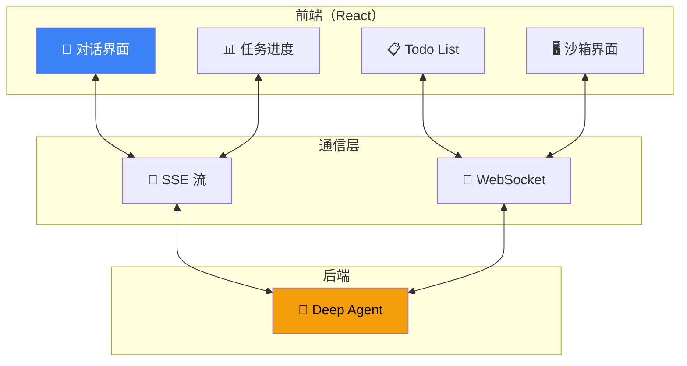

# 前端集成

## 这是什么？

Deep Agents 提供了开箱即用的 **React 组件**，让你快速构建 Agent 的 Web UI——实时对话、任务进度条、子 Agent 状态、Todo List 同步。



## 能做什么？

| 功能 | 说明 |
|------|------|
| **实时对话** | 流式显示 Agent 回复 |
| **子 Agent 进度** | 实时展示每个子 Agent 的工作状态 |
| **Todo List** | 任务清单，实时同步 Agent 进度 |
| **工具调用展示** | 看到 Agent 正在调用什么工具 |
| **沙箱 UI** | IDE 风格的代码编辑和执行界面 |

## 基本用法

```tsx
import { createDeepAgent } from "deepagents";
import { useAgentStream } from "deepagents/frontend";

// 后端：创建 Agent
const agent = createDeepAgent({
  tools: [search, calculator],
  system: "你是一个全能助手。",
});

// 前端：React 组件
function AgentChat() {
  const { messages, status, send } = useAgentStream({
    endpoint: "/api/agent",
  });

  return (
    <div className="chat-container">
      {/* 消息列表 */}
      <div className="messages">
        {messages.map((msg) => (
          <div key={msg.id} className={`message ${msg.role}`}>
            {msg.content}
          </div>
        ))}
      </div>

      {/* 状态指示器 */}
      {status === "thinking" && (
        <div className="status">🤔 Agent 正在思考...</div>
      )}
      {status === "tool_call" && (
        <div className="status">🔧 正在调用工具...</div>
      )}

      {/* 输入框 */}
      <form onSubmit={(e) => {
        e.preventDefault();
        const input = e.currentTarget.elements.namedItem("message") as HTMLInputElement;
        send(input.value);
        input.value = "";
      }}>
        <input name="message" placeholder="输入消息..." />
        <button type="submit">发送</button>
      </form>
    </div>
  );
}
```

## 后端 API 路由

```typescript
// Next.js API Route: /api/agent/route.ts
import { createDeepAgent } from "deepagents";

const agent = createDeepAgent({
  tools: [search, calculator],
  system: "你是一个全能助手。",
});

export async function POST(req: Request) {
  const { messages } = await req.json();
  const stream = await agent.stream({ messages });

  return new Response(
    new ReadableStream({
      async start(controller) {
        for await (const chunk of stream) {
          controller.enqueue(
            `data: ${JSON.stringify(chunk)}\n\n`
          );
        }
        controller.enqueue("data: [DONE]\n\n");
        controller.close();
      },
    }),
    {
      headers: {
        "Content-Type": "text/event-stream",
        "Cache-Control": "no-cache",
        "Connection": "keep-alive",
      },
    }
  );
}
```

## Todo List 同步

```tsx
import { useAgentTodos } from "deepagents/frontend";

function TodoPanel() {
  const { todos, status } = useAgentTodos({
    endpoint: "/api/agent",
  });

  return (
    <div className="todo-panel">
      <h3>📋 任务清单</h3>
      {todos.map((todo) => (
        <div key={todo.id} className={`todo ${todo.status}`}>
          {todo.status === "done" && "✅ "}
          {todo.status === "in_progress" && "🔄 "}
          {todo.status === "pending" && "⏳ "}
          {todo.title}
        </div>
      ))}
    </div>
  );
}
```

## 子 Agent 进度展示

```tsx
import { useAgentStream } from "deepagents/frontend";

function AgentProgress() {
  const { events } = useAgentStream({ endpoint: "/api/agent" });

  return (
    <div className="progress-panel">
      {events
        .filter(e => e.type.startsWith("subagent_"))
        .map((e) => (
          <div key={e.id} className={`subagent-event ${e.type}`}>
            {e.type === "subagent_start" && `👥 启动：${e.name}`}
            {e.type === "subagent_end" && `✅ 完成：${e.name}`}
          </div>
        ))}
    </div>
  );
}
```

## 事件类型

| 事件 | 类型 | 说明 |
|------|------|------|
| `text` | 增量文本 | Agent 的回复内容 |
| `tool_call` | 工具调用 | 正在调用的工具和参数 |
| `tool_result` | 工具结果 | 工具返回的结果 |
| `subagent_start` | 子 Agent 启动 | 子 Agent 名称和任务 |
| `subagent_end` | 子 Agent 完成 | 子 Agent 名称和结果 |
| `todo_update` | Todo 更新 | 任务状态变化 |
| `thinking` | 思考中 | Agent 内部推理 |
| `done` | 完成 | 全部执行完毕 |

## 最佳实践

| 实践 | 说明 |
|------|------|
| **用 SSE 而不是 WebSocket** | 对话场景 SSE 更简单可靠 |
| **缓冲更新** | 别每个字符都重渲染，按句更新 |
| **展示工具调用** | 让用户知道 Agent 在做什么 |
| **错误边界** | 捕获渲染错误，别让整个 UI 崩溃 |
| **响应式设计** | 移动端也要能用 |

## 下一步

- [流式输出](/deepagents/streaming) — 理解流式事件
- [ACP 协议](/deepagents/acp) — IDE 集成方案
- [CLI 工具](/deepagents/cli) — 终端版本
