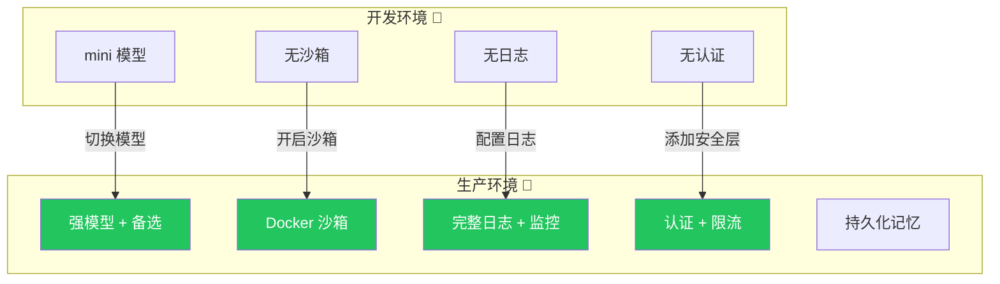

# 生产部署

## 从开发到生产

开发时可以随意配置——用默认模型、不用沙箱、不设限流。但生产环境必须严谨。



## 检查清单

- [ ] **模型配置**：明确指定模型，不用默认值
- [ ] **长期记忆**：开启持久化存储（数据库）
- [ ] **沙箱**：配置 Docker 沙箱执行代码
- [ ] **中间件**：添加错误处理、重试、限流
- [ ] **日志监控**：配置日志收集和告警
- [ ] **API Key 管理**：环境变量，不硬编码
- [ ] **人工介入**：危险操作需要确认
- [ ] **超时设置**：工具调用、子 Agent 都设超时
- [ ] **健康检查**：`/health` 端点
- [ ] **优雅关闭**：处理 SIGTERM 信号

## 推荐配置

```typescript
import { createDeepAgent } from "deepagents";

// 中间件
const logger = {
  name: "logger",
  execute: async (ctx, next) => {
    const start = Date.now();
    try {
      const result = await next();
      console.log(JSON.stringify({
        timestamp: new Date().toISOString(),
        action: ctx.action,
        duration: Date.now() - start,
        status: "success",
      }));
      return result;
    } catch (err) {
      console.error(JSON.stringify({
        timestamp: new Date().toISOString(),
        action: ctx.action,
        duration: Date.now() - start,
        status: "error",
        error: err.message,
      }));
      throw err;
    }
  },
};

const retry = {
  name: "retry",
  execute: async (ctx, next) => {
    for (let i = 0; i < 3; i++) {
      try {
        return await next();
      } catch (err) {
        if (i === 2) throw err;
        await new Promise(r => setTimeout(r, 1000 * Math.pow(2, i)));
      }
    }
  },
};

const rateLimiter = {
  name: "rate_limiter",
  execute: async (ctx, next) => {
    // 每用户每分钟 30 次
    return next();
  },
};

// 生产 Agent
const agent = createDeepAgent({
  model: "openai:gpt-4o",

  system: "你是一个专业的助手。",

  tools: [search, calculator],

  memory: {
    shortTerm: true,
    longTerm: true,
    store: "database",
    database: {
      type: "postgresql",
      url: process.env.DATABASE_URL,
      table: "agent_memory",
    },
  },

  sandbox: {
    enabled: true,
    type: "docker",
    config: {
      image: "python:3.12-slim",
      memory: "512m",
      timeout: 30000,
    },
  },

  middleware: [logger, retry, rateLimiter],

  context: {
    strategy: "summarization",
    triggerAt: 0.8,
  },
});
```

## 部署方式

| 方式 | 适用场景 | 说明 |
|------|----------|------|
| **Node.js 服务** | 简单部署 | 直接起 HTTP 服务 |
| **Docker** | 标准化部署 | 容器化，环境一致 |
| **Kubernetes** | 大规模 | 自动扩缩容、滚动更新 |
| **Vercel / Railway** | Serverless | 按需计费 |
| **LangSmith** | 官方托管 | 集成监控和调试 |

### Docker 部署

```dockerfile
FROM node:20-slim

WORKDIR /app
COPY package*.json ./
RUN npm ci --production
COPY . .

EXPOSE 8080
CMD ["node", "server.js"]
```

### 健康检查

```typescript
// server.ts
import http from "http";

const server = http.createServer(async (req, res) => {
  if (req.url === "/health") {
    res.writeHead(200);
    res.end(JSON.stringify({ status: "ok", timestamp: Date.now() }));
    return;
  }
  // ... Agent 处理逻辑
});

// 优雅关闭
process.on("SIGTERM", () => {
  console.log("收到 SIGTERM，正在关闭...");
  server.close(() => process.exit(0));
});
```

## 监控指标

| 指标 | 说明 | 告警阈值 |
|------|------|----------|
| **响应时间** | Agent 处理耗时 | > 30 秒 |
| **错误率** | 请求失败比例 | > 5% |
| **Token 消耗** | 模型调用成本 | 日消耗 > 预算 80% |
| **活跃连接** | 当前连接数 | > 最大值 80% |
| **工具调用次数** | 工具使用频率 | 异常飙升 |

## 常见问题

| 问题 | 原因 | 解决方案 |
|------|------|----------|
| 内存泄漏 | 没有清理旧会话 | 设置会话 TTL |
| 响应变慢 | 模型 API 限流 | 添加重试中间件 |
| 数据丢失 | 记忆没持久化 | 开启数据库存储 |
| 安全漏洞 | 沙箱未启用 | 生产必须用沙箱 |

## 下一步

- [沙箱](/deepagents/sandboxes) — 安全执行代码
- [记忆](/deepagents/memory) — 配置持久化存储
- [流式输出](/deepagents/streaming) — 生产级流式方案
