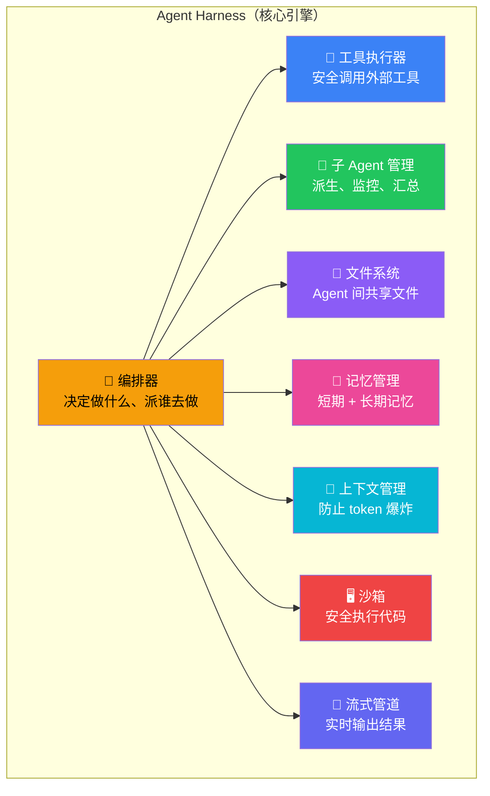
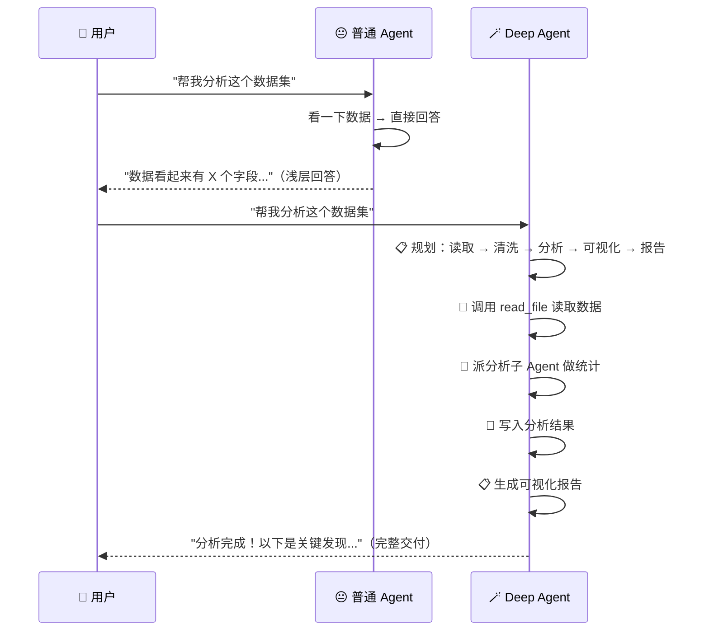
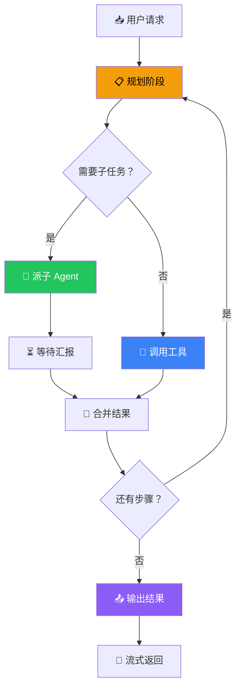

# Agent Harness 能力

## 这是什么？

**Agent Harness**（Agent 托管层）是 Deep Agent 的核心引擎。它不只是给你一个能聊天的 AI——而是给你一个完整的"Agent 运行环境"。

打个比方：普通 Agent 像一个人坐在桌前回答问题。Deep Agent 像一个项目经理——它会规划任务、分配下属、管理文件、记住上下文、在安全环境里测试，最后给你交付结果。

## Harness 包含什么？



## 内置能力一览

| 能力 | 说明 | 默认状态 | 详细文档 |
|------|------|----------|----------|
| **任务规划** | 自动把复杂任务拆成子步骤 | ✅ 内置 | [上下文工程](/deepagents/context-engineering) |
| **工具调用** | 调用你定义的外部工具 | ✅ 内置 | [工具](/deepagents/tools) |
| **子 Agent** | 派生专门的子 Agent 处理子任务 | ✅ 内置 | [子 Agent](/deepagents/subagents) |
| **文件系统** | Agent 间共享文件 | ✅ 内置 | [文件系统](/deepagents/backends) |
| **记忆** | 短期 + 长期记忆 | ⚙️ 需配置 | [记忆](/deepagents/memory) |
| **沙箱** | 安全执行代码 | ⚙️ 需配置 | [沙箱](/deepagents/sandboxes) |
| **流式输出** | 实时返回中间结果 | ✅ 内置 | [流式输出](/deepagents/streaming) |
| **人工介入** | 关键步骤需用户确认 | ⚙️ 需配置 | [人工介入](/deepagents/human-in-the-loop) |
| **上下文管理** | 滑动窗口 / 摘要压缩 | ✅ 内置 | [上下文工程](/deepagents/context-engineering) |
| **中间件** | 日志、限流、重试等 | ⚙️ 需配置 | — |

## 与普通 Agent 的区别



| 对比维度 | 普通 Agent | Deep Agent |
|----------|------------|------------|
| **任务处理** | 单步问答 | 多步规划 + 执行 |
| **文件操作** | ❌ 无 | ✅ 内置文件系统 |
| **子任务** | ❌ 自己硬扛 | ✅ 派子 Agent 处理 |
| **记忆** | 依赖对话历史 | 短期 + 长期记忆 |
| **输出** | 一次性回答 | 流式实时输出 |
| **安全性** | ⚙️ 需自建 | ✅ 沙箱隔离 |

## 使用示例

```typescript
import { createDeepAgent } from "deepagents";
import { tool } from "langchain";
import { z } from "zod";

// 定义工具
const readCSV = tool(
  async ({ path }) => {
    const content = await fs.promises.readFile(path, "utf-8");
    const lines = content.split("\n");
    return `CSV 文件：${lines.length} 行，${lines[0].split(",").length} 列`;
  },
  {
    name: "read_csv",
    description: "读取 CSV 文件并返回基本信息",
    schema: z.object({ path: z.string() }),
  }
);

const generateChart = tool(
  async ({ data, type }) => {
    return `已生成 ${type} 图表，数据点：${data.length}`;
  },
  {
    name: "generate_chart",
    description: "根据数据生成图表",
    schema: z.object({
      data: z.string().describe("JSON 格式的数据"),
      type: z.enum(["bar", "line", "pie"]).describe("图表类型"),
    }),
  }
);

// 创建 Deep Agent——Harness 自动启用所有内置能力
const agent = createDeepAgent({
  tools: [readCSV, generateChart],
  system: `你是一个数据分析助手。
流程：
1. 读取数据文件
2. 分析数据特征
3. 生成可视化图表
4. 总结关键发现`,
});
```

## Harness 工作流程



## 最佳实践

| 实践 | 说明 |
|------|------|
| **系统提示要精简** | Harness 会自动处理规划，你只需描述角色 |
| **工具描述要清楚** | Harness 靠描述决定什么时候调用工具 |
| **利用子 Agent** | 复杂任务拆给子 Agent，别让主 Agent 硬扛 |
| **开启记忆** | 生产环境务必开启长期记忆 |
| **配置沙箱** | 执行代码的场景必须用沙箱 |

## 常见问题

| 问题 | 原因 | 解决方案 |
|------|------|----------|
| Agent 不规划，直接回答 | 系统提示没有要求规划 | 在 system 中明确"先规划再执行" |
| 子 Agent 没被派出去 | description 不清楚 | 给子 Agent 写清晰的 description |
| 文件读写失败 | 文件系统后端未配置 | 设置 `filesystem.backend` |
| 流式输出断断续续 | 网络问题 | 检查网络连接，或用 chunk 缓冲 |

## 下一步

- [创建 Agent](/deepagents/creation) — 创建你的第一个 Deep Agent
- [子 Agent](/deepagents/subagents) — 派生专门的子任务
- [文件系统](/deepagents/backends) — 配置 Agent 的共享硬盘
- [上下文工程](/deepagents/context-engineering) — 管理 Agent 的视野
