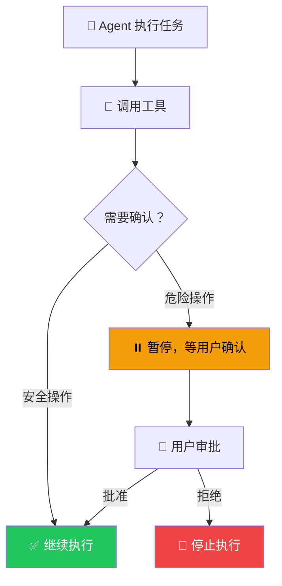
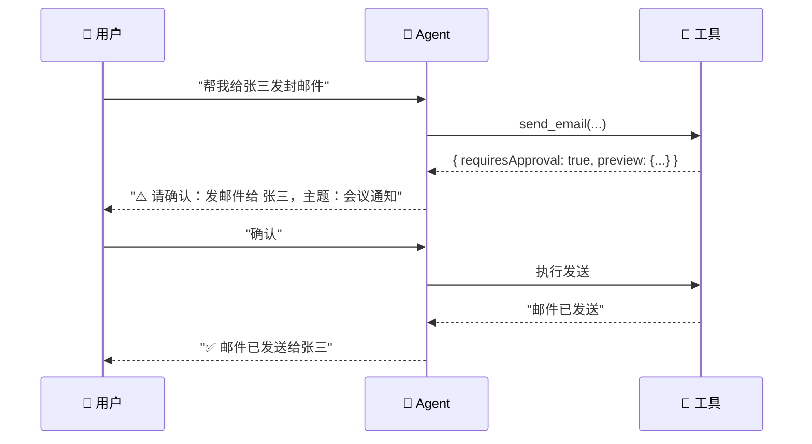

# 人工介入（Human-in-the-Loop）

## 这是什么？

Agent 干到关键步骤会举手问你："老板，这步能做吗？" 你点头它才继续。



## 类比

> 就像自动驾驶汽车——平时自己开，遇到复杂路口会提示你接管。

## 使用方式

```typescript
import { createDeepAgent } from "deepagents";
import { tool } from "langchain";
import { z } from "zod";

// 需要确认的工具
const sendEmail = tool(
  async ({ to, subject, body }) => {
    // 返回需要审批的标记
    return {
      requiresApproval: true,
      action: "send_email",
      preview: { to, subject, body: body.slice(0, 200) },
    };
  },
  {
    name: "send_email",
    description: "发送邮件（需要用户确认）",
    schema: z.object({
      to: z.string().describe("收件人"),
      subject: z.string().describe("邮件主题"),
      body: z.string().describe("邮件内容"),
    }),
  }
);

const deleteFile = tool(
  async ({ path }) => ({
    requiresApproval: true,
    action: "delete_file",
    preview: { path },
  }),
  {
    name: "delete_file",
    description: "删除文件（需要用户确认）",
    schema: z.object({ path: z.string() }),
  }
);

// 安全工具，不需要确认
const readFile = tool(
  async ({ path }) => fs.promises.readFile(path, "utf-8"),
  { name: "read_file", description: "读取文件", schema: z.object({ path: z.string() }) }
);

// 创建 Agent，配置人工介入
const agent = createDeepAgent({
  tools: [sendEmail, deleteFile, readFile],
  humanInTheLoop: {
    enabled: true,
    approvalTools: ["send_email", "delete_file"], // 只有这两个需要确认
    onApprovalRequest: async (request) => {
      // 展示审批界面，等用户点击
      console.log(`⚠️ 需要确认：${request.action}`);
      console.log(JSON.stringify(request.preview, null, 2));
      // 返回用户的决定
      return await getUserDecision(); // true = 批准，false = 拒绝
    },
  },
  system: "你是一个助手。发邮件和删文件前必须确认。",
});
```

## 执行流程



## 适用场景

| 场景 | 风险等级 | 建议 |
|------|----------|------|
| 📧 发邮件、发消息 | 🟡 中 | 必须确认——发错人很尴尬 |
| 💳 支付、转账 | 🔴 高 | 必须确认——钱没了就没了 |
| 🗑️ 删除数据 | 🔴 高 | 必须确认——删了可能找不回来 |
| 🔧 系统配置变更 | 🟡 中 | 建议确认 |
| 📖 读文件、查数据 | 🟢 低 | 不需要确认 |
| 🔍 搜索信息 | 🟢 低 | 不需要确认 |

## 前端集成

```typescript
// React 组件
function ApprovalDialog({ request, onApprove, onReject }) {
  return (
    <div className="approval-dialog">
      <h3>⚠️ Agent 请求确认</h3>
      <pre>{JSON.stringify(request.preview, null, 2)}</pre>
      <button onClick={onApprove}>✅ 批准</button>
      <button onClick={onReject}>❌ 拒绝</button>
    </div>
  );
}
```

## 最佳实践

| 实践 | 说明 |
|------|------|
| **展示预览** | 让用户看到具体要做什么，再决定 |
| **默认拒绝** | 用户不响应时，默认拒绝危险操作 |
| **分级审批** | 不同风险级别不同确认方式 |
| **记录日志** | 所有审批决定都记录日志 |
| **超时处理** | 设置审批超时，避免无限等待 |

## 下一步

- [工具](/deepagents/tools) — 创建安全的工具
- [沙箱](/deepagents/sandboxes) — 在沙箱中执行代码
- [生产部署](/deepagents/going-to-production) — 生产环境安全策略
