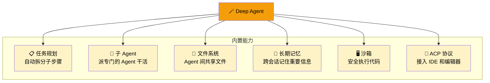
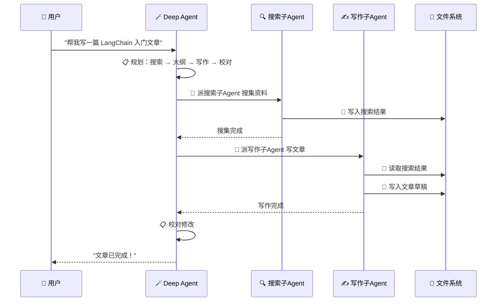
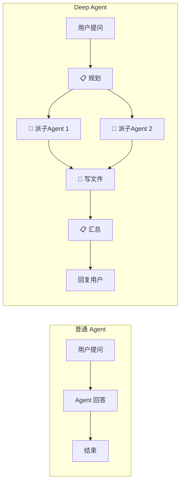

# Deep Agents 概览

## 这是什么？

`deepagents` 是一个**开箱即用的 Agent 框架**。它在 LangChain 的基础上，内置了一整套高级能力：



## 为什么用它？

普通 Agent 一问一答。Deep Agent 能做**复杂多步骤任务**：



## 适用场景

| 场景 | Deep Agent 怎么帮你 |
|------|---------------------|
| 📝 写长文章 | 自动搜索 → 大纲 → 逐段写作 → 校对 |
| 📊 数据分析 | 自动读文件 → 清洗 → 分析 → 生成报告 |
| 🎯 复杂任务 | 自动拆分 → 派子 Agent 并行处理 → 汇总结果 |
| 💬 客户支持 | 根据问题类型路由到不同的处理 Agent |
| 🔬 深度研究 | 多轮搜索 → 对比分析 → 生成研究报告 |

## 安装

```bash
npm install deepagents @langchain/core zod
```

## 最简示例

```typescript
import { createDeepAgent } from "deepagents";

const agent = createDeepAgent({
  system: "你是一个有帮助的助手。",
});

const result = await agent.invoke({
  messages: [{ role: "user", content: "帮我写一首关于春天的诗" }],
});

console.log(result.messages[result.messages.length - 1].content);
```

## 带工具的示例

```typescript
import { createDeepAgent } from "deepagents";
import { tool } from "langchain";
import { z } from "zod";

// ① 定义搜索工具
const search = tool(
  async ({ query }) => {
    // 实际项目中接入搜索 API
    return `搜索"${query}"的结果：LangChain 是一个 Agent 开发框架...`;
  },
  {
    name: "search",
    description: "搜索互联网获取信息",
    schema: z.object({ query: z.string() }),
  }
);

// ② 定义写文件工具
const writeFile = tool(
  ({ filename, content }) => {
    console.log(`📝 写入文件 ${filename}：${content.slice(0, 50)}...`);
    return `文件 ${filename} 写入成功`;
  },
  {
    name: "write_file",
    description: "将内容写入文件",
    schema: z.object({
      filename: z.string().describe("文件名"),
      content: z.string().describe("文件内容"),
    }),
  }
);

// ③ 创建 Agent
const agent = createDeepAgent({
  tools: [search, writeFile],
  system: `你是一个研究助手。
流程：
1. 先搜索相关信息
2. 整理成结构化笔记
3. 写入文件保存`,
});

// ④ 调用
const result = await agent.invoke({
  messages: [{ role: "user", content: "帮我研究一下 LangChain 是什么，保存成笔记" }],
});
```

## 与普通 Agent 的区别



## 与其他产品的关系

```
Deep Agents = LangChain + LangGraph + 内置增强功能
```

| 你需要 | 用什么 |
|--------|--------|
| 快速做一个复杂 Agent | **Deep Agents** ✅ |
| 自定义 Agent 行为 | [LangChain](/langchain/) |
| 底层工作流控制 | [LangGraph](/langgraph/) |

详见 [产品关系与选型指南](/overview/product-comparison)。

## 下一步

- [快速开始](/deepagents/quickstart)
- [创建 Agent](/deepagents/creation)
- [工具（Tools）](/deepagents/tools)
- [子 Agent（Subagents）](/deepagents/subagents)
