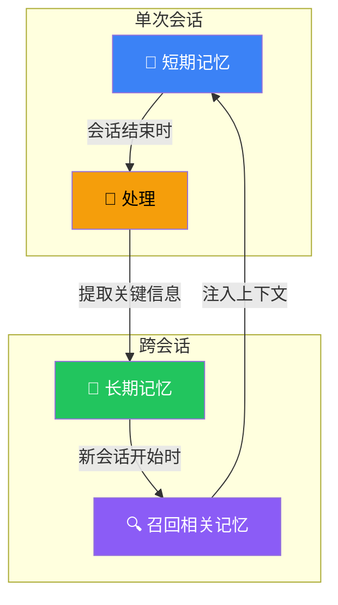
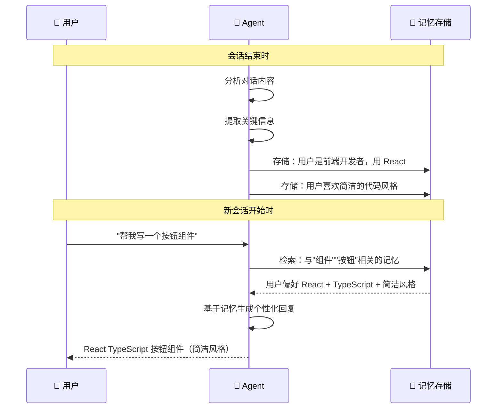

# 记忆（Memory）

## 这是什么？

Agent 的"大脑"——让它记住用户说过的话、偏好、历史操作。



| 类型 | 时长 | 存储位置 | 用途 |
|------|------|----------|------|
| **短期记忆** | 单次会话 | 内存 | 当前对话上下文 |
| **长期记忆** | 跨会话 | 数据库/文件 | 用户偏好、历史总结、个人资料 |

## 使用方式

```typescript
import { createDeepAgent } from "deepagents";

const agent = createDeepAgent({
  memory: {
    shortTerm: true,         // 开启短期记忆（默认开启）
    longTerm: true,          // 开启长期记忆
    store: "disk",           // 长期记忆存储位置："disk" | "database"
    path: "./memory",        // disk 存储路径
  },
  system: "记住用户的偏好和历史对话，提供个性化的回复。",
});
```

## 配置项

| 参数 | 类型 | 默认值 | 说明 |
|------|------|--------|------|
| `shortTerm` | `boolean` | `true` | 是否开启短期记忆 |
| `longTerm` | `boolean` | `false` | 是否开启长期记忆 |
| `store` | `string` | `"memory"` | 长期记忆存储方式 |
| `path` | `string` | `"./memory"` | disk 存储路径 |
| `maxEntries` | `number` | `1000` | 最大记忆条目数 |
| `ttl` | `number` | — | 记忆过期时间（秒） |

## 短期记忆

短期记忆在**单次会话**内有效。Agent 能记住当前对话中说过的话：

```typescript
const result1 = await agent.invoke({
  messages: [{ role: "user", content: "我叫小明，我喜欢蓝色" }],
});
// Agent 回复：记住了，小明！

const result2 = await agent.invoke({
  messages: [
    ...result1.messages,
    { role: "user", content: "我喜欢什么颜色？" },
  ],
});
// Agent 回复：你喜欢蓝色！🔵
```

> 💡 短期记忆默认开启，其实就是**对话历史在上下文中保留**。关闭它等于 Agent 只看到最后一条消息。

## 长期记忆

长期记忆**跨会话**保存。新会话开始时，Agent 会自动加载相关记忆：

```typescript
// 第一次会话
const result1 = await agent.invoke({
  messages: [{ role: "user", content: "我是前端开发者，主要用 React 和 TypeScript" }],
});
// Agent 回复：好的，记住了你的技术栈！

// ——— 三天后，新会话 ———

const result2 = await agent.invoke({
  messages: [{ role: "user", content: "帮我写一个组件" }],
});
// Agent 自动知道你是前端开发者
// 回复：好的，给你写一个 React + TypeScript 组件...
```

### 长期记忆工作流



### 记忆内容示例

```typescript
// 记忆条目结构
interface MemoryEntry {
  id: string;
  content: string;          // 记忆内容
  category: "preference" | "fact" | "summary";  // 类别
  timestamp: number;        // 创建时间
  relevance: number;        // 相关性分数
  source: string;           // 来源会话 ID
}

// 示例记忆
[
  { content: "用户是前端开发者，主要用 React 和 TypeScript", category: "fact" },
  { content: "用户喜欢简洁的代码风格，不喜欢过度设计", category: "preference" },
  { content: "用户在做一个电商项目，需要商品列表和购物车功能", category: "summary" },
]
```

## 手动管理记忆

```typescript
// 读取所有记忆
const memories = await agent.memory.list();
console.log(memories);

// 搜索特定记忆
const results = await agent.memory.search("用户偏好");
console.log(results);

// 添加自定义记忆
await agent.memory.add({
  content: "用户最常用 VS Code 开发",
  category: "preference",
});

// 删除特定记忆
await agent.memory.delete("memory-id-123");

// 清空所有记忆
await agent.memory.clear();
```

## 数据库存储

```typescript
import { createDeepAgent } from "deepagents";

const agent = createDeepAgent({
  memory: {
    longTerm: true,
    store: "database",
    database: {
      type: "postgresql",      // 或 "mysql", "sqlite"
      url: process.env.DATABASE_URL,
      table: "agent_memory",   // 存储表名
    },
  },
});
```

## 最佳实践

| 场景 | 建议 |
|------|------|
| **客服 Agent** | 开启长期记忆，记住用户历史问题和偏好 |
| **一次性任务** | 只用短期记忆就够了 |
| **个人助手** | 长期记忆 + 定期清理过期记忆 |
| **团队协作** | 按用户 ID 隔离记忆，避免信息泄漏 |
| **成本敏感** | 限制 `maxEntries`，减少存储和检索成本 |

## 常见问题

| 问题 | 原因 | 解决方案 |
|------|------|----------|
| Agent "忘记"了早期信息 | 短期记忆被滑动窗口截掉 | 重要信息存入长期记忆 |
| 记忆太多，回复变慢 | 检索范围太大 | 设置 `maxEntries` 和 `ttl` |
| 跨用户记忆混乱 | 没有按用户隔离 | 使用 `userId` 参数 |
| 记忆不准确 | 提取策略太宽松 | 调整提取阈值 |

## 下一步

- [上下文工程](/deepagents/context-engineering) — 管理上下文窗口
- [短期记忆](/langchain/short-term-memory) — LangChain 的短期记忆
- [长期记忆](/langchain/long-term-memory) — LangChain 的长期记忆
