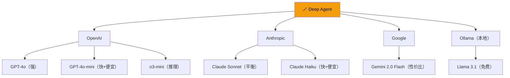
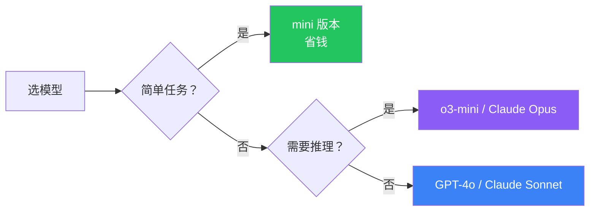

# 模型配置（Models）

## 这是什么？

Deep Agent 支持**几乎所有主流 LLM**——不像某些框架只能用一个厂商的模型。你可以随时切换，甚至让主 Agent 和子 Agent 用不同的模型。

## 支持的模型



## 快速配置

```typescript
import { createDeepAgent } from "deepagents";

// OpenAI
const agent1 = createDeepAgent({ model: "openai:gpt-4o" });
const agent2 = createDeepAgent({ model: "openai:gpt-4o-mini" });   // 省成本
const agent3 = createDeepAgent({ model: "openai:o3-mini" });        // 推理模型

// Anthropic
const agent4 = createDeepAgent({ model: "anthropic:claude-sonnet-4-20250514" });
const agent5 = createDeepAgent({ model: "anthropic:claude-haiku-4-20250414" }); // 快+便宜

// Google
const agent6 = createDeepAgent({ model: "google:gemini-2.0-flash" });

// 本地模型（通过 Ollama）
const agent7 = createDeepAgent({ model: "ollama:llama3.1" });
```

## 高级配置

```typescript
const agent = createDeepAgent({
  model: {
    provider: "openai",
    name: "gpt-4o",
    temperature: 0.7,        // 0-1，越高越有创意
    maxTokens: 4096,         // 最大输出 token 数
    topP: 0.9,               // 核采样
    frequencyPenalty: 0,     // 频率惩罚
    apiKey: process.env.OPENAI_API_KEY,  // 自定义 API Key
  },
});
```

## 主 Agent 和子 Agent 用不同模型

```typescript
import { createDeepAgent, createSubagent } from "deepagents";

// 子 Agent 用便宜模型
const searcher = createSubagent({
  name: "searcher",
  description: "搜索信息",
  model: "openai:gpt-4o-mini",  // 便宜，搜索不需要太强
  tools: [searchWeb],
  system: "搜索并总结信息。",
});

// 主 Agent 用强模型
const agent = createDeepAgent({
  model: "anthropic:claude-sonnet-4-20250514",  // 强模型做最终决策
  tools: [searcher],
  system: "你是一个助手，需要搜索时派 searcher 去做。",
});
```

## 选型建议

| 场景 | 推荐模型 | 原因 |
|------|----------|------|
| 快速响应、简单任务 | GPT-4o-mini / Claude Haiku | 快+便宜 |
| 复杂推理、高质量输出 | GPT-4o / Claude Sonnet | 能力强 |
| 长文档处理 | Claude Sonnet（200K 上下文） | 上下文大 |
| 性价比之选 | Gemini 2.0 Flash | 价格低、能力不弱 |
| 隐私敏感 / 离线 | Ollama + Llama 3.1 | 数据不出本地 |
| 数学/逻辑推理 | o3-mini | 推理能力强 |

## 模型切换流程



## 最佳实践

| 实践 | 说明 |
|------|------|
| **开发用 mini** | 开发阶段用便宜模型，上线再切强模型 |
| **子 Agent 用便宜模型** | 子任务不需要最强模型 |
| **测试多模型** | 不同模型对同一任务效果可能差异大 |
| **监控 token 用量** | 用 LangSmith 监控消耗 |
| **设置环境变量** | API Key 放 `.env`，别硬编码 |

## 下一步

- [创建 Agent](/deepagents/creation) — 完整配置教程
- [子 Agent](/deepagents/subagents) — 给子 Agent 指定模型
