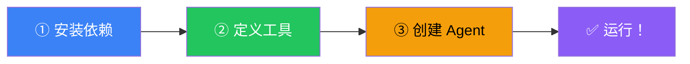
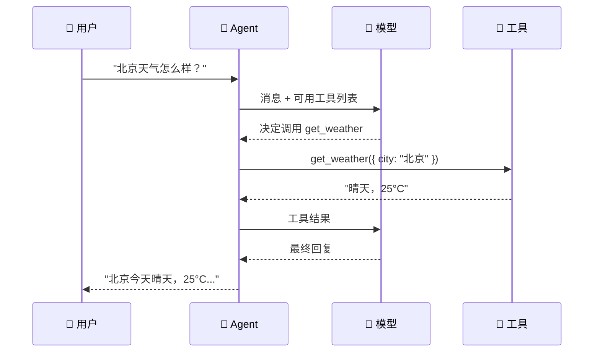

# Deep Agents 快速开始

## 安装

```bash
npm install deepagents @langchain/core zod
```

> 💡 需要 Node.js 18+。TypeScript 项目会自动获得类型支持。

## 三步创建 Agent



### 第一步：安装（已完成 ✅）

### 第二步：定义工具

```typescript
import { tool } from "langchain";
import { z } from "zod";

// 一个简单的天气查询工具
const getWeather = tool(
  ({ city }) => `今天${city}晴天，25°C，微风`,
  {
    name: "get_weather",
    description: "查询指定城市的当前天气",
    schema: z.object({
      city: z.string().describe("城市名称"),
    }),
  }
);
```

### 第三步：创建 Agent 并调用

```typescript
import { createDeepAgent } from "deepagents";

// 创建 Agent
const agent = createDeepAgent({
  tools: [getWeather],
  system: "你是一个天气查询助手，用中文回答。",
});

// 调用 Agent
const result = await agent.invoke({
  messages: [{ role: "user", content: "北京天气怎么样？" }],
});

const reply = result.messages[result.messages.length - 1];
console.log(reply.content);
// → "北京今天天气晴朗，25°C，有微风，很适合外出！☀️"
```

## 完整可运行示例

```typescript
import { createDeepAgent } from "deepagents";
import { tool } from "langchain";
import { z } from "zod";

// 工具 1：搜索
const search = tool(
  async ({ query }) => {
    // 模拟搜索
    return `搜索"${query}"的结果：LangChain 是一个 Agent 开发框架...`;
  },
  {
    name: "search",
    description: "搜索互联网获取信息",
    schema: z.object({ query: z.string() }),
  }
);

// 工具 2：计算器
const calculator = tool(
  ({ expression }) => {
    try {
      // ⚠️ 生产环境不要用 eval！
      return `计算结果：${eval(expression)}`;
    } catch {
      return "计算表达式有误";
    }
  },
  {
    name: "calculator",
    description: "计算数学表达式",
    schema: z.object({ expression: z.string() }),
  }
);

// 创建 Agent
const agent = createDeepAgent({
  tools: [search, calculator],
  system: `你是一个全能助手。
- 需要信息 → 用 search
- 需要计算 → 用 calculator
- 用中文回答`,
});

// 测试
async function main() {
  const r1 = await agent.invoke({
    messages: [{ role: "user", content: "帮我算一下 123 * 456" }],
  });
  console.log(r1.messages.at(-1)!.content);

  const r2 = await agent.invoke({
    messages: [{ role: "user", content: "LangChain 是什么？" }],
  });
  console.log(r2.messages.at(-1)!.content);
}

main();
```

## 配置模型

```typescript
// 用 Anthropic Claude
const agent = createDeepAgent({
  model: "anthropic:claude-sonnet-4-20250514",
  tools: [getWeather],
});

// 用 OpenAI GPT-4o
const agent2 = createDeepAgent({
  model: "openai:gpt-4o",
  tools: [getWeather],
});

// 开发省钱用 mini 版
const agent3 = createDeepAgent({
  model: "openai:gpt-4o-mini",
  tools: [getWeather],
});
```

## 流式输出

```typescript
const stream = await agent.stream({
  messages: [{ role: "user", content: "北京天气？" }],
});

for await (const chunk of stream) {
  if (chunk.type === "text") {
    process.stdout.write(chunk.content); // 边生成边输出
  }
}
```

## 运行流程



## 常见问题

| 问题 | 解决方案 |
|------|----------|
| `Cannot find module 'deepagents'` | 运行 `npm install deepagents` |
| Agent 不回复 | 检查 API Key 是否设置（`.env`） |
| TypeScript 类型报错 | 确保 zod 是 v3.x |
| 模型响应慢 | 开发阶段用 `gpt-4o-mini` |

## 下一步

- [创建 Agent](/deepagents/creation) — 更完整的配置选项
- [工具（Tools）](/deepagents/tools) — 创建更强大的工具
- [子 Agent（Subagents）](/deepagents/subagents) — 派生子任务处理
