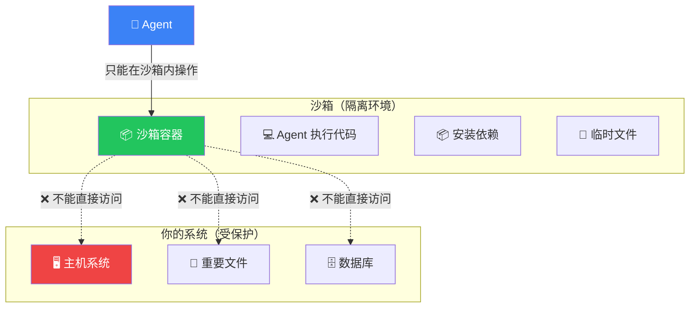
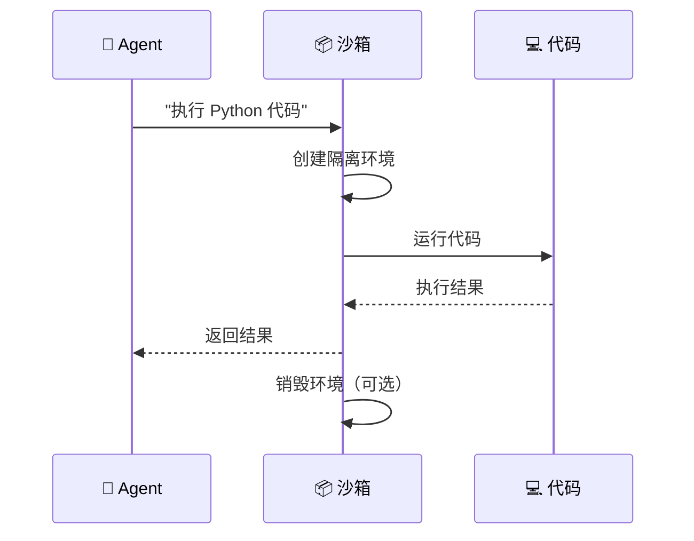

# 沙箱（Sandboxes）

## 这是什么？

沙箱 = Agent 的"安全实验室"。Agent 可以在沙箱里执行代码、安装依赖、做各种实验，但**不会影响你的系统**。

就像小朋友在游乐场玩——随便折腾，但出不了围栏。



## 为什么需要它？

| 没有沙箱 | 有沙箱 |
|----------|--------|
| Agent 直接在你的系统上跑代码 | Agent 在隔离环境中跑代码 |
| 写错了可能删文件、装错包 | 写错了只影响沙箱，随时重置 |
| 安全风险高 | 安全可控 |
| 依赖冲突 | 每个沙箱独立环境 |

## 使用方式

```typescript
import { createDeepAgent } from "deepagents";
import { tool } from "langchain";
import { z } from "zod";

// 代码执行工具
const runCode = tool(
  async ({ language, code }) => {
    // 沙箱会自动隔离执行
    return `执行结果：${code.slice(0, 50)}...`;
  },
  {
    name: "run_code",
    description: "在沙箱中执行代码",
    schema: z.object({
      language: z.enum(["python", "javascript", "bash"]),
      code: z.string(),
    }),
  }
);

const agent = createDeepAgent({
  sandbox: {
    enabled: true,
    type: "docker",
    config: {
      image: "python:3.12-slim",  // 沙箱镜像
      memory: "512m",              // 内存限制
      cpu: 1,                      // CPU 核数
      timeout: 30000,              // 执行超时（毫秒）
    },
  },
  tools: [runCode],
  system: "你可以执行 Python/JS 代码来完成计算任务。",
});
```

## 沙箱类型

| 类型 | 说明 | 适用场景 | 性能 |
|------|------|----------|------|
| `local` | 本地进程，轻量 | 开发测试 | ⚡ 最快 |
| `docker` | Docker 容器，隔离好 | 生产环境 | 🔄 中等 |
| `cloud` | 云端沙箱（e2b 等） | 大规模部署 | 🌐 依赖网络 |

### Docker 沙箱配置

```typescript
sandbox: {
  enabled: true,
  type: "docker",
  config: {
    image: "python:3.12-slim",   // 基础镜像
    memory: "512m",               // 内存限制
    cpu: 1,                       // CPU 核数
    timeout: 30000,               // 单次执行超时
    network: "none",              // 禁用网络（更安全）
    volumes: [],                  // 挂载卷
    env: {                        // 环境变量
      "PYTHONUNBUFFERED": "1",
    },
  },
}
```

### 云端沙箱（e2b）

```typescript
sandbox: {
  enabled: true,
  type: "cloud",
  cloud: {
    provider: "e2b",
    apiKey: process.env.E2B_API_KEY,
  },
}
```

## 执行流程



## 安全配置

```typescript
sandbox: {
  enabled: true,
  type: "docker",
  security: {
    network: "none",             // 禁用网络
    readOnly: true,              // 只读文件系统
    allowSyscalls: [],           // 允许的系统调用
    dropCapabilities: ["ALL"],   // 丢弃所有权限
  },
}
```

## 最佳实践

| 实践 | 说明 |
|------|------|
| **生产必须用沙箱** | 绝不让 Agent 直接在主机跑代码 |
| **限制资源** | 设置内存、CPU、超时上限 |
| **禁用网络** | 除非代码需要联网，否则禁用 |
| **只读优先** | 默认只读，需要写入时再开 |
| **镜像最小化** | 用 slim/alpine 镜像，减少攻击面 |
| **日志审计** | 记录所有沙箱执行日志 |

## 常见问题

| 问题 | 原因 | 解决方案 |
|------|------|----------|
| 沙箱启动慢 | Docker 镜像太大 | 用 slim 镜像，预构建缓存 |
| 代码执行超时 | 默认超时太短 | 增加 `timeout` 配置 |
| 依赖安装失败 | 沙箱网络被禁用 | 预装依赖，或开放网络白名单 |
| 磁盘空间不足 | 沙箱文件累积 | 定期清理，设置 `autoCleanup: true` |

## 下一步

- [生产部署](/deepagents/going-to-production) — 生产环境安全配置
- [工具](/deepagents/tools) — 创建安全的代码执行工具
- [人工介入](/deepagents/human-in-the-loop) — 代码执行前确认
