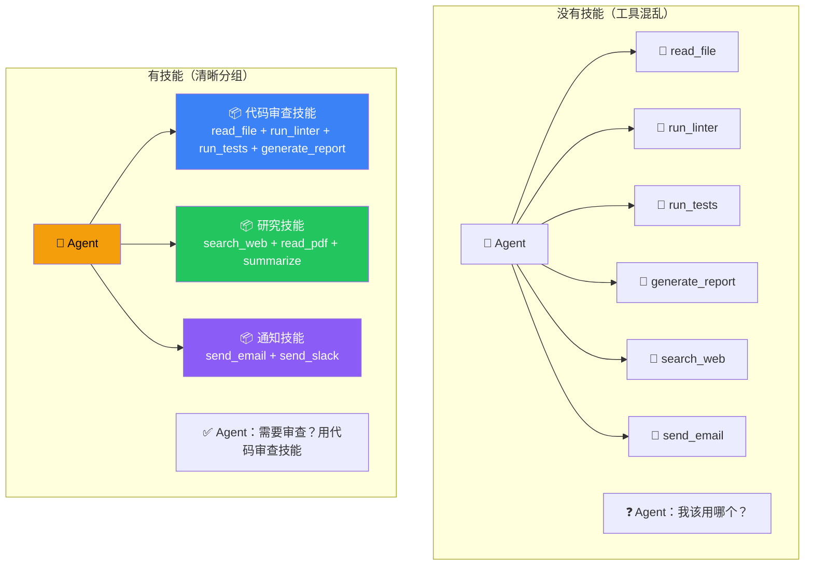
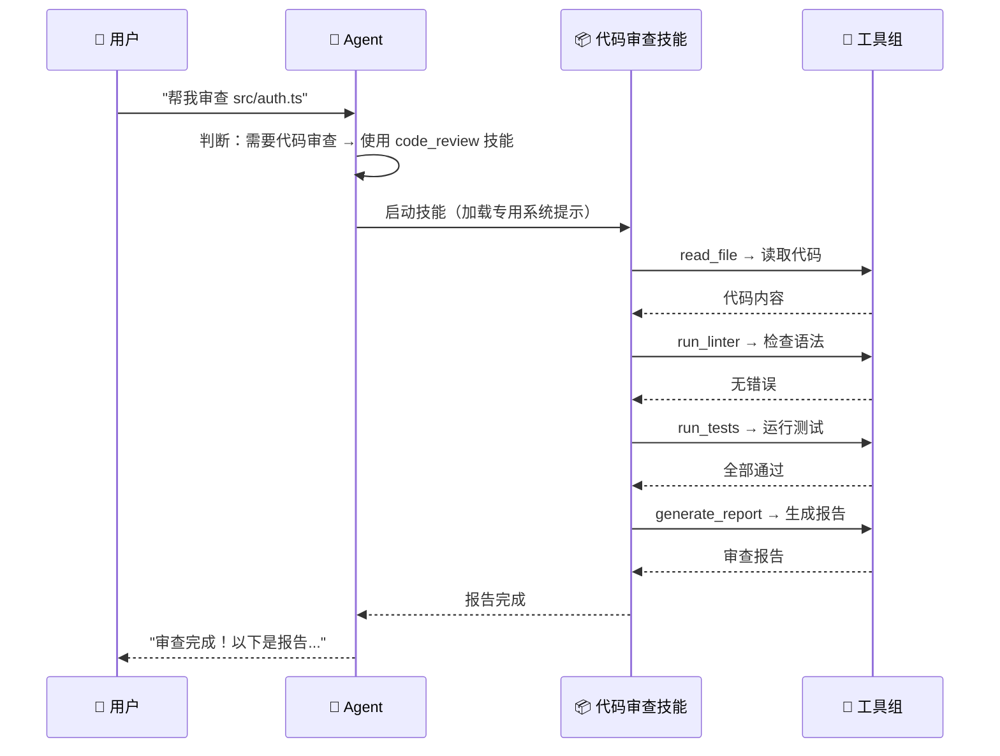

# 技能（Skills）

## 这是什么？

**技能 = 一组预定义的能力包**。它把多个工具、一个专门的系统提示、甚至一个子 Agent，打包成一个独立的能力模块。

打个比方：
- **工具** = 一把螺丝刀（单一操作）
- **技能** = 整个工具箱（一组操作 + 使用说明书）
- **子 Agent** = 一个工人（有自己的工具箱和判断力）

技能介于工具和子 Agent 之间——比工具更强大，比子 Agent 更轻量。

## 为什么用技能？

没有技能的话，你得把所有工具都塞进 Agent 的 `tools` 数组里，然后在系统提示里写"什么时候用什么工具"。工具一多，Agent 就会犹豫不决。

技能帮你做了**语义分组**——Agent 知道"代码审查技能"包含读代码、跑测试、生成报告，不需要分别决策每个工具的调用。



## 基本用法

```typescript
import { createDeepAgent } from "deepagents";
import { tool } from "langchain";
import { z } from "zod";

// 定义工具
const readFile = tool(
  async ({ path }) => fs.promises.readFile(path, "utf-8"),
  { name: "read_file", description: "读取文件", schema: z.object({ path: z.string() }) }
);

const runLinter = tool(
  async ({ path }) => `Lint 结果：${path} 无错误`,
  { name: "run_linter", description: "运行代码检查", schema: z.object({ path: z.string() }) }
);

const runTests = tool(
  async ({ path }) => `测试结果：全部通过 ✅`,
  { name: "run_tests", description: "运行单元测试", schema: z.object({ path: z.string() }) }
);

const generateReport = tool(
  async ({ findings }) => `审查报告：\n${findings}`,
  {
    name: "generate_report",
    description: "生成审查报告",
    schema: z.object({ findings: z.string() }),
  }
);

// ① 定义技能
const codeReviewSkill = {
  name: "code_review",
  description: "审查代码质量——读代码、检查语法、运行测试、生成报告",
  tools: [readFile, runLinter, runTests, generateReport],
  system: `你是一个资深代码审查专家。
规则：
1. 先读取代码，理解整体结构
2. 运行 linter 检查语法问题
3. 运行测试验证功能正确性
4. 汇总发现，生成审查报告
重点关注：代码风格、潜在 bug、性能问题、安全漏洞`,
};

// ② 把技能传给 Agent
const agent = createDeepAgent({
  skills: [codeReviewSkill],
  system: `你是一个开发助手。
- 用户要求审查代码 → 使用 code_review 技能
- 其他问题直接回答`,
});
```

## 技能 vs 工具 vs 子 Agent

| | 工具 | 技能 | 子 Agent |
|--|------|------|----------|
| **范围** | 单个操作 | 一组操作 + 专门的系统提示 | 独立的 Agent 实例 |
| **类比** | 一把螺丝刀 | 整个工具箱 | 一个工人 |
| **上下文** | 共享主 Agent | 共享主 Agent | 独立上下文 |
| **延迟** | 最低 | 低 | 较高（要启动子进程） |
| **适用** | 简单操作 | 中等复杂度任务 | 复杂独立任务 |
| **何时用** | 读文件、发请求 | 代码审查、数据分析 | 深度研究、内容创作 |

## 使用流程



## 更多技能示例

### 数据分析技能

```typescript
const dataAnalysisSkill = {
  name: "data_analysis",
  description: "分析数据——读取 CSV/JSON、统计分析、生成图表",
  tools: [readFile, runSQL, generateChart],
  system: `你是一个数据分析师。
步骤：
1. 读取数据文件，了解数据结构
2. 检查数据质量（缺失值、异常值）
3. 进行统计分析（均值、分布、相关性）
4. 生成可视化图表
5. 总结关键发现和建议`,
};
```

### 写作技能

```typescript
const writingSkill = {
  name: "technical_writing",
  description: "技术写作——搜索资料、整理大纲、撰写文档",
  tools: [searchWeb, readFile, writeFile],
  system: `你是一个技术写作专家。
流程：
1. 搜索相关资料
2. 整理大纲结构
3. 逐节撰写内容
4. 检查逻辑连贯性和可读性
风格：简洁专业，多用代码示例`,
};
```

## 技能配置选项

```typescript
interface Skill {
  name: string;                    // 唯一名称
  description: string;             // 主 Agent 看到的描述
  tools: Tool[];                   // 技能包含的工具
  system: string;                  // 技能专用的系统提示
  model?: string;                  // 可选：指定模型
  maxSteps?: number;               // 可选：最大执行步骤数
  timeout?: number;                // 可选：超时时间（毫秒）
}
```

## 最佳实践

| 实践 | 说明 |
|------|------|
| **一个技能一个主题** | 别把搜索、分析、写作混在一个技能里 |
| **描述要具体** | 写清楚"什么时候用这个技能" |
| **系统提示精简** | 技能的系统提示控制在 300 字以内 |
| **工具要限制** | 只给技能需要的工具，减少出错 |
| **技能可以组合** | 多个技能可以传给同一个 Agent |
| **用技能替代复杂工具链** | 当你发现系统提示里写了 3 个以上工具的使用说明，就该用技能了 |

## 常见问题

| 问题 | 原因 | 解决方案 |
|------|------|----------|
| Agent 不用技能 | description 不明确 | 写清楚触发条件 |
| 技能执行太慢 | 工具太多或网络慢 | 精简工具、增加超时 |
| 技能之间冲突 | 工具名重复 | 确保所有技能的工具名唯一 |
| 技能结果不对 | 系统提示太模糊 | 给更具体的执行步骤 |

## 下一步

- [工具（Tools）](/deepagents/tools) — 给技能添加工具
- [子 Agent（Subagents）](/deepagents/subagents) — 用子 Agent 处理更复杂的任务
- [创建 Agent](/deepagents/creation) — 把技能集成到 Agent 中
