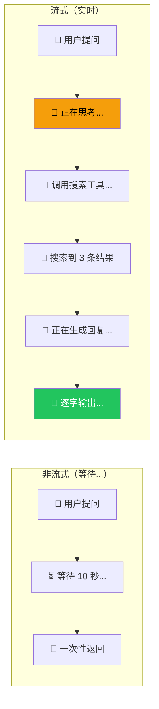
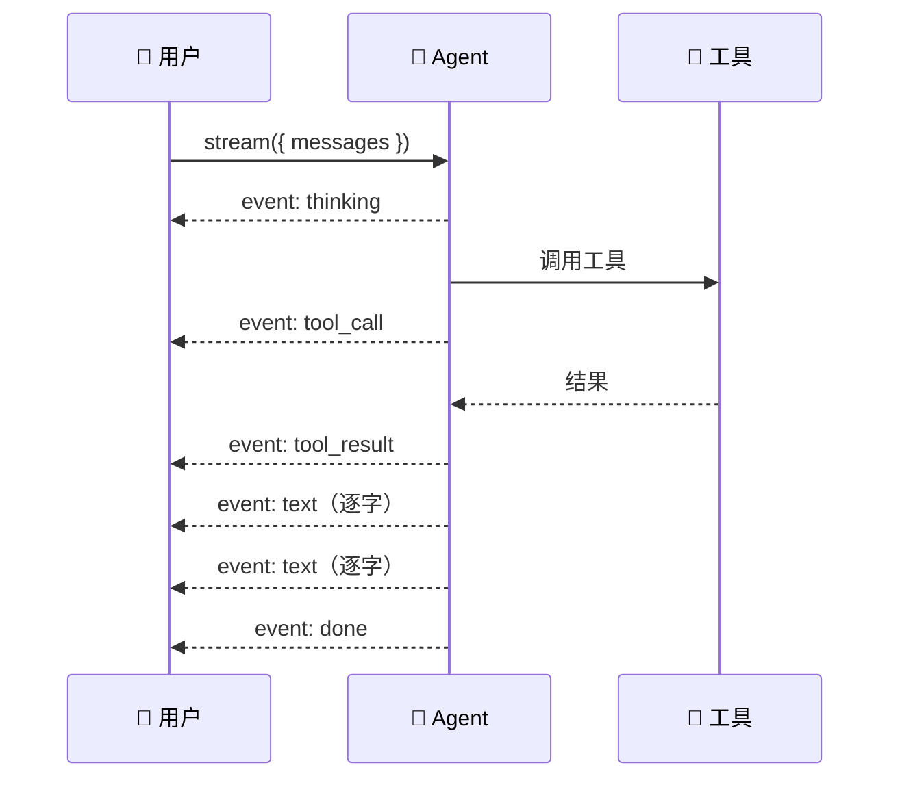

# 流式输出（Streaming）

## 这是什么？

> 不等外卖全部做好再通知你，而是"已接单" → "正在做" → "已出锅" → "已送达"，每个阶段都告诉你。

流式输出让 Agent 边思考边输出，用户能实时看到进度，不用盯着空白屏幕干等。



## 基本用法

```typescript
import { createDeepAgent } from "deepagents";

const agent = createDeepAgent({
  tools: [getWeather],
  system: "你是一个天气助手",
});

// 流式调用
const stream = await agent.stream({
  messages: [{ role: "user", content: "北京天气怎么样？" }],
});

// 逐块接收输出
for await (const chunk of stream) {
  switch (chunk.type) {
    case "text":
      process.stdout.write(chunk.content); // 逐字输出
      break;
    case "tool_call":
      console.log(`\n🔧 调用工具：${chunk.toolName}`);
      break;
    case "tool_result":
      console.log(`✅ 工具返回：${chunk.result.slice(0, 100)}`);
      break;
  }
}
```

## 流式事件类型

| 类型 | 说明 | 数据 |
|------|------|------|
| `text` | Agent 的文本输出（增量） | `{ content: string }` |
| `tool_call` | Agent 正在调用工具 | `{ toolName: string, args: object }` |
| `tool_result` | 工具返回结果 | `{ toolName: string, result: string }` |
| `subagent_start` | 子 Agent 开始执行 | `{ name: string, task: string }` |
| `subagent_end` | 子 Agent 执行完成 | `{ name: string, result: string }` |
| `thinking` | Agent 正在思考 | `{ content: string }` |
| `error` | 发生错误 | `{ message: string }` |
| `done` | 全部完成 | `{ finalMessage: string }` |

## 完整示例：带进度展示

```typescript
import { createDeepAgent } from "deepagents";

const agent = createDeepAgent({
  tools: [search, calculator],
  system: "你是一个全能助手。",
});

async function chat(userMessage: string) {
  const stream = await agent.stream({
    messages: [{ role: "user", content: userMessage }],
  });

  console.log("📋 Agent 执行进度：\n");

  for await (const chunk of stream) {
    switch (chunk.type) {
      case "thinking":
        console.log("🤔 正在思考...");
        break;
      case "tool_call":
        console.log(`🔧 调用工具：${chunk.toolName}(${JSON.stringify(chunk.args)})`);
        break;
      case "tool_result":
        console.log(`✅ 工具完成\n`);
        break;
      case "subagent_start":
        console.log(`👥 启动子 Agent：${chunk.name}`);
        break;
      case "subagent_end":
        console.log(`✅ 子 Agent 完成：${chunk.name}\n`);
        break;
      case "text":
        process.stdout.write(chunk.content);
        break;
      case "done":
        console.log("\n\n🎉 完成！");
        break;
    }
  }
}

chat("帮我研究一下 LangChain 是什么，然后写一篇入门文章");
```

## 与前端集成

```typescript
// Next.js API Route
export async function POST(req: Request) {
  const { messages } = await req.json();
  const stream = await agent.stream({ messages });

  // 返回 SSE 流
  return new Response(
    new ReadableStream({
      async start(controller) {
        for await (const chunk of stream) {
          controller.enqueue(
            `data: ${JSON.stringify(chunk)}\n\n`
          );
        }
        controller.close();
      },
    }),
    {
      headers: {
        "Content-Type": "text/event-stream",
        "Cache-Control": "no-cache",
      },
    }
  );
}
```

## 事件流架构



## 最佳实践

| 实践 | 说明 |
|------|------|
| **前端用 SSE** | Server-Sent Events 最简单可靠 |
| **缓冲 text 事件** | 别每个字都更新 UI，按句/段更新 |
| **展示工具调用** | 让用户知道 Agent 在做什么 |
| **错误要处理** | `error` 事件别忽略 |
| **设置超时** | 防止流永远不结束 |

## 下一步

- [前端集成](/deepagents/frontend) — 构建实时 Web UI
- [子 Agent](/deepagents/subagents) — 流式获取子 Agent 进度
