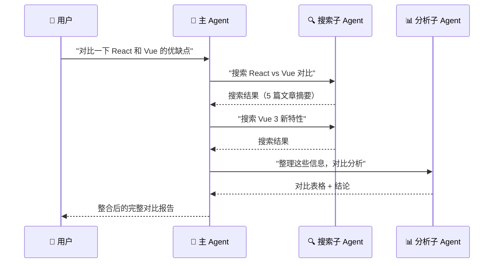

# 子 Agent（Subagents）

## 这是什么？

主 Agent 太忙了？派一个小弟去干专门的活。

子 Agent 是主 Agent 的"分身"——它有自己的工具、自己的上下文，干完活把结果汇报给主 Agent。

```mermaid
graph TB
    User["👤 用户"] -->|"复杂任务"| Main["🤖 主 Agent"]
    Main -->|"搜索任务"| Sub1["🔍 搜索子 Agent"]
    Main -->|"分析任务"| Sub2["📊 分析子 Agent"]
    Main -->|"写作任务"| Sub3["✍️ 写作子 Agent"]
    Sub1 -->|"搜索结果"| Main
    Sub2 -->|"分析报告"| Main
    Sub3 →|"文章初稿"| Main
    Main -->|"整合结果"| User

    style Main fill:#3b82f6,color:#fff
    style Sub1 fill:#22c55e,color:#fff
    style Sub2 fill:#f59e0b,color:#000
    style Sub3 fill:#8b5cf6,color:#fff
```

## 为什么用它？

| 场景 | 好处 | 示例 |
|------|------|------|
| **复杂任务拆分** | 每个子 Agent 专注一件事 | 搜索 Agent 专门搜，写作 Agent 专门写 |
| **上下文隔离** | 子 Agent 的对话不会污染主 Agent | 搜索 10 轮不影响主 Agent 的简洁性 |
| **并行处理** | 多个子 Agent 同时干活 | 同时搜 Google 和 Bing |
| **专用系统提示** | 每个子 Agent 有独立的角色设定 | 搜索 Agent 强调"找到最新信息" |
| **独立工具集** | 子 Agent 只有自己需要的工具 | 搜索 Agent 只有搜索工具，不能写文件 |

## 基本用法

```typescript
import { createDeepAgent, createSubagent } from "deepagents";
import { tool } from "langchain";
import { z } from "zod";

// 定义搜索工具
const searchWeb = tool(
  async ({ query }) => {
    const res = await fetch(`https://api.search.example.com/search?q=${query}`);
    const data = await res.json();
    return data.results.map((r: any) => `- ${r.title}: ${r.snippet}`).join("\n");
  },
  {
    name: "search_web",
    description: "搜索互联网",
    schema: z.object({ query: z.string() }),
  }
);

// ① 创建搜索子 Agent
const searchAgent = createSubagent({
  name: "searcher",
  description: "搜索专家，擅长从互联网找到相关信息",
  tools: [searchWeb],
  system: `你是一个搜索专家。
- 搜索时尝试多个关键词组合
- 找到信息后用简洁的语言总结
- 标注信息来源和时间`,
});

// ② 创建分析子 Agent
const analysisAgent = createSubagent({
  name: "analyst",
  description: "数据分析专家，擅长从信息中提取关键洞察",
  tools: [],
  system: `你是一个数据分析专家。
- 从提供的信息中提取关键数据点
- 用表格或列表整理数据
- 给出数据驱动的结论`,
});

// ③ 主 Agent 把任务派给子 Agent
const agent = createDeepAgent({
  tools: [searchAgent, analysisAgent],
  system: `你是一个研究助手。
- 需要搜索信息 → 派 searcher 去做
- 需要分析数据 → 派 analyst 去做
- 最终由你整合结果，回复用户`,
});
```

## 调用流程



## 并行子 Agent

多个子 Agent 同时执行，加快速度：

```typescript
const googleAgent = createSubagent({
  name: "google_searcher",
  description: "用 Google 搜索信息",
  tools: [googleSearch],
  system: "用 Google 搜索，返回最相关的结果。",
});

const bingAgent = createSubagent({
  name: "bing_searcher",
  description: "用 Bing 搜索信息",
  tools: [bingSearch],
  system: "用 Bing 搜索，返回最相关的结果。",
});

const agent = createDeepAgent({
  tools: [googleAgent, bingAgent],
  system: `需要搜索时，同时派 google_searcher 和 bing_searcher 去做，
综合两边的结果再回复用户。`,
});
```

## 子 Agent 配置

```typescript
const subagent = createSubagent({
  // 必填
  name: "writer",                    // 唯一名称，主 Agent 用这个调用
  description: "专业写作助手",        // 主 Agent 看到的描述
  tools: [readFile, writeFile],      // 子 Agent 能用的工具

  // 可选
  system: "你是一个专业的技术写作助手...",  // 子 Agent 的系统提示
  model: "anthropic:claude-sonnet-4-20250514",     // 可以用不同的模型
  memory: { shortTerm: true },       // 子 Agent 的记忆配置
});
```

| 参数 | 说明 |
|------|------|
| `name` | 唯一名称，主 Agent 用它来指派任务 |
| `description` | 主 Agent 看到的描述，决定什么时候派这个子 Agent |
| `tools` | 子 Agent 能使用的工具列表 |
| `system` | 子 Agent 的系统提示 |
| `model` | 可选，子 Agent 使用的模型（可以和主 Agent 不同） |
| `memory` | 可选，子 Agent 的记忆配置 |

## 结果汇报

子 Agent 完成任务后，会自动把结果汇报给主 Agent：

```typescript
// 主 Agent 的视角：
// 1. 用户问了一个问题
// 2. 主 Agent 决定派 searcher 去搜索
// 3. searcher 返回了搜索结果（自动注入主 Agent 的上下文）
// 4. 主 Agent 基于搜索结果生成回复
```

> 💡 子 Agent 的**完整执行历史**会压缩后传给主 Agent。主 Agent 能看到子 Agent 做了什么、得到了什么结果。

## 实战：研究助手

```typescript
import { createDeepAgent, createSubagent } from "deepagents";

// 搜索子 Agent
const searcher = createSubagent({
  name: "researcher",
  description: "深度研究专家",
  tools: [searchWeb, readPDF],
  system: `你是一个深度研究专家。
- 搜索多个来源
- 验证信息的可靠性
- 用结构化格式总结发现`,
});

// 写作子 Agent
const writer = createSubagent({
  name: "writer",
  description: "技术写作专家",
  tools: [],
  system: `你是一个技术写作专家。
- 语言简洁专业
- 用 Markdown 格式
- 包含引用来源`,
});

// 主 Agent
const researchAgent = createDeepAgent({
  tools: [searcher, writer],
  system: `你是一个研究协调助手。
流程：
1. 收到研究课题后，派 researcher 深度搜索
2. 收到搜索结果后，可以要求 researcher 补充搜索
3. 信息足够后，派 writer 撰写报告
4. 审核报告质量，必要时让 writer 修改`,
});
```

## 最佳实践

- **一个子 Agent 一件事**——别让一个子 Agent 同时做搜索和分析
- **描述要清楚**——主 Agent 靠 `description` 决定派谁
- **工具要限制**——子 Agent 只给它需要的工具，减少出错的可能
- **系统提示要精简**——子 Agent 只关心自己的任务
- **别嵌套太深**——子 Agent 再派子 Agent 会增加延迟和成本

## 下一步

- [异步子 Agent](/deepagents/async-subagents) — 异步执行子 Agent
- [上下文工程](/deepagents/context-engineering) — 管理 Agent 的上下文
- [工具（Tools）](/deepagents/tools) — 给 Agent 和子 Agent 添加工具
