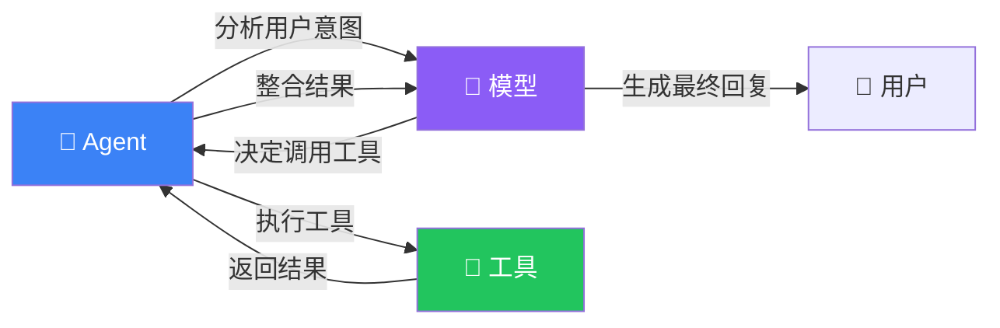
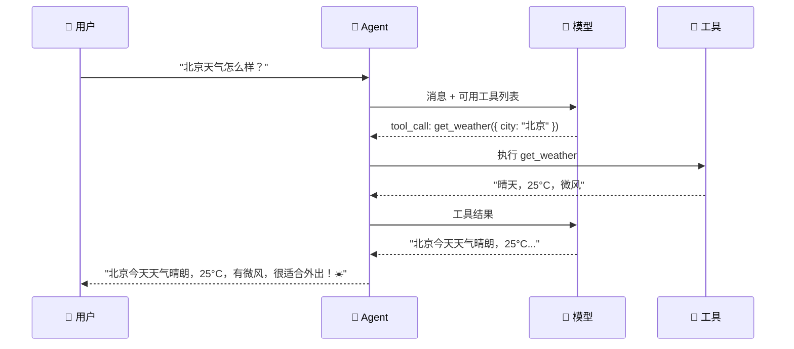

# 工具（Tools）

## 这是什么？

工具是 Agent 与外部世界交互的方式。Agent 不能直接查天气、搜网页、读数据库——**工具帮它做到这些**。



## 创建工具

```typescript
import { tool } from "langchain";
import { z } from "zod";

const getWeather = tool(
  ({ city }) => {
    // 同步工具：直接返回结果
    const weatherMap: Record<string, string> = {
      "北京": "晴天，25°C，微风",
      "上海": "多云，22°C，东南风",
    };
    return weatherMap[city] || `${city}：暂无天气数据`;
  },
  {
    name: "get_weather",
    description: "查询指定城市的当前天气，返回天气状况和温度",
    schema: z.object({
      city: z.string().describe("城市名称，如：北京、上海、深圳"),
    }),
  }
);
```

### ⚠️ 描述很重要

Agent 靠 `description` 决定**什么时候该调用这个工具**。写得越清楚，调用越准确。

```typescript
// ❌ 差的描述
description: "获取信息"

// ✅ 好的描述
description: "查询指定城市的当前天气状况，包括温度、风力和天气类型（晴/雨/阴）"
```

## 异步工具

```typescript
const searchWeb = tool(
  async ({ query, limit }) => {
    // 异步工具：可以做网络请求、数据库查询等
    const response = await fetch(
      `https://api.search.example.com/search?q=${encodeURIComponent(query)}&limit=${limit}`
    );
    const data = await response.json();

    // 格式化返回结果
    return data.results
      .map((r: any) => `- ${r.title}: ${r.snippet}`)
      .join("\n");
  },
  {
    name: "search_web",
    description: "在互联网上搜索信息，返回相关网页的标题和摘要",
    schema: z.object({
      query: z.string().describe("搜索关键词"),
      limit: z.number().optional().describe("返回结果数量，默认 5"),
    }),
  }
);
```

## 带错误处理的工具

```typescript
const readFile = tool(
  async ({ path }) => {
    try {
      const content = await fs.promises.readFile(path, "utf-8");
      return content;
    } catch (error: any) {
      if (error.code === "ENOENT") {
        return `错误：文件 "${path}" 不存在`;
      }
      if (error.code === "EACCES") {
        return `错误：没有读取 "${path}" 的权限`;
      }
      return `错误：读取文件失败 — ${error.message}`;
    }
  },
  {
    name: "read_file",
    description: "读取指定路径的文件内容",
    schema: z.object({
      path: z.string().describe("文件路径，如：/tmp/data.txt"),
    }),
  }
);
```

> 💡 **错误信息会返回给 Agent**——它会理解错误并决定下一步怎么做（换路径、告诉用户等）。所以错误信息要**清晰具体**。

## 工具返回值格式

工具返回的内容会直接进入 Agent 的上下文。格式化好一点，Agent 理解得更准确。

```typescript
// ❌ 返回原始 JSON（Agent 要自己解析）
return JSON.stringify(hugeDataObject);

// ✅ 返回格式化文本（Agent 直接能用）
const formatResults = (results: any[]) => {
  return results
    .map((r, i) => `${i + 1}. **${r.title}**\n   ${r.summary}\n   来源: ${r.url}`)
    .join("\n\n");
};
```

## 组合使用

```typescript
import { createDeepAgent } from "deepagents";

const agent = createDeepAgent({
  tools: [getWeather, searchWeb, readFile, calculator],
  system: `你是一个全能助手。
- 用户问天气 → 用 get_weather
- 用户要搜东西 → 用 search_web
- 用户要读文件 → 用 read_file
- 用户要算数 → 用 calculator`,
});
```

## 工具执行流程



## 常见踩坑

| 问题 | 原因 | 解决方案 |
|------|------|----------|
| Agent 不调用工具 | 描述太模糊 | 把描述写具体，包括参数说明 |
| 工具返回了太多数据 | 没有限制输出长度 | 截断或分页，控制在 2000 字符内 |
| 工具报错后 Agent 卡住 | 没有错误处理 | 用 try/catch 返回友好的错误信息 |
| schema 类型错误 | zod 定义不严格 | 用 `.describe()` 加参数说明 |
| 工具名冲突 | 多个工具同名 | 确保每个工具的 `name` 唯一 |

## 下一步

- [子 Agent（Subagents）](/deepagents/subagents) — 把复杂任务委派给专门的 Agent
- [中间件](/langchain/middleware) — 用中间件增强工具行为
- [技能（Skills）](/deepagents/skills) — 把工具打包成可复用的技能
