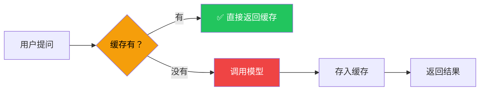

# 缓存集成

## 这是什么？

同样的问题问两次，第二次直接返回缓存结果，不用再调模型。省钱、省时间。

类比：缓存就像便签纸——第一次查到答案后写在便签上贴桌上，下次同样的问题先看便签，不用再查。

## 工作原理



## 基本用法

```typescript
import { InMemoryCache } from "@langchain/core/caches";
import { ChatOpenAI } from "@langchain/openai";

const cache = new InMemoryCache();

const model = new ChatOpenAI({
  model: "gpt-4o",
  cache,  // 传入缓存实例
});

// 第一次调用：调模型（慢，花钱）
const r1 = await model.invoke("什么是 LangChain？");

// 第二次调用：从缓存返回（快，免费）
const r2 = await model.invoke("什么是 LangChain？");
```

## 缓存后端

| 后端 | 包 | 适用场景 |
|------|-----|----------|
| `InMemoryCache` | `@langchain/core/caches` | 开发测试（重启后丢失） |
| `RedisCache` | `@langchain/community/caches/ioredis` | 生产环境（高性能） |
| `MomentoCache` | `@langchain/community/caches/momento` | 云端托管 |

## Redis 缓存

```typescript
import { RedisCache } from "@langchain/community/caches/ioredis";
import Redis from "ioredis";

const redis = new Redis("redis://localhost:6379");
const cache = new RedisCache(redis);

const model = new ChatOpenAI({
  model: "gpt-4o",
  cache,
});
```

## 缓存策略

| 策略 | 说明 | 适用场景 |
|------|------|----------|
| **完全匹配** | 输入完全一致才命中 | 确定性问题 |
| **语义匹配** | 含义相似即命中（需要额外实现） | 用户表述不一致 |
| **TTL 过期** | 缓存多久后自动失效 | 时效性数据 |

## 最佳实践

| 实践 | 说明 |
|------|------|
| 开发用 Memory，生产用 Redis | 开发阶段快速迭代，生产需要持久化 |
| 设定 TTL | 数据变更后缓存要能过期 |
| temperature=0 时效果最好 | 温度为 0 时输出确定，缓存命中率最高 |
| 监控缓存命中率 | 命中率低说明缓存策略需要调整 |

## 常见问题

| 问题 | 解答 |
|------|------|
| 缓存会让回答变旧吗？ | 会。设定 TTL 或在关键场景跳过缓存 |
| 不同模型能共享缓存吗？ | 不建议，不同模型输出不同 |
| temperature > 0 时缓存有用吗？ | 有用但命中率低，建议只缓存 temperature=0 的调用 |

## 下一步

- [可观测性 →](/langchain/observability)
- [中间件 →](/integrations/middleware)
