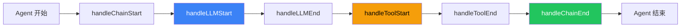

# 回调集成

## 这是什么？

回调（Callback）= Agent 执行过程中的"通知系统"。模型调用开始、结束、工具执行、链流转……每个阶段都会触发回调，你可以在这里做日志、监控、计费。

类比：就像快递的物流跟踪——每个节点（揽收、运输、派送）都会更新状态。回调就是 Agent 的"物流跟踪"。

## 工作原理



## 回调事件

| 事件 | 触发时机 | 典型用途 |
|------|----------|----------|
| `handleLLMStart` | 模型开始调用 | 记录输入 prompt |
| `handleLLMEnd` | 模型调用结束 | 记录输出、计费 |
| `handleLLMError` | 模型调用出错 | 错误告警 |
| `handleToolStart` | 工具开始执行 | 记录工具调用 |
| `handleToolEnd` | 工具执行结束 | 记录工具结果 |
| `handleChainStart` | 链/Agent 开始 | 追踪执行流程 |
| `handleChainEnd` | 链/Agent 结束 | 记录总耗时 |

## 使用示例

### 基本日志回调

```typescript
import { BaseCallbackHandler } from "@langchain/core/callbacks/base";
import { createAgent } from "langchain";

const logger = BaseCallbackHandler.fromMethods({
  handleLLMStart: (_llm, prompts) => {
    console.log("🧠 模型调用开始:", prompts[0].slice(0, 100) + "...");
  },
  handleLLMEnd: (output) => {
    console.log("✅ 模型调用结束");
  },
  handleToolStart: (_tool, input) => {
    console.log("🔧 工具调用:", input);
  },
  handleToolEnd: (output) => {
    console.log("📋 工具返回:", output.slice(0, 100));
  },
});

const agent = createAgent({
  model: "openai:gpt-4o",
  tools: [myTool],
  callbacks: [logger],
});
```

### 计费统计回调

```typescript
const costTracker = BaseCallbackHandler.fromMethods({
  handleLLMEnd: (output) => {
    const usage = output.llmOutput?.tokenUsage;
    if (usage) {
      console.log(`Token 消耗: ${usage.totalTokens} (输入: ${usage.promptTokens}, 输出: ${usage.completionTokens})`);
    }
  },
});
```

## 最佳实践

| 实践 | 说明 |
|------|------|
| 生产环境必加日志回调 | 排查问题的关键 |
| 监控 token 消耗 | 防止意外烧钱 |
| 错误回调要告警 | 不要只 console.log，要通知到人 |
| 回调不要太重 | 回调在主流程中同步执行，太重会拖慢 Agent |

## 常见问题

| 问题 | 解答 |
|------|------|
| 回调和中间件的区别？ | 中间件控制流程（限流、重试），回调只监听不干预 |
| 能加多个回调吗？ | 能，`callbacks` 接受数组 |
| 回调是同步还是异步？ | 支持异步，但要注意不要阻塞主流程 |

## 下一步

- [可观测性 →](/langchain/observability)
- [中间件 →](/integrations/middleware)
