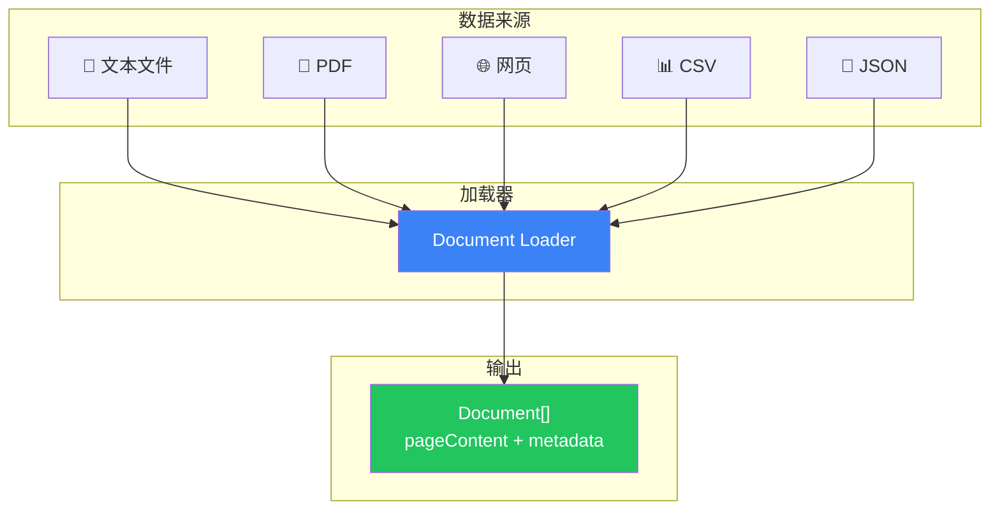

# 文档加载器

## 这是什么？

文档加载器 = 从各种来源（PDF、网页、数据库等）读取内容，转成统一的 `Document` 格式。

类比：不同格式的文件（PDF、Word、网页）就像不同语言的人，加载器是"翻译官"，把它们统一成 LangChain 能理解的格式。

## 工作流程



## 常用加载器

| 来源 | 加载器 | 包 |
|------|--------|------|
| 文本文件 | `TextLoader` | `langchain/document_loaders/fs/text` |
| PDF | `PDFLoader` | `@langchain/community/document_loaders/fs/pdf` |
| 网页 | `CheerioWebBaseLoader` | `@langchain/community/document_loaders/web/cheerio` |
| CSV | `CSVLoader` | `langchain/document_loaders/fs/csv` |
| JSON | `JSONLoader` | `langchain/document_loaders/fs/json` |
| 目录 | `DirectoryLoader` | `langchain/document_loaders/fs/directory` |
| Notion | `NotionLoader` | `@langchain/community/document_loaders/web/notion` |

## 使用示例

### 加载文本文件

```typescript
import { TextLoader } from "langchain/document_loaders/fs/text";

const loader = new TextLoader("./data.txt");
const docs = await loader.load();
console.log(docs[0].pageContent);  // 文件内容
console.log(docs[0].metadata);     // { source: "./data.txt" }
```

### 加载 PDF

```typescript
import { PDFLoader } from "@langchain/community/document_loaders/fs/pdf";

const loader = new PDFLoader("./report.pdf", {
  splitPages: true,  // 每页一个 Document
});
const docs = await loader.load();
console.log(`共 ${docs.length} 页`);
```

### 加载网页

```typescript
import { CheerioWebBaseLoader } from "@langchain/community/document_loaders/web/cheerio";

const loader = new CheerioWebBaseLoader("https://example.com/article");
const docs = await loader.load();
console.log(docs[0].pageContent);  // 网页正文
```

### 批量加载目录

```typescript
import { DirectoryLoader } from "langchain/document_loaders/fs/directory";
import { TextLoader } from "langchain/document_loaders/fs/text";
import { PDFLoader } from "@langchain/community/document_loaders/fs/pdf";

const loader = new DirectoryLoader("./docs", {
  ".txt": (path) => new TextLoader(path),
  ".pdf": (path) => new PDFLoader(path),
});

const docs = await loader.load();
console.log(`共加载 ${docs.length} 个文档`);
```

## Document 结构

```typescript
interface Document {
  pageContent: string;   // 文档内容
  metadata: Record<string, any>;  // 元数据（来源、页码等）
}
```

## 最佳实践

| 实践 | 说明 |
|------|------|
| 保留 metadata | 加载时带上来源路径，方便追溯 |
| 大文件分页加载 | PDF 建议 `splitPages: true` |
| 网页加载注意反爬 | 部分网站需要设置 User-Agent |
| 组合使用 | `DirectoryLoader` + 多种子加载器批量处理 |

## 下一步

- [文档转换器 →](/integrations/document-transformers)
- [文本切分器 →](/integrations/splitters)
- [RAG 实战 →](/tutorials/rag-qa)
