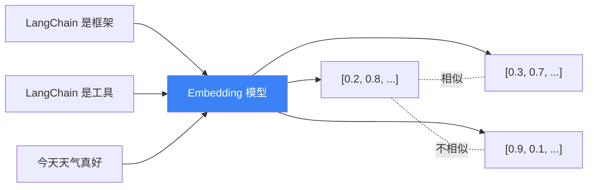

# Embedding 模型集成

## 这是什么？

Embedding = 把文字变成数字向量。语义相似的文字，向量也相似。这样计算机就能"理解"文字的含义，进行语义搜索。

类比：给每个词发一个"身份证号码"——意思相近的词，号码也相近。这样找"相似含义"就像查号码簿。

## 工作原理



## OpenAI Embeddings

```typescript
import { OpenAIEmbeddings } from "@langchain/openai";

const embeddings = new OpenAIEmbeddings({
  model: "text-embedding-3-small",  // 推荐，性价比高
  // model: "text-embedding-3-large",  // 精度更高，但更贵
});

// 单条文本 → 向量
const vector = await embeddings.embedQuery("你好世界");
console.log(vector.length);  // → 1536（维度数）

// 批量文本 → 向量数组
const vectors = await embeddings.embedDocuments(["你好", "世界", "LangChain"]);
console.log(vectors.length);  // → 3
```

## 在向量库中使用

```typescript
import { OpenAIEmbeddings } from "@langchain/openai";
import { MemoryVectorStore } from "langchain/vectorstores/memory";

const embeddings = new OpenAIEmbeddings({ model: "text-embedding-3-small" });

// 从文档创建向量库
const vectorStore = await MemoryVectorStore.fromDocuments(docs, embeddings);

// 搜索
const results = await vectorStore.similaritySearch("Agent 是什么", 3);
```

## Embedding 模型选择

| 模型 | 维度 | 价格 | 适用场景 |
|------|------|------|----------|
| `text-embedding-3-small` | 1536 | 便宜 | 通用，性价比首选 |
| `text-embedding-3-large` | 3072 | 贵 | 需要高精度 |
| `text-embedding-3-small` + dimensions 参数 | 可调 | 便宜 | 需要降维 |

## 其他厂商

| 厂商 | 包 | 模型 |
|------|-----|------|
| Azure | `@langchain/openai` | Azure OpenAI Embeddings |
| AWS Bedrock | `@langchain/aws` | Amazon Titan Embeddings |
| Google | `@langchain/google-genai` | Google Embeddings |

## 最佳实践

| 实践 | 说明 |
|------|------|
| 同一项目用同一个模型 | 不同模型的向量空间不兼容 |
| 先试 small 模型 | 性价比高，大部分场景够用 |
| 批量 embed 省钱 | 用 `embedDocuments` 批量处理，比逐条 `embedQuery` 便宜 |
| 向量要存持久化存储 | Memory 重启丢失，生产用 Pinecone/Qdrant |

## 常见问题

| 问题 | 解答 |
|------|------|
| 向量维度是什么意思？ | 数字向量的长度，维度越高表示越精细 |
| 能自己训练 Embedding 模型吗？ | 能，但对大多数场景用预训练模型就够了 |
| 中文效果好吗？ | `text-embedding-3-small` 对中文效果不错 |

## 下步

- [RAG 实战 →](/tutorials/rag-qa)
- [向量库存储 →](/integrations/stores)
- [检索器 →](/integrations/retrievers)
