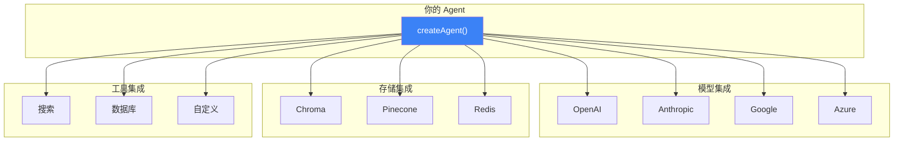

# 集成概览

LangChain 的一大优势就是**丰富的集成生态**——主流模型、向量库、工具几乎开箱即用，不用自己写适配层。

## 集成架构

## Chat 模型集成

| 厂商 | 包名 | 推荐模型 | 说明 |
|------|------|----------|------|
| OpenAI | `@langchain/openai` | gpt-4o, gpt-4o-mini | 生态最全，性价比高 |
| Anthropic | `@langchain/anthropic` | claude-sonnet-4, claude-haiku-4 | 长上下文强，安全性高 |
| Google | `@langchain/google-genai` | gemini-2.0-flash | 速度快，多模态好 |
| Azure | `@langchain/openai` | Azure OpenAI | 企业级，合规性强 |
| AWS Bedrock | `@langchain/aws` | Claude on AWS | AWS 生态集成 |

详见 → [Chat 模型集成](/integrations/chat)

## Embedding 集成

| 厂商 | 包名 | 推荐模型 |
|------|------|----------|
| OpenAI | `@langchain/openai` | text-embedding-3-small |
| Azure | `@langchain/openai` | Azure OpenAI Embeddings |
| Bedrock | `@langchain/aws` | Amazon Titan Embeddings |

详见 → [Embedding 集成](/integrations/embeddings)

## 向量库存储

| 向量库 | 包名 | 特点 |
|--------|------|------|
| Memory | `langchain/vectorstores/memory` | 内存，开发测试用 |
| Chroma | `@langchain/community/vectorstores/chroma` | 轻量本地，入门首选 |
| Pinecone | `@langchain/pinecone` | 云端托管，生产级 |
| Qdrant | `@langchain/qdrant` | 高性能，支持过滤 |
| Weaviate | `@langchain/weaviate` | 开源搜索引擎 |
| FAISS | `faiss-node` | Facebook 高性能库 |

详见 → [存储集成](/integrations/stores)

## 工具集成

| 工具 | 说明 | 包 |
|------|------|------|
| Google Search | Google 搜索 | `@langchain/google-custom-search` |
| Anthropic Tools | Anthropic 内置工具 | `@langchain/anthropic` |
| Web Browser | 网页浏览 | `@langchain/community/tools/web_browser` |
| MCP | 模型上下文协议工具 | `@langchain/mcp` |

详见 → [工具集成](/integrations/tools)

## 其他集成

| 类别 | 说明 | 链接 |
|------|------|------|
| **文档加载器** | PDF、网页、CSV 等来源 | [文档加载器](/integrations/document-loaders) |
| **文本切分器** | 长文档切分 | [文本切分器](/integrations/splitters) |
| **文档转换器** | 文档预处理 | [文档转换器](/integrations/document-transformers) |
| **检索器** | 向量相似度搜索 | [检索器](/integrations/retrievers) |
| **缓存** | 模型结果缓存 | [缓存集成](/integrations/caching) |
| **中间件** | 限流、重试、日志 | [中间件集成](/integrations/middleware) |
| **回调** | 执行过程监听 | [回调集成](/integrations/callbacks) |

## 下一步

- [Chat 模型 →](/integrations/chat)
- [Embedding 模型 →](/integrations/embeddings)
- [快速开始 →](/overview/quickstart)
