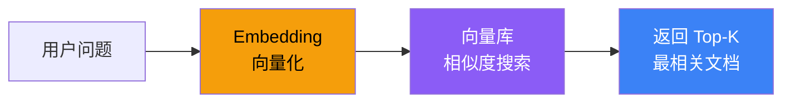

# 检索器

## 这是什么？

检索器（Retriever）= 从大量文档中找到与用户问题最相关的几条。它是 RAG 系统的核心组件。

类比：你去图书馆找资料，检索器就是那个帮你查目录、找书架、挑出最相关章节的图书管理员。

## 工作流程



## 基本用法

```typescript
import { OpenAIEmbeddings } from "@langchain/openai";
import { MemoryVectorStore } from "langchain/vectorstores/memory";
import { Document } from "@langchain/core/documents";

// ① 准备文档
const docs = [
  new Document({ pageContent: "LangChain 是 Agent 开发框架", metadata: { source: "intro" } }),
  new Document({ pageContent: "LangGraph 是底层编排运行时", metadata: { source: "intro" } }),
  new Document({ pageContent: "Deep Agents 开箱即用", metadata: { source: "intro" } }),
];

// ② 创建向量库
const embeddings = new OpenAIEmbeddings({ model: "text-embedding-3-small" });
const vectorStore = await MemoryVectorStore.fromDocuments(docs, embeddings);

// ③ 检索
const results = await vectorStore.similaritySearch("什么是 LangGraph", 2);
console.log(results.map(r => r.pageContent));
// → ["LangGraph 是底层编排运行时", "LangChain 是 Agent 开发框架"]
```

## 带分数检索

相似度分数越接近 1，表示越相关：

```typescript
const results = await vectorStore.similaritySearchWithScore("Agent 框架", 3);

for (const [doc, score] of results) {
  console.log(`[相似度: ${score.toFixed(3)}] ${doc.pageContent}`);
}
// → [相似度: 0.892] LangChain 是 Agent 开发框架
// → [相似度: 0.756] Deep Agents 开箱即用
// → [相似度: 0.621] LangGraph 是底层编排运行时
```

## 自定义 Retriever

```typescript
import { BaseRetriever } from "@langchain/core/retrievers";
import { Document } from "@langchain/core/documents";

class CustomRetriever extends BaseRetriever {
  lc_namespace = ["custom"];

  async _getRelevantDocuments(query: string): Promise<Document[]> {
    // 你的检索逻辑：数据库查询、API 调用、混合检索等
    const results = await myDatabase.search(query);
    return results.map(r => new Document({ pageContent: r.text }));
  }
}
```

## 检索策略对比

| 策略 | 说明 | 适用场景 |
|------|------|----------|
| **相似度检索** | 基于向量余弦相似度 | 语义匹配 |
| **MMR（最大边际相关性）** | 兼顾相关性和多样性 | 避免结果重复 |
| **带分数过滤** | 设定相似度阈值 | 保证结果质量 |
| **混合检索** | 向量 + 关键词 | 精确 + 语义都要 |

## 最佳实践

| 实践 | 说明 |
|------|------|
| 合理设置 `topK` | 3-5 通常够用，太多反而引入噪声 |
| 使用 metadata 过滤 | 在检索前缩小范围，提升精度 |
| chunkSize 适中 | 500-1000 字符，太大会丢失精度 |
| 定期更新向量库 | 文档变更后需要重新 embedding |

## 下一步

- [RAG 详解 →](/langchain/retrieval)
- [Embedding 模型 →](/integrations/embeddings)
- [RAG 实战教程 →](/tutorials/rag-qa)
