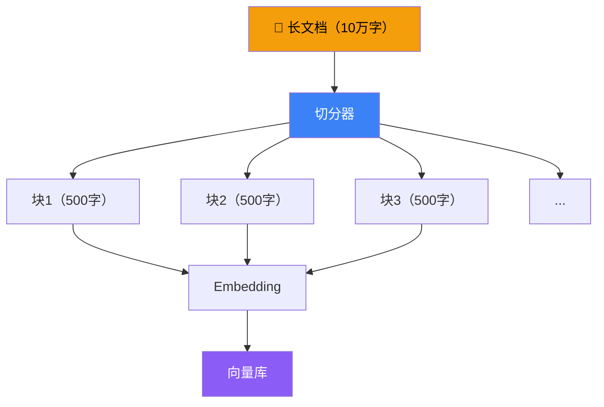

# 文本切分器

## 这是什么？

大文档太长，超过模型的上下文窗口（比如 128K token）。切分器（Splitter）把它切成小块，每块都能安全地放进模型。

类比：一本 500 页的书，你不可能一口气读完。切成章节，每章单独阅读和理解。

## 为什么需要切分？



## 基本用法

```typescript
import { RecursiveCharacterTextSplitter } from "langchain/text_splitter";

const splitter = new RecursiveCharacterTextSplitter({
  chunkSize: 500,       // 每块最大 500 字符
  chunkOverlap: 50,     // 相邻块重叠 50 字符
});

// 切分纯文本
const chunks = await splitter.splitText(longDocument);
console.log(chunks);  // → ["第一块内容...", "第二块内容...", ...]

// 切分 Document 对象
const docChunks = await splitter.splitDocuments(docs);
```

## 切分策略对比

| 策略 | 切分依据 | 适用场景 |
|------|----------|----------|
| `RecursiveCharacterTextSplitter` | 段落 → 句子 → 字符（递归） | **通用首选** |
| `TokenTextSplitter` | Token 数量 | 需要精确控制 token |
| `MarkdownHeaderTextSplitter` | Markdown 标题 | Markdown 文档 |
| `HTMLHeaderTextSplitter` | HTML 标题标签 | 网页内容 |
| `CharacterTextSplitter` | 固定字符分隔符 | 简单场景 |

## 参数调优

```typescript
const splitter = new RecursiveCharacterTextSplitter({
  chunkSize: 800,                    // 每块最大字符数
  chunkOverlap: 100,                 // 重叠字符数
  separators: ["\n\n", "\n", "。", "，", " ", ""],  // 中文友好分隔符
  lengthFunction: (text) => text.length,  // 长度计算方式
});
```

| 参数 | 推荐值 | 说明 |
|------|--------|------|
| `chunkSize` | 500-1000 | 太大 → 超窗口或引入噪声；太小 → 丢失上下文 |
| `chunkOverlap` | 50-100 | 通常为 chunkSize 的 10%-20% |
| `separators` | 见上 | 中文文档建议加 `"。"` `"；"` |

## 最佳实践

| 实践 | 说明 |
|------|------|
| 中文加分隔符 | 默认分隔符是按英文设计的，中文要加 `"。"` `"；"` 等 |
| chunkOverlap 不能太小 | 切分边界处的语义会丢失，重叠能缓解 |
| 先清洗再切分 | 去掉 HTML 标签、多余空白，避免垃圾内容进向量库 |
| 保留 metadata | 切分后的块要带上来源信息，方便追溯原文 |
| chunkSize 要和模型窗口匹配 | 如果模型窗口是 4K，chunkSize 别超过 1000 |

## 下一步

- [文档转换器 →](/integrations/document-transformers)
- [RAG 实战 →](/tutorials/rag-qa)
