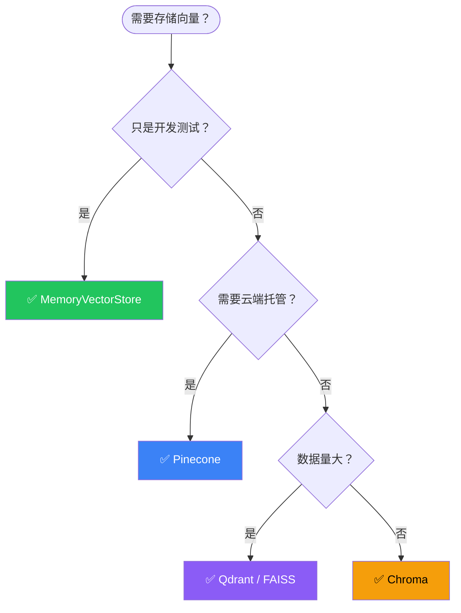

# 存储集成

## 这是什么？

存储 = Agent 需要持久化的数据放哪里。最主要的是**向量库**（存 embedding，供 RAG 检索用），还有键值存储（存对话历史、用户数据等）。

类比：向量库 = 图书馆的索引卡片柜，按内容相似度排序；键值存储 = 文件柜，按标签存取。

## 向量库

| 向量库 | 包名 | 特点 | 适用场景 |
|--------|------|------|----------|
| MemoryVectorStore | `langchain/vectorstores/memory` | 内存，无需安装 | 开发测试 |
| Chroma | `@langchain/community/vectorstores/chroma` | 轻量本地 | 小型项目 |
| Pinecone | `@langchain/pinecone` | 云端托管 | 生产环境 |
| Qdrant | `@langchain/qdrant` | 高性能，支持过滤 | 大规模数据 |
| Weaviate | `@langchain/weaviate` | 开源搜索引擎 | 需要全文搜索 |
| FAISS | `faiss-node` | Facebook 高性能 | 大规模向量计算 |

## 使用示例

```typescript
import { OpenAIEmbeddings } from "@langchain/openai";
import { MemoryVectorStore } from "langchain/vectorstores/memory";
import { Document } from "@langchain/core/documents";

// ① 准备文档
const docs = [
  new Document({ pageContent: "LangChain 是 Agent 框架", metadata: { topic: "langchain" } }),
  new Document({ pageContent: "LangGraph 是运行时", metadata: { topic: "langgraph" } }),
];

// ② 创建向量库
const embeddings = new OpenAIEmbeddings({ model: "text-embedding-3-small" });
const vectorStore = await MemoryVectorStore.fromDocuments(docs, embeddings);

// ③ 搜索
const results = await vectorStore.similaritySearch("Agent 框架", 3);
console.log(results[0].pageContent);  // → LangChain 是 Agent 框架
```

## 向量库选型流程



## 键值存储

用于存储对话历史、用户数据等结构化信息：

| 存储 | 说明 |
|------|------|
| `InMemoryStore` | 内存中，开发用 |
| `Redis` | 高性能缓存 + 持久化 |
| `MongoDB` | 文档数据库，灵活 schema |

## 最佳实践

| 实践 | 说明 |
|------|------|
| 开发用 Memory，生产换真实库 | 开发阶段用 MemoryVectorStore 快速迭代 |
| 向量库要和 Embedding 模型配套 | 不同模型的向量不能混用 |
| 定期备份 | 向量库损坏后需要重新 embedding，成本很高 |
| metadata 过滤提效 | 搜索时用 metadata 过滤缩小范围 |

## 下一步

- [Embedding 模型 →](/integrations/embeddings)
- [RAG 实战 →](/tutorials/rag-qa)
