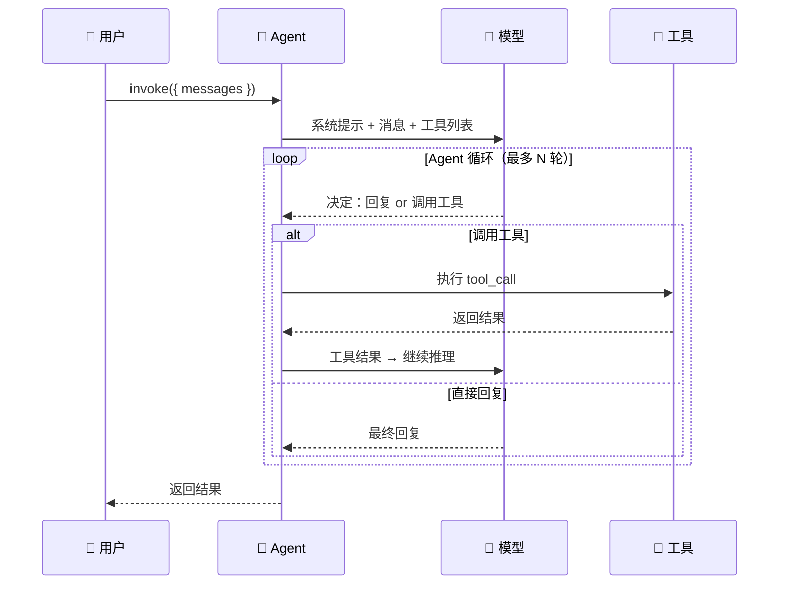

# 创建 Agent

## 基本用法

```typescript
import { createAgent, tool } from "langchain";
import { z } from "zod";

// ① 定义工具
const calculator = tool(
  ({ expression }) => {
    try {
      return String(eval(expression));
    } catch {
      return `无法计算：${expression}`;
    }
  },
  {
    name: "calculator",
    description: "计算数学表达式，如：1+1、3*4、(10+5)/3",
    schema: z.object({ expression: z.string().describe("数学表达式") }),
  }
);

// ② 创建 Agent
const agent = createAgent({
  model: "openai:gpt-4o",
  tools: [calculator],
  system: "你是一个数学助手，需要用 calculator 来计算。",
});

// ③ 调用
const result = await agent.invoke({
  messages: [{ role: "user", content: "123 * 456 等于多少？" }],
});

console.log(result.messages.at(-1)?.content);
```

## 完整配置

```typescript
const agent = createAgent({
  // 模型
  model: "openai:gpt-4o",

  // 系统提示
  system: `你是一个全栈开发助手。
规则：
1. 用 TypeScript 写代码
2. 代码必须带注释
3. 不确定时先问用户`,

  // 工具
  tools: [readFile, writeFile, runCommand],

  // 中间件（日志、限流等）
  middleware: [logger, rateLimiter],

  // 结构化输出（可选）
  outputSchema: z.object({
    answer: z.string(),
    confidence: z.number(),
    sources: z.array(z.string()),
  }),
});
```

## 配置项

| 参数 | 类型 | 必填 | 说明 |
|------|------|------|------|
| `model` | `string` | 是 | 模型标识 |
| `tools` | `Tool[]` | 否 | 工具列表 |
| `system` | `string` | 否 | 系统提示 |
| `middleware` | `Middleware[]` | 否 | 中间件列表 |
| `outputSchema` | `ZodSchema` | 否 | 结构化输出 schema |

## 模型选择

```typescript
// OpenAI
createAgent({ model: "openai:gpt-4o" })          // 最强
createAgent({ model: "openai:gpt-4o-mini" })     // 性价比高
createAgent({ model: "openai:o3-mini" })          // 推理模型

// Anthropic
createAgent({ model: "anthropic:claude-sonnet-4-20250514" })   // 平衡
createAgent({ model: "anthropic:claude-haiku-4-20250514" })    // 快+便宜

// Google
createAgent({ model: "google:gemini-2.0-flash" })  // 快速

// 本地模型（Ollama）
createAgent({ model: "ollama:llama3.1" })
```

> 💡 **模型格式**：`provider:model-name`。不同 provider 需要对应的 API Key 环境变量。

## 多工具组合

```typescript
const agent = createAgent({
  model: "openai:gpt-4o",
  tools: [search, calculator, readFile, writeFile],
  system: `你是一个全能助手。
- 搜索信息 → 用 search
- 计算数学 → 用 calculator
- 读取文件 → 用 readFile
- 写入文件 → 用 writeFile`,
});
```

## Agent 执行流程



## 流式输出

```typescript
const stream = await agent.stream({
  messages: [{ role: "user", content: "解释一下什么是 TypeScript" }],
});

for await (const chunk of stream) {
  if (chunk.type === "token") {
    process.stdout.write(chunk.content);  // 逐字输出
  } else if (chunk.type === "tool_call") {
    console.log(`\n🔧 调用工具：${chunk.toolName}`);
  }
}
```

## 错误处理

```typescript
try {
  const result = await agent.invoke({
    messages: [{ role: "user", content: "帮我算一下" }],
  });
} catch (error: any) {
  if (error.code === "MODEL_RATE_LIMIT") {
    console.error("模型限流，请稍后重试");
  } else if (error.code === "TOOL_NOT_FOUND") {
    console.error("找不到指定的工具");
  } else {
    console.error("Agent 执行失败：", error.message);
  }
}
```

## 常见问题

| 问题 | 原因 | 解决方案 |
|------|------|----------|
| Agent 不调用工具 | 工具 `description` 太模糊 | 写清楚工具的用途和参数 |
| 循环调用不停 | Agent 在反复尝试 | 设置 `maxIterations` |
| 回复太慢 | 模型太大 | 开发用 `mini`，上线再换 |
| 类型报错 | zod 版本不匹配 | 确保 zod v3.x |

## 下一步

- [工具调用](/langchain/agents/tool-calling) — 深入工具调用机制
- [流式输出](/langchain/agents/streaming) — 实时输出
- [结构化输出](/langchain/agents/structured-output) — 获取结构化数据
- [Guardrails](/langchain/agents/guardrails) — 安全检查
