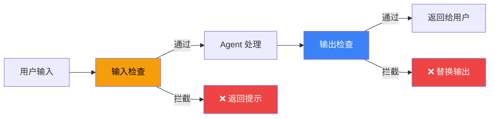

# Guardrails 安全检查

## 这是什么？

Agent 的"安检门"——在用户输入进来、Agent 输出出去之前，先过一遍安全检查。

> 就像机场安检——人进去之前先过 X 光机，有危险品直接拦住。



## 检查类型

| 类型 | 检查什么 | 示例 |
|------|----------|------|
| **输入检查** | 用户发的内容 | 过滤敏感词、注入攻击 |
| **输出检查** | Agent 生成的内容 | 防止泄露隐私、不当言论 |
| **工具检查** | 工具调用前 | 确认工具参数合理 |

## 使用方式

```typescript
import { createAgent } from "langchain";

const agent = createAgent({
  model: "openai:gpt-4o",
  tools: [getWeather],
  guardrails: [
    // 输入检查：过滤敏感词
    {
      type: "input",
      check: (input) => {
        const blocked = ["密码", "信用卡号"];
        return !blocked.some((word) => input.includes(word));
      },
      message: "检测到敏感内容，请勿输入。",
    },
    // 输出检查：防止泄露 API Key
    {
      type: "output",
      check: (output) => !output.includes("sk-"),
      message: "输出包含敏感信息，已拦截。",
    },
  ],
});
```

## 最佳实践

| 做法 | 说明 |
|------|------|
| ✅ 输入输出都检查 | 防止注入和泄露 |
| ✅ 检查要快速 | 避免影响响应速度 |
| ✅ 拦截要友好 | 返回人类可读的提示 |
| ❌ 只靠关键词 | 要结合正则和 LLM 检查 |

## 下一步

- [人工介入](/langchain/agents/human-in-the-loop)
- [中间件](/langchain/middleware)
