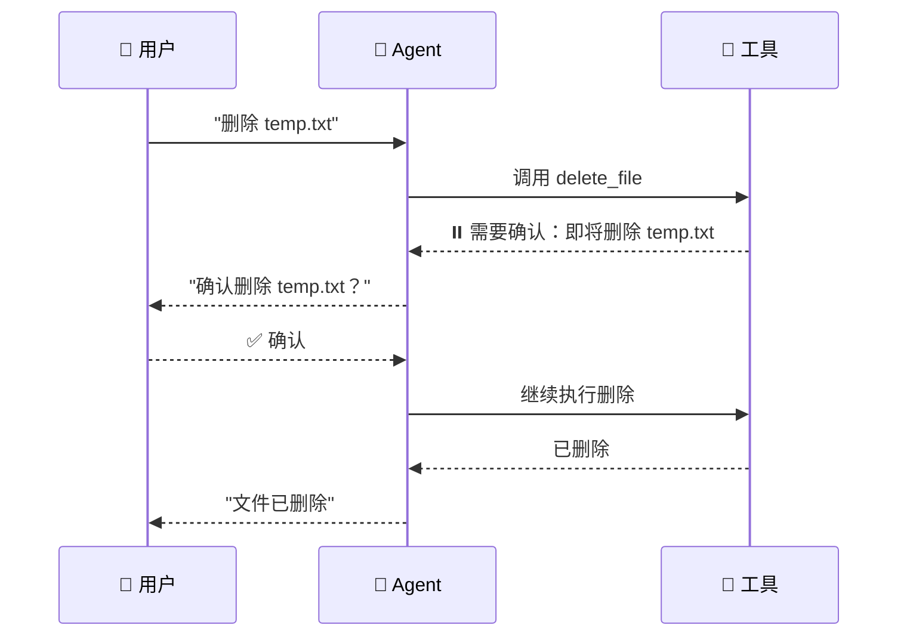

# 人工介入（Human-in-the-Loop）

## 这是什么？

Agent 做到关键步骤会举手问你："老板，这步能做吗？" 你点头它才继续。

> 类比：自动挡汽车——大部分时候自己开，但过收费站要你递卡确认。



## 使用方式

```typescript
import { createAgent, tool } from "langchain";
import { z } from "zod";

const deleteFile = tool(
  async ({ path }) => {
    return {
      requiresApproval: true,
      action: "delete_file",
      data: { path },
      message: `即将删除文件: ${path}，是否确认？`,
    };
  },
  {
    name: "delete_file",
    description: "删除文件（需要用户确认）",
    schema: z.object({ path: z.string() }),
  }
);

const agent = createAgent({
  model: "openai:gpt-4o",
  tools: [deleteFile],
  humanInTheLoop: {
    enabled: true,
    approvalTools: ["delete_file"],
  },
});
```

## 适用场景

| 场景 | 说明 |
|------|------|
| 🗑️ 删除操作 | 删除文件、数据等不可逆操作 |
| 📧 发送消息 | 邮件、消息发出前确认 |
| 💳 金融交易 | 支付、转账前确认 |
| 🔧 系统配置 | 修改生产环境配置前确认 |

## 最佳实践

| 做法 | 说明 |
|------|------|
| ✅ 只拦截关键操作 | 不要什么都要确认，用户体验差 |
| ✅ 提供足够上下文 | 告诉用户具体要做什么、影响什么 |
| ✅ 支持取消 | 用户拒绝时 Agent 要优雅处理 |
| ❌ 拦截太多 | 每步都确认等于没有自动化 |

## 下一步

- [Guardrails](/langchain/agents/guardrails)
- [Deep Agents 人工介入](/deepagents/human-in-the-loop)
