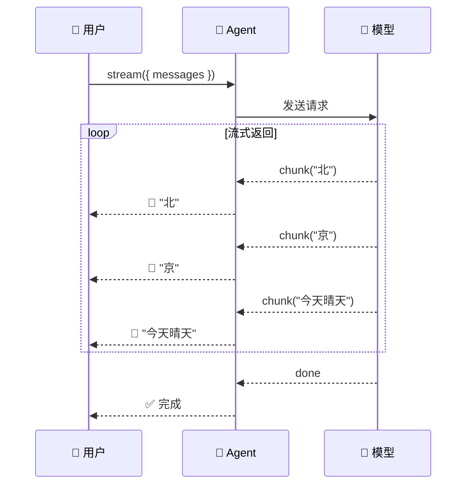

# 流式输出

## 这是什么？

不用等 Agent 全部执行完才返回结果——边执行边返回，像打字一样逐字显示。

> 类比：`invoke` 像等整份外卖送到才吃，`stream` 像火锅——边涮边吃。

## 事件类型

| 类型 | 说明 | 典型用途 |
|------|------|---------|
| `text` | Agent 的文本输出 | 逐字显示 |
| `tool_call` | Agent 正在调用工具 | 显示 loading 状态 |
| `tool_result` | 工具返回结果 | 显示工具执行结果 |
| `done` | 全部完成 | 隐藏 loading |

## 基本用法

```typescript
import { createAgent } from "langchain";

const agent = createAgent({
  model: "openai:gpt-4o",
  tools: [getWeather],
});

const stream = await agent.stream({
  messages: [{ role: "user", content: "北京天气？" }],
});

for await (const chunk of stream) {
  if (chunk.type === "text") {
    process.stdout.write(chunk.content);  // 逐字输出
  } else if (chunk.type === "tool_call") {
    console.log(`\n🔧 调用工具：${chunk.toolName}`);
  } else if (chunk.type === "tool_result") {
    console.log(`✅ 工具返回：${chunk.result}`);
  }
}
```

## 流式流程



## 在 Express 中使用

```typescript
import express from "express";
import { createAgent } from "langchain";

const app = express();
app.use(express.json());

const agent = createAgent({
  model: "openai:gpt-4o",
  tools: [getWeather],
});

app.post("/chat", async (req, res) => {
  // 设置 SSE 头
  res.setHeader("Content-Type", "text/event-stream");
  res.setHeader("Cache-Control", "no-cache");
  res.setHeader("Connection", "keep-alive");

  const stream = await agent.stream({
    messages: [{ role: "user", content: req.body.message }],
  });

  for await (const chunk of stream) {
    res.write(`data: ${JSON.stringify(chunk)}\n\n`);
  }

  res.end();
});
```

## 常见问题

| 问题 | 原因 | 解决方案 |
|------|------|---------|
| 流式不生效 | 用了 `invoke` 而非 `stream` | 换成 `stream` 方法 |
| 前端不更新 | 没处理 SSE 事件 | 前端用 `EventSource` 或 `fetch` + `ReadableStream` |
| 中途断开 | 网络超时 | 加 `timeout` 中间件 |

## 下一步

- [创建 Agent](/langchain/agents/creation)
- [前端集成](/langchain/frontend)
- [Deep Agents 流式输出](/deepagents/streaming)
