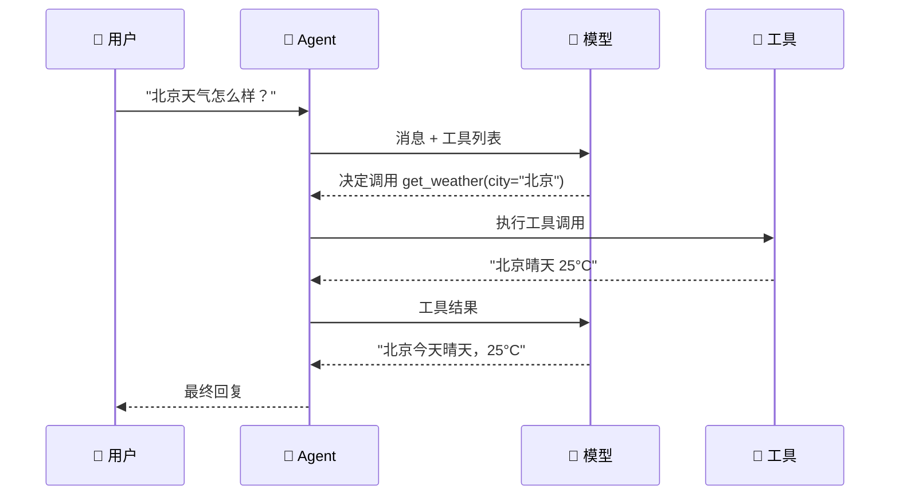
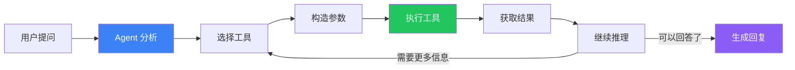

# 工具调用

## 工作原理

Agent 不是自己执行操作，而是"指挥"工具干活——它决定调哪个工具、传什么参数，然后等工具返回结果。



## 完整示例

```typescript
import { createAgent, tool } from "langchain";
import { z } from "zod";

const search = tool(
  async ({ query }) => `搜索"${query}"的结果...`,
  {
    name: "search",
    description: "搜索互联网，返回相关信息",
    schema: z.object({ query: z.string() }),
  }
);

const calculator = tool(
  ({ expression }) => {
    try {
      return String(eval(expression));
    } catch {
      return `无法计算：${expression}`;
    }
  },
  {
    name: "calculator",
    description: "计算数学表达式",
    schema: z.object({ expression: z.string() }),
  }
);

// Agent 会根据用户的问题自动选择工具
const agent = createAgent({
  model: "openai:gpt-4o",
  tools: [search, calculator],
});

// → 调用 calculator
await agent.invoke({ messages: [{ role: "user", content: "1+1等于多少？" }] });

// → 调用 search
await agent.invoke({ messages: [{ role: "user", content: "搜索最新AI新闻" }] });
```

## 工具调用流程



## ⚠️ 常见踩坑

| 问题 | 原因 | 解决方案 |
|------|------|---------|
| Agent 不调用工具 | 工具 `description` 太模糊 | 写清楚用途、参数格式、返回值 |
| 选错工具 | 工具太多功能重叠 | 按场景分组，别一股脑全塞 |
| 工具报错 | 没做异常处理 | 工具内部 try/catch，返回友好错误信息 |
| 无限循环 | Agent 反复调同一个工具 | 设置 `maxIterations` 或在 system 中限定次数 |

## 工具描述最佳实践

```typescript
// ❌ 不好的描述
description: "获取信息"

// ✅ 好的描述
description: "查询指定城市的当前天气。输入城市名（如'北京'），返回天气状况和温度。"
```

## 下一步

- [工具（Tools）](/langchain/tools) — 创建和管理工具
- [流式输出](/langchain/agents/streaming) — 实时看到工具调用过程
- [创建 Agent](/langchain/agents/creation)
