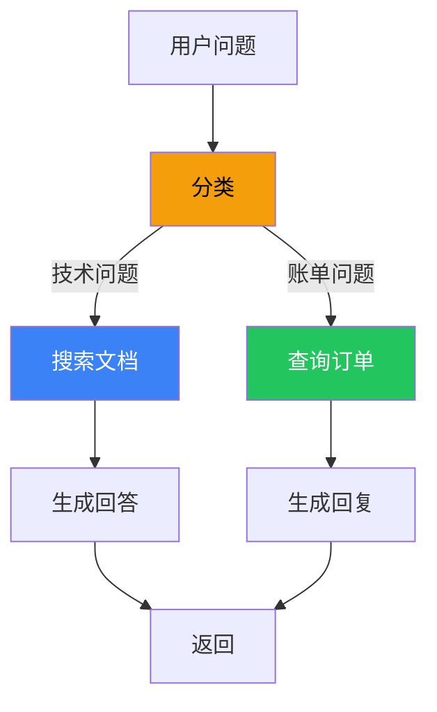
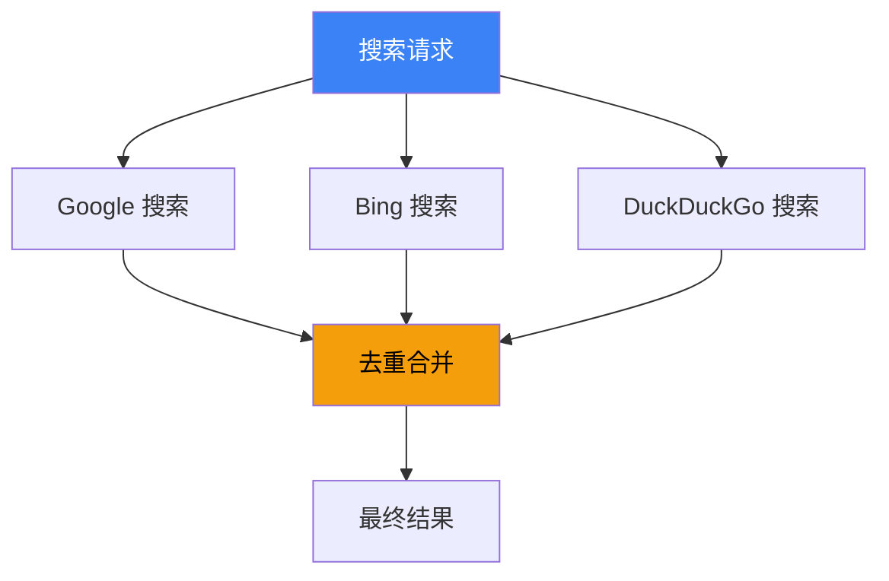

# Chains（链）

## 这是什么？

链 = 把多个步骤串起来执行。就像工厂流水线——原料进来，经过加工、检验、包装，成品出去。


## 使用方式

```typescript
import { createChain } from "langchain";

// ① 定义每一步
const researchChain = createChain()
  .step("search", async (input) => {
    // 步骤 1：搜索
    return await searchWeb(input.topic);
  })
  .step("summarize", async (searchResults) => {
    // 步骤 2：总结（用 LLM）
    return await llm.invoke(`总结以下内容：\n${searchResults}`);
  })
  .step("format", async (summary) => {
    // 步骤 3：格式化
    return `# 研究报告\n\n${summary}\n\n---\n生成时间：${new Date().toLocaleDateString()}`;
  });

// ② 执行
const result = await researchChain.invoke({ topic: "LangChain 入门" });
console.log(result);
```

## 链 vs Agent

| 维度 | 链（Chain） | Agent |
|------|------------|-------|
| **流程** | 固定步骤，顺序执行 | 动态决策，Agent 自己决定 |
| **灵活性** | 低——流程写死了 | 高——可以推理和选择 |
| **可预测性** | 高——每步都是确定的 | 低——取决于模型决策 |
| **适用场景** | 流程确定的任务 | 需要推理的任务 |
| **成本** | 低——步骤固定 | 高——每步都要调模型 |

> 💡 **简单理解**：链 = 流水线（固定路线），Agent = 智能体（自己判断）。

## 条件分支

链支持条件分支，根据中间结果走不同路径：

```typescript
const supportChain = createChain()
  .step("classify", async (input) => {
    // 第一步：分类
    const category = await llm.invoke(
      `把这个问题分类为 "technical" 或 "billing"：${input.question}`
    );
    return { ...input, category };
  })
  .branch(
    // 条件：技术问题 → 走技术路径
    (state) => state.category === "technical",
    createChain()
      .step("searchDocs", async (state) => {
        return await searchDocs(state.question);
      })
      .step("generateAnswer", async (state) => {
        return await llm.invoke(`基于文档回答：${state.docs}`);
      })
  )
  .branch(
    // 条件：账单问题 → 走账单路径
    (state) => state.category === "billing",
    createChain()
      .step("lookupOrder", async (state) => {
        return await db.query(state.orderId);
      })
      .step("generateResponse", async (state) => {
        return await llm.invoke(`基于订单信息回复：${state.order}`);
      })
  );
```



## 并行执行

多个独立步骤可以并行执行，加快速度：

```typescript
const parallelChain = createChain()
  .parallel([
    // 这三个步骤同时执行
    async (input) => searchGoogle(input.query),
    async (input) => searchBing(input.query),
    async (input) => searchDuckDuckGo(input.query),
  ])
  .step("merge", async (results) => {
    // 合并三个搜索引擎的结果
    const [google, bing, ddg] = results;
    return deduplicate([...google, ...bing, ...ddg]);
  });
```



## 实战：内容生成链

```typescript
import { createChain } from "langchain";
import { ChatPromptTemplate } from "@langchain/core/prompts";

const contentChain = createChain()
  .step("research", async ({ topic }) => {
    // 搜索相关资料
    const results = await searchWeb(`${topic} 最新发展`);
    return { topic, research: results };
  })
  .step("outline", async ({ topic, research }) => {
    // 用 LLM 生成大纲
    const outline = await llm.invoke(
      `基于以下资料，为"${topic}"写一个文章大纲：\n${research}`
    );
    return { topic, research, outline };
  })
  .step("draft", async ({ topic, outline }) => {
    // 根据大纲写初稿
    const draft = await llm.invoke(
      `根据以下大纲写一篇 1000 字的文章：\n${outline}`
    );
    return { topic, outline, draft };
  })
  .step("polish", async ({ draft }) => {
    // 润色
    const polished = await llm.invoke(
      `润色以下文章，使其更专业、更流畅：\n${draft}`
    );
    return { content: polished };
  });

// 执行
const result = await contentChain.invoke({ topic: "AI Agent 的未来" });
console.log(result.content);
```

## 链的错误处理

```typescript
const chain = createChain()
  .step("risky", async (input) => {
    // 可能失败的步骤
    return await fetchExternalAPI(input);
  })
  .step("safe", async (result) => {
    return processResult(result);
  })
  .onError(async (error, step, state) => {
    // 全局错误处理
    console.error(`步骤 "${step}" 失败：`, error.message);

    if (step === "risky") {
      // 重试或使用 fallback
      return await fallbackAPI(state);
    }
    throw error;
  });
```

## 最佳实践

1. **每步做一件事**——别把搜索和分析塞进步骤
2. **中间结果要传递**——用 state 对象传递数据
3. **能用链就不用 Agent**——流程确定的任务用链更省成本
4. **并行能加速**——独立步骤用 `parallel()`
5. **错误要处理**——每步都可能失败，要有 fallback

## 下一步

- [创建 Agent](/langchain/agents/creation) — 需要推理时用 Agent
- [Prompts](/langchain/prompts) — 提示词模板
- [Middleware](/langchain/middleware) — 中间件增强链
