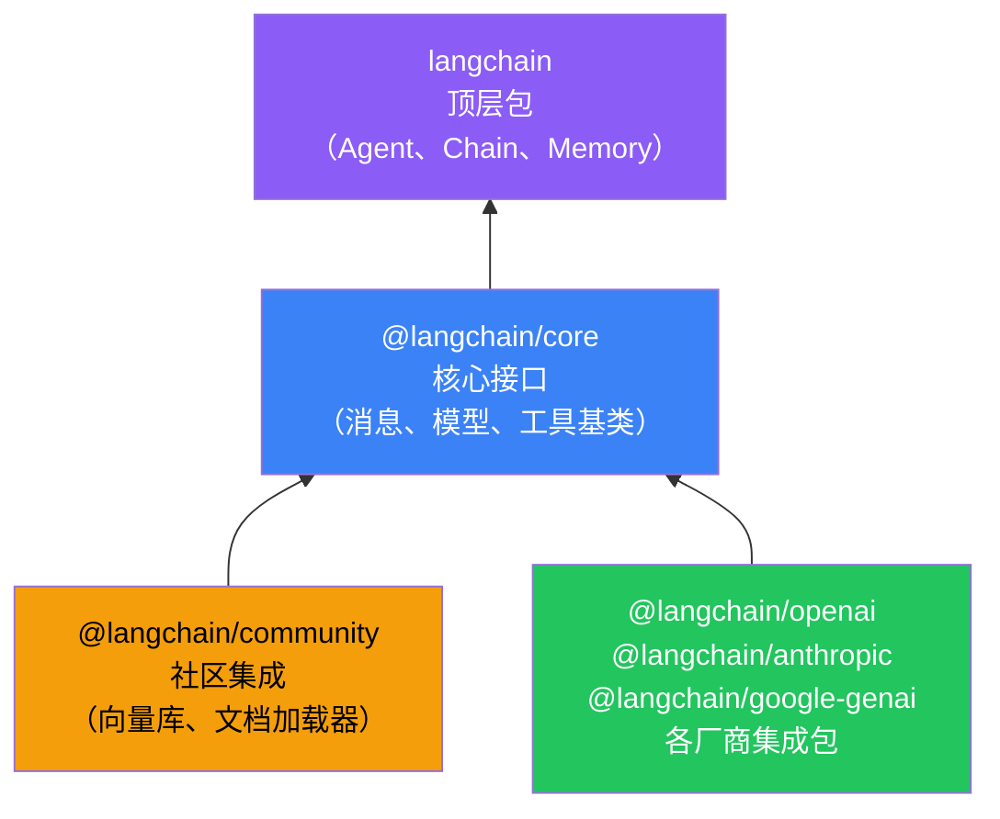
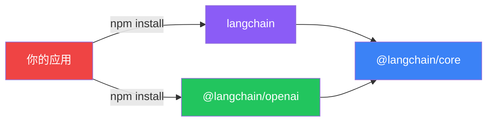

# 组件架构

## 整体结构

LangChain 采用分层架构——底层是核心接口，中间是各厂商集成，顶层是 Agent、Chain 等高层组件。



## 各层职责

### @langchain/core — 地基

所有包都依赖它。定义了最基本的数据结构和接口：

| 模块 | 说明 |
|------|------|
| `messages` | 消息类型（HumanMessage、AIMessage 等） |
| `models` | 模型接口抽象（ChatModel） |
| `tools` | 工具基类和 `tool()` 函数 |
| `output_parsers` | 输出解析器 |
| `prompts` | 提示词模板 |

> 💡 你很少直接用 core，但它无处不在——就像空气，平时不注意，但缺了不行。

### 各厂商集成包 — 桥梁

每个 LLM 厂商一个包，把厂商的 API 翻译成 core 的标准接口：

```typescript
// 用法完全一样，只是 import 不同
import { ChatOpenAI } from "@langchain/openai";
import { ChatAnthropic } from "@langchain/anthropic";

const gpt = new ChatOpenAI({ model: "gpt-4o" });
const claude = new ChatAnthropic({ model: "claude-sonnet-4-20250514" });

// 调用方式完全一致
await gpt.invoke("你好");
await claude.invoke("你好");
```

### langchain — 顶层包

把底层能力组合成开箱即用的高层组件：

| 模块 | 说明 |
|------|------|
| `agents` | Agent 创建和执行 |
| `chains` | 链的构建 |
| `memory` | 记忆管理 |
| `retrieval` | RAG 检索 |
| `middleware` | 中间件 |

## 依赖关系速查



## 我该装哪些包？

| 需求 | 最小安装 |
|------|---------|
| 只调模型 | `@langchain/core` + `@langchain/openai` |
| 做 Agent | `langchain` + `@langchain/openai` |
| 做 RAG | `langchain` + `@langchain/openai` + `@langchain/community` |

## 下一步

- [Messages（消息）](/langchain/messages)
- [Models（模型）](/langchain/models)
- [安装](/langchain/install)
