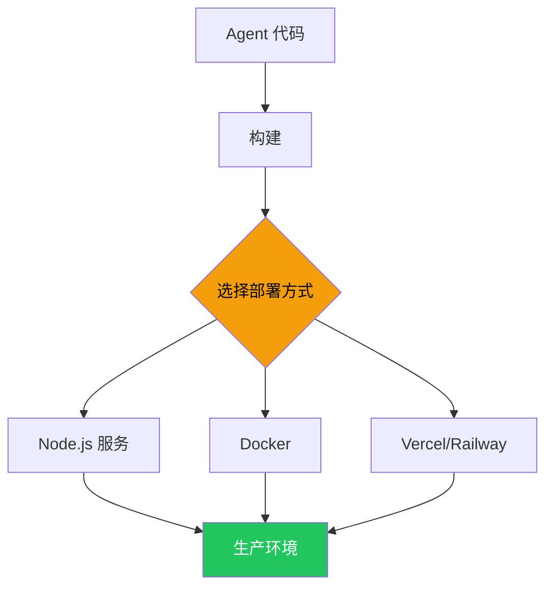

# 部署

## 部署方式对比

| 方式 | 说明 | 适用场景 |
|------|------|---------|
| **Node.js 服务** | 直接起 HTTP 服务 | 简单场景 |
| **Docker** | 容器化部署 | 标准化部署 |
| **Vercel / Railway** | Serverless | 快速上线 |
| **LangSmith** | 官方托管平台 | 全托管 |



## Node.js 服务

```typescript
import express from "express";
import { createAgent } from "langchain";

const app = express();
app.use(express.json());

const agent = createAgent({
  model: "openai:gpt-4o",
  tools: [getWeather],
});

app.post("/chat", async (req, res) => {
  const result = await agent.invoke({
    messages: [{ role: "user", content: req.body.message }],
  });
  res.json(result);
});

app.listen(3000, () => console.log("Agent 服务已启动：http://localhost:3000"));
```

## Docker 部署

```dockerfile
FROM node:18-slim
WORKDIR /app
COPY package*.json ./
RUN npm ci --production
COPY . .
EXPOSE 3000
CMD ["node", "server.js"]
```

```bash
docker build -t my-agent .
docker run -p 3000:3000 --env-file .env my-agent
```

## 生产检查清单

| 检查项 | 说明 |
|--------|------|
| ✅ 环境变量管理 | API Key 不硬编码，用 `.env` 或密钥管理服务 |
| ✅ 错误处理 | 全局 try/catch + 友好的错误响应 |
| ✅ 限流 | 防止被刷，加 `rateLimiter` 中间件 |
| ✅ 可观测性 | 开启 LangSmith 追踪 |
| ✅ 健康检查 | 加 `/health` 端点 |
| ✅ 日志 | 记录关键请求，但不要记敏感数据 |

## 下一步

- [生产部署（Deep Agents）](/deepagents/going-to-production)
- [可观测性](/langchain/observability)
- [中间件](/langchain/middleware)
