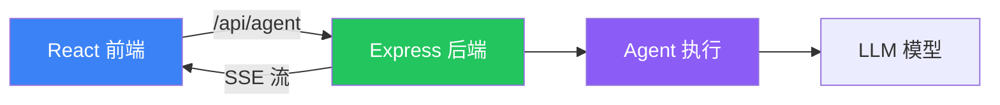

# 前端集成

## 能做什么？

| 功能 | 说明 |
|------|------|
| **流式 UI** | Agent 回复逐字显示，像 ChatGPT 那样 |
| **分支聊天** | 编辑消息、重新生成、回退到历史 |
| **工具调用卡片** | 可视化展示工具执行过程 |
| **推理 Token** | 展示模型思考过程 |

## 流式 UI 示例

```typescript
import { useStream } from "langchain/frontend";

function Chat() {
  const { messages, status, send } = useStream({
    endpoint: "/api/agent",
  });

  return (
    <div>
      {messages.map((msg) => (
        <div key={msg.id} className={msg.role}>
          {msg.content}
          {msg.status === "streaming" && <span>▊</span>}
        </div>
      ))}
      <input onKeyDown={(e) => e.key === "Enter" && send(e.target.value)} />
    </div>
  );
}
```

## 工具调用卡片

```typescript
function ToolCallCard({ toolCall }) {
  return (
    <div className="tool-card">
      <div className="tool-name">🔧 {toolCall.name}</div>
      <div className="tool-params">{JSON.stringify(toolCall.params)}</div>
      <div className="tool-result">{toolCall.result}</div>
    </div>
  );
}
```

## UI 框架推荐

| 框架 | 说明 |
|------|------|
| **AI Elements** | shadcn/ui 风格的 AI 组件 |
| **assistant-ui** | 无头 React AI 聊天框架 |
| **Vercel AI SDK** | `useChat` hook + 流式支持 |

## 前后端通信流程



## 下一步

- [Deep Agents 前端集成](/deepagents/frontend)
- [流式输出](/langchain/agents/streaming)
- [部署](/langchain/deployment)
