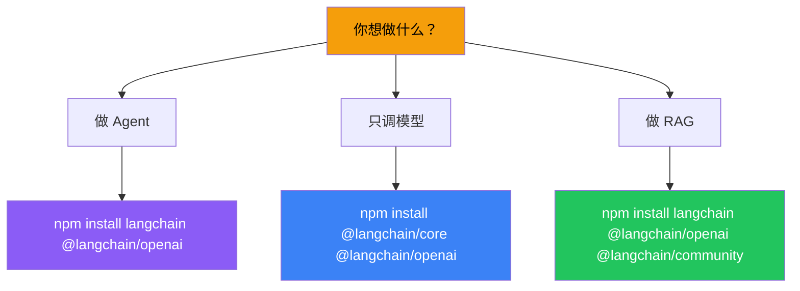

# 安装

## 核心包

```bash
# 最小安装——只有核心接口
npm install @langchain/core

# Agent 功能（包含核心 + Agent + 链等）
npm install langchain

# 模型集成（按需安装）
npm install @langchain/openai        # OpenAI
npm install @langchain/anthropic     # Anthropic
npm install @langchain/google-genai  # Google
```

## 按场景安装

| 场景 | 安装命令 |
|------|---------|
| 快速上手 | `npm install langchain @langchain/openai` |
| Anthropic 用户 | `npm install langchain @langchain/anthropic` |
| 只需要模型调用 | `npm install @langchain/core @langchain/openai` |
| RAG 项目 | `npm install langchain @langchain/openai @langchain/community` |



## 环境变量

```bash
# .env（不要提交到 Git）
OPENAI_API_KEY=sk-xxx
ANTHROPIC_API_KEY=sk-ant-xxx
```

## 验证安装

```typescript
import { createAgent, tool } from "langchain";
import { z } from "zod";

const hello = tool(
  () => "Hello from LangChain!",
  {
    name: "hello",
    description: "打个招呼",
    schema: z.object({}),
  }
);

const agent = createAgent({
  model: "openai:gpt-4o-mini",
  tools: [hello],
});

const result = await agent.invoke({
  messages: [{ role: "user", content: "打个招呼" }],
});

console.log(result);
// 看到输出 → 安装成功 🎉
```

## 常见问题

| 问题 | 解决方案 |
|------|---------|
| `Cannot find module` | 检查包名拼写，确认 npm install 成功 |
| `API Key not found` | 确认 `.env` 文件在项目根目录且格式正确 |
| TypeScript 类型报错 | 确保 tsconfig 开启了 `strict: true` |

## 下一步

- [组件架构](/langchain/component-architecture)
- [创建 Agent](/langchain/agents/creation)
