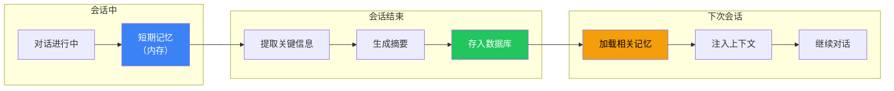

# 长期记忆

## 这是什么？

Agent 的"长期大脑"——**跨会话**记住用户说过的话。就像老朋友，好久不见还记得你的喜好。

## 短期 vs 长期

| | 短期记忆 | 长期记忆 |
|--|---------|---------|
| 时长 | 单次会话 | 跨会话 |
| 存储 | 内存 | 数据库/文件 |
| 类比 | 当面聊天记得 | 写在日记本里 |
| 场景 | 普通对话 | 客服、个人助手 |

## 工作原理



## 使用方式

```typescript
import { createAgent } from "langchain";

const agent = createAgent({
  model: "openai:gpt-4o",
  memory: {
    shortTerm: true,
    longTerm: {
      enabled: true,
      store: "postgres", // 或 "disk"、"redis"
    },
  },
});

// 第一次会话
await agent.invoke({
  messages: [{ role: "user", content: "我叫小明，住在北京，喜欢滑雪" }],
});
// 会话结束 → 自动提取：姓名=小明，城市=北京，爱好=滑雪

// 几天后的新会话
await agent.invoke({
  messages: [{ role: "user", content: "推荐个周末活动" }],
});
// Agent 记得你喜欢滑雪 → 推荐北京周边滑雪场
```

## 存储后端

| 后端 | 说明 | 适用场景 |
|------|------|---------|
| `disk` | 本地文件存储 | 开发测试 |
| `postgres` | PostgreSQL 数据库 | 生产环境 |
| `redis` | Redis 缓存 | 高频读写 |
| 自定义 | 实现 Store 接口 | 特殊需求 |

## 最佳实践

| 做法 | 说明 |
|------|------|
| ✅ 只记重要的 | 用户偏好、历史决策、关键事实 |
| ✅ 定期清理 | 过期记忆会干扰上下文 |
| ✅ 分类存储 | 按用户 ID 隔离记忆 |
| ❌ 记太多 | 会影响上下文窗口大小 |
| ❌ 记敏感信息 | 密码、token 不该存入记忆 |

## 下一步

- [短期记忆](/langchain/short-term-memory)
- [Deep Agents 记忆](/deepagents/memory)
