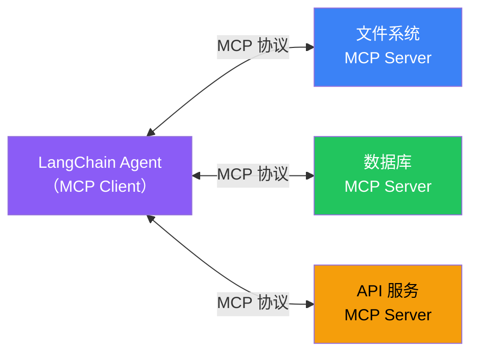

# MCP（模型上下文协议）

## 这是什么？

MCP = **Model Context Protocol**，一个开放标准，让模型能以统一的方式接入各种工具和数据源。

> 类比：MCP 就像 USB 接口——不管你是插鼠标、键盘还是 U 盘，接口统一，即插即用。



## 核心概念

| 概念 | 说明 |
|------|------|
| **MCP Server** | 提供工具和数据的服务端（每个服务一个） |
| **MCP Client** | 调用工具的客户端（LangChain Agent） |
| **Tools** | MCP Server 暴露的可调用工具 |
| **Resources** | MCP Server 暴露的数据资源 |

## 使用方式

```typescript
import { createAgent } from "langchain";
import { MCPClient } from "langchain/mcp";

// ① 连接 MCP Server
const mcpClient = new MCPClient({
  serverUrl: "http://localhost:3001",
});

// ② 获取 MCP Server 提供的工具
const tools = await mcpClient.getTools();

// ③ 创建 Agent，自动使用 MCP 工具
const agent = createAgent({
  model: "openai:gpt-4o",
  tools,
});

const result = await agent.invoke({
  messages: [{ role: "user", content: "列出当前目录的文件" }],
});
```

## MCP vs 直接定义工具

| 维度 | 直接定义 | MCP |
|------|---------|-----|
| 部署 | 代码里写死 | 独立服务，即插即用 |
| 复用 | 复制代码 | 多个 Agent 可共享 |
| 维护 | 改代码重启 | 更新 Server 不影响 Agent |
| 适用 | 单个项目 | 跨团队/跨公司共享 |

## 适用场景

- 统一管理多个工具服务
- 工具提供者和消费者解耦
- 跨团队/跨公司共享工具能力
- 接入第三方工具生态

## 下一步

- [工具](/langchain/tools) — 直接定义工具
- [集成](/integrations/) — 查看可用的集成
