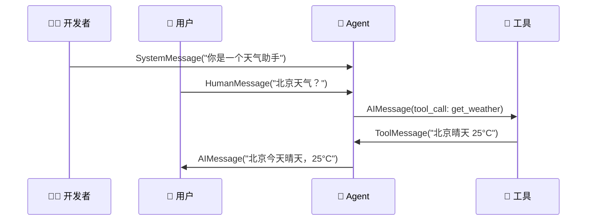

# 消息（Messages）

## 这是什么？

Agent 的对话是用"消息"来传递的——用户说一句、Agent 回一句、工具返回结果，都是消息。

> 类比：消息就像聊天记录里的每一行——谁说的、说了什么、什么时间，都有记录。

## 消息类型

| 类型 | 说明 | 谁发的 |
|------|------|--------|
| `HumanMessage` | 用户的消息 | 用户 |
| `AIMessage` | AI 的回复 | Agent |
| `SystemMessage` | 系统提示（定义 Agent 的行为） | 开发者 |
| `ToolMessage` | 工具调用结果 | 工具 |
| `FunctionMessage` | 函数调用结果（旧版兼容） | 工具 |

## 消息流转



## 使用方式

```typescript
import {
  HumanMessage,
  AIMessage,
  SystemMessage,
  ToolMessage,
} from "@langchain/core/messages";

// 构造对话历史
const messages = [
  new SystemMessage("你是一个天气助手，用简洁的语言回答。"),
  new HumanMessage("北京天气怎么样？"),
  new AIMessage("今天北京晴天，25°C，适合出门。"),
  new HumanMessage("明天呢？"),
];
```

## 消息结构

```typescript
interface BaseMessage {
  content: string;           // 消息内容
  name?: string;             // 发送者名称（可选）
  additional_kwargs?: {};    // 额外参数（如 tool_calls）
  response_metadata?: {};    // 响应元数据（token 用量等）
}
```

## 在 Agent 中使用

```typescript
import { createAgent } from "langchain";

const agent = createAgent({
  model: "openai:gpt-4o",
  tools: [getWeather],
});

const result = await agent.invoke({
  messages: [
    new SystemMessage("你是一个有帮助的助手"),
    new HumanMessage("帮我写一首关于春天的诗"),
  ],
});

// result 包含完整的对话历史
console.log(result.messages);
```

## 常见问题

| 问题 | 原因 | 解决方案 |
|------|------|---------|
| 上下文丢失 | 没传历史消息 | 每次调用带上之前的 messages |
| Token 爆炸 | 消息太多 | 用 `sliding_window` 或 `summary` 策略裁剪 |
| 工具调用异常 | ToolMessage 格式不对 | 确保 `tool_call_id` 匹配 |

## 下一步

- [创建 Agent](/langchain/agents/creation)
- [Prompts（提示词）](/langchain/prompts)
- [短期记忆](/langchain/short-term-memory)
