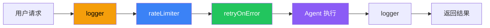

# Middleware（中间件）

## 这是什么？

Agent 每次行动前，中间件先过一遍——拦住不合规的，记录日志，或者做重试。

> 类比：就像餐厅的服务员——客人点菜（用户请求）→ 服务员确认（中间件）→ 厨房做菜（Agent 执行）→ 服务员上菜（中间件）→ 客人。



## 内置中间件

| 中间件 | 说明 |
|--------|------|
| `rateLimiter` | 限流，防止请求过多 |
| `retryOnError` | 失败自动重试 |
| `logger` | 记录日志 |
| `timeout` | 超时控制 |
| `cache` | 结果缓存 |

## 使用方式

```typescript
import { createAgent } from "langchain";
import { rateLimiter, retryOnError, logger } from "langchain/middleware";

const agent = createAgent({
  model: "openai:gpt-4o",
  tools: [getWeather],
  middleware: [
    rateLimiter({ maxRequests: 10, windowMs: 60000 }), // 每分钟最多 10 次
    retryOnError({ maxRetries: 3 }),                    // 失败重试 3 次
    logger({ level: "info" }),                           // 记录日志
  ],
});
```

## 自定义中间件

```typescript
const myMiddleware = {
  name: "my_middleware",
  before: async (context) => {
    // Agent 执行前
    console.log("即将执行：", context.messages);
  },
  after: async (context, result) => {
    // Agent 执行后
    console.log("执行结果：", result);
  },
  onError: async (context, error) => {
    // 出错时
    console.error("出错了：", error);
  },
};
```

## 最佳实践

| 做法 | 说明 |
|------|------|
| ✅ 日志放最外层 | 先记录再执行 |
| ✅ 限流放前面 | 被限流的请求不消耗重试次数 |
| ✅ 缓存放最后 | 先过检查再查缓存 |
| ❌ 中间件太多 | 每层都有性能开销 |

## 下一步

- [创建 Agent](/langchain/agents/creation)
- [Guardrails](/langchain/agents/guardrails)
- [可观测性](/langchain/observability)
