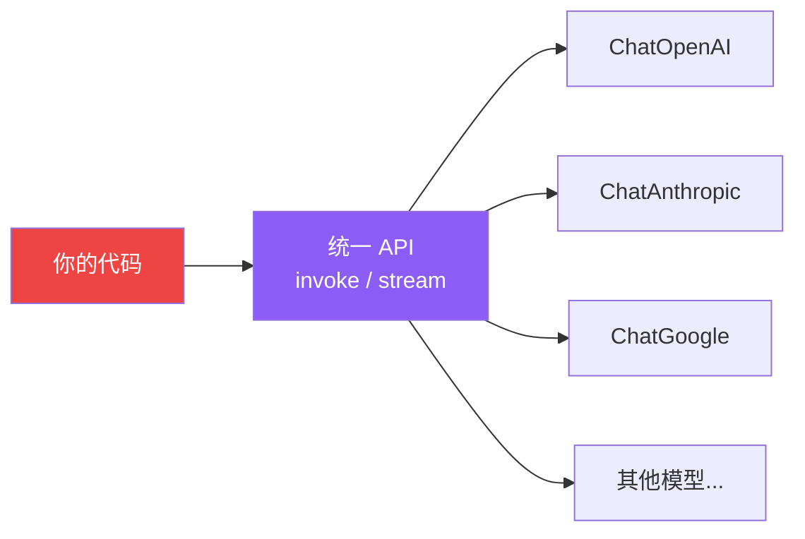

# Models（模型）

## 这是什么？

LangChain 提供统一的模型接口——不管你用 OpenAI、Anthropic 还是 Google，代码写法都一样。

> 类比：就像手机充电器的 USB-C 接口——不管什么品牌的手机，线都一样。



## 支持的模型

| 厂商 | 包名 | 示例模型 |
|------|------|----------|
| OpenAI | `@langchain/openai` | gpt-4o, gpt-4o-mini, o3-mini |
| Anthropic | `@langchain/anthropic` | claude-sonnet-4, claude-haiku-4 |
| Google | `@langchain/google-genai` | gemini-2.0-flash |
| Azure | `@langchain/openai` | Azure OpenAI |
| AWS Bedrock | `@langchain/aws` | Claude on Bedrock |
| Ollama | `@langchain/ollama` | llama3.1（本地） |

## 使用方式

```typescript
import { ChatOpenAI } from "@langchain/openai";
import { ChatAnthropic } from "@langchain/anthropic";

// OpenAI
const gpt = new ChatOpenAI({ model: "gpt-4o", temperature: 0 });

// Anthropic
const claude = new ChatAnthropic({ model: "claude-sonnet-4-20250514", temperature: 0 });

// 调用方式完全一致
const r1 = await gpt.invoke("你好");
const r2 = await claude.invoke("你好");
```

## Agent 中使用

```typescript
import { createAgent } from "langchain";

// 直接传字符串标识
const agent = createAgent({
  model: "openai:gpt-4o",  // 或 "anthropic:claude-sonnet-4-20250514"
});
```

## 模型参数

| 参数 | 说明 | 默认值 |
|------|------|--------|
| `model` | 模型名称 | 必填 |
| `temperature` | 随机性（0=确定，1=创意） | 0.7 |
| `maxTokens` | 最大输出 Token | 模型默认 |
| `timeout` | 请求超时（毫秒） | 60000 |

## 常见问题

| 问题 | 原因 | 解决方案 |
|------|------|---------|
| 报 API Key 错误 | 环境变量没设 | 检查 `OPENAI_API_KEY` 等 |
| 响应慢 | 模型太大 | 开发用 `mini`，上线再换强模型 |
| 输出截断 | maxTokens 太小 | 调大或不设限制 |

## 下一步

- [Chat 模型集成](/integrations/chat)
- [创建 Agent](/langchain/agents/creation)
- [安装](/langchain/install)
