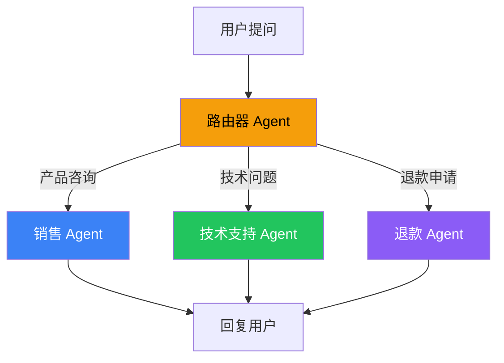

# Multi-Agent 多 Agent

## 这是什么？

一个 Agent 干不完的活，派多个 Agent 分工合作。就像公司里不同部门——销售、技术、客服各管各的。



## 四种协作模式

| 模式 | 说明 | 类比 |
|------|------|------|
| **Handoffs（交接）** | A 干完交给 B | 接力赛传棒 |
| **Router（路由）** | 根据问题类型分发 | 前台分诊 |
| **Skills（技能）** | 按需加载能力模块 | 点菜 |
| **Subagents（子 Agent）** | 主 Agent 派生子 Agent | 老板派活 |

## Handoffs 示例

```typescript
import { createAgent, createHandoff } from "langchain";

// ① 创建专门的 Agent
const salesAgent = createAgent({
  model: "openai:gpt-4o",
  system: "你是销售专家，回答产品和价格问题。语气热情。",
});

const techAgent = createAgent({
  model: "openai:gpt-4o",
  system: "你是技术支持，解决技术问题。回答专业耐心。",
});

// ② 创建路由 Agent
const router = createAgent({
  model: "openai:gpt-4o",
  handoffs: [
    createHandoff(salesAgent, { name: "sales", description: "产品和价格咨询" }),
    createHandoff(techAgent, { name: "tech", description: "技术问题" }),
  ],
  system: "你是客服路由器，根据问题类型转给对应的专家。",
});

// ③ 使用——自动路由
const result = await router.invoke({
  messages: [{ role: "user", content: "这个产品多少钱？" }],
});
// → 自动转给 salesAgent
```

## 适用场景

| 场景 | 推荐模式 |
|------|---------|
| 客服系统 | Router + Handoffs |
| 多领域问答 | Router |
| 复杂任务拆分 | Subagents |
| 能力按需加载 | Skills |

## 下一步

- [子 Agent](/deepagents/subagents)
- [客服系统实战](/langchain/tutorials/customer-support)
- [创建 Agent](/langchain/agents/creation)
