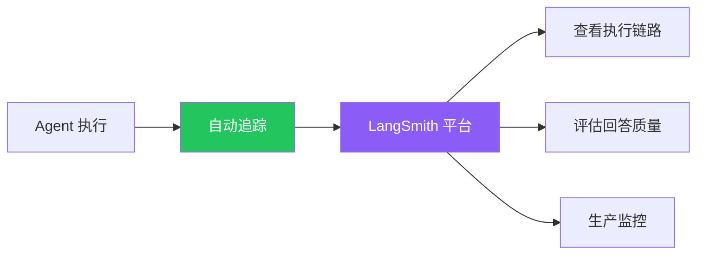

# 可观测性（LangSmith）

## 这是什么？

LangSmith = Agent 的"黑匣子"——记录 Agent 每一步做了什么，方便调试和监控。

> 类比：飞机的黑匣子，出了问题回放整个过程。



## 核心功能

| 功能 | 说明 |
|------|------|
| **Tracing** | 追踪 Agent 的完整执行链路 |
| **Evaluation** | 评估 Agent 的回答质量 |
| **Prompt Engineering** | 迭代优化提示词 |
| **Monitoring** | 生产环境监控和告警 |

## 使用方式

### 1. 安装和配置

```bash
npm install langsmith

# 环境变量
export LANGCHAIN_TRACING_V2=true
export LANGCHAIN_API_KEY=lsv2_xxx
export LANGCHAIN_PROJECT=my-agent
```

### 2. 自动追踪

配置好环境变量后，Agent 的每次调用都会自动记录：

```typescript
import { createAgent } from "langchain";

const agent = createAgent({
  model: "openai:gpt-4o",
  tools: [getWeather],
});

// 这次调用会被自动追踪
await agent.invoke({
  messages: [{ role: "user", content: "北京天气？" }],
});
```

### 3. 查看追踪

访问 [smith.langchain.com](https://smith.langchain.com)：

| 能看到 | 说明 |
|--------|------|
| 输入消息 | 用户发了什么 |
| Agent 决策 | 模型为什么选这个工具 |
| 工具调用 | 传了什么参数、返回什么 |
| 最终输出 | Agent 回复了什么 |
| 耗时 / Token | 性能和成本数据 |

## 最佳实践

| 做法 | 说明 |
|------|------|
| ✅ 按项目隔离 | 不同环境用不同 `LANGCHAIN_PROJECT` |
| ✅ 生产必开 | 出问题能快速定位 |
| ✅ 配合评估 | 用 Evaluation 功能自动化测试 Agent 质量 |
| ❌ 留存敏感数据 | 检查追踪记录有没有泄露密钥 |

## 下一步

- [部署](/langchain/deployment)
- [LangGraph 可观测性](/langgraph/observability)
