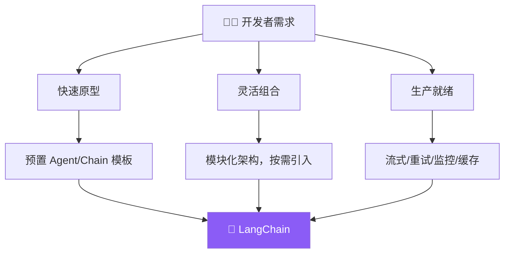

# 设计哲学

## 一句话概括

> **LangChain 的目标：让 LLM 应用开发像搭积木一样简单，同时不牺牲生产级能力。**

## 为什么这样设计？

做 LLM 应用，你可能面临这些选择：

- 想快速验证想法 → 不想写一堆胶水代码
- 想换模型 → 不想改业务逻辑
- 想上生产 → 不想从零加监控、重试、缓存

LangChain 的设计就是为了解决这些矛盾。



## 三个核心原则

### 1. 模块化（Modular）

每个功能都是独立的包，用什么装什么，不用的不装。

```bash
# 最小安装——只有核心接口
npm install @langchain/core

# 需要 OpenAI？加上
npm install @langchain/openai

# 需要 Agent 和 Chain？再加
npm install langchain
```

**好处**：生产环境不会因为装了一堆用不到的依赖而变得臃肿。

| 包 | 内容 | 什么时候装 |
|---|------|-----------|
| `@langchain/core` | 消息、模型接口、工具基类 | 始终需要 |
| `@langchain/openai` | OpenAI 集成 | 用 GPT 时 |
| `@langchain/anthropic` | Anthropic 集成 | 用 Claude 时 |
| `langchain` | Agent、Chain、Memory 等高层组件 | 需要 Agent 功能时 |
| `@langchain/community` | 社区集成（向量库、文档加载器） | 需要 RAG 时 |

### 2. 可组合（Composable）

模块之间用标准接口对接，自由组合：

```typescript
// 同一套代码，换个模型就能跑
const agent = createAgent({
  model: "openai:gpt-4o",    // 换成 "anthropic:claude-sonnet-4-20250514" 也行
  tools: [search, calculator],
  memory: { type: "short_term" },
});
```

这种"统一接口"的设计意味着：
- 换模型不改代码，只改配置
- 工具可以跨 Agent 复用
- 记忆、检索、中间件都是"插件"

### 3. 生产就绪（Production-Ready）

不只是 demo 能跑，而是能直接上生产：

| 能力 | 说明 |
|------|------|
| **流式输出** | 边执行边返回，用户体验好 |
| **错误恢复** | 自动重试、fallback 机制 |
| **中间件** | 限流、缓存、日志，一行配置搞定 |
| **可观测性** | 对接 LangSmith，追踪每一步 |
| **类型安全** | TypeScript 全覆盖，编译期发现错误 |

## 与其他框架的对比

| 维度 | LangChain | Deep Agents | LangGraph |
|------|-----------|-------------|-----------|
| 定位 | 底层开发框架 | 开箱即用 Agent | 底层编排运行时 |
| 学习曲线 | 中等 | 低 | 高 |
| 灵活度 | 高 | 中 | 最高 |
| 适合 | 需要自定义的项目 | 快速搭建 Agent | 复杂工作流编排 |

> 💡 **简单理解**：LangChain 是"半成品厨房"——灶台、水槽、烤箱都装好了，你自己决定做什么菜。Deep Agents 是"预制菜"，加热就能吃。LangGraph 是"毛坯房"，你自己设计厨房布局。

## 下一步

- [安装](/langchain/install) — 动手装起来
- [组件架构](/langchain/component-architecture) — 了解模块关系
- [创建第一个 Agent](/langchain/agents/creation) — 五分钟上手
