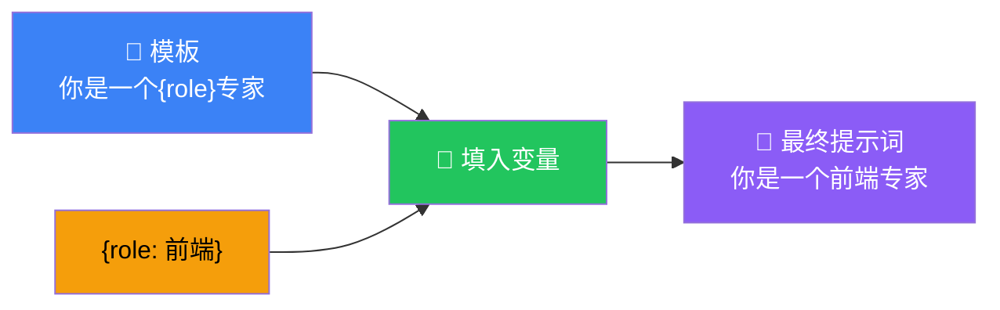

# Prompts（提示词）

## 这是什么？

提示词模板 = 带变量的提示词。不是每次手写，而是定义一个模板，运行时填入变量。



## 基本用法

```typescript
import { ChatPromptTemplate } from "@langchain/core/prompts";

// ① 定义模板
const prompt = ChatPromptTemplate.fromMessages([
  ["system", "你是一个{role}专家。"],
  ["human", "{question}"],
]);

// ② 填入变量
const formatted = await prompt.format({
  role: "前端开发",
  question: "React 和 Vue 怎么选？",
});

// 结果：
// System: 你是一个前端开发专家。
// Human: React 和 Vue 怎么选？
```

## 模板类型

### System + Human

最常用的组合——定义角色 + 用户输入：

```typescript
const prompt = ChatPromptTemplate.fromMessages([
  ["system", `你是一个{domain}领域的资深专家。
- 用{style}的语言风格
- 回答要{length}`],
  ["human", "{question}"],
]);
```

### 多轮对话模板

```typescript
const prompt = ChatPromptTemplate.fromMessages([
  ["system", "你是一个客服助手。"],
  ["human", "我想退货。"],
  ["ai", "好的，请提供您的订单号。"],
  ["human", "{orderNumber}"],  // 变量在历史对话之后
]);
```

### 带 Few-shot 示例

给模型几个示例，让它学会格式：

```typescript
const prompt = ChatPromptTemplate.fromMessages([
  ["system", "你是一个情感分析专家，判断文本是正面还是负面。"],

  // Few-shot 示例
  ["human", "这个产品太好用了！"],
  ["ai", '{"sentiment": "positive", "confidence": 0.95}'],
  ["human", "质量很差，不值这个价。"],
  ["ai", '{"sentiment": "negative", "confidence": 0.92}'],

  // 真正的输入
  ["human", "{text}"],
]);
```

## 在 Agent 中使用

```typescript
import { createAgent } from "langchain";

const agent = createAgent({
  model: "openai:gpt-4o",
  tools: [search],
  system: "你是一个{domain}专家，用{style}的风格回答。",
});

// 调用时传入变量
const result = await agent.invoke({
  messages: [{ role: "user", content: "React 怎么做状态管理？" }],
  variables: { domain: "前端", style: "通俗易懂" },
});
```

## 在 Chain 中使用

```typescript
import { createChain } from "langchain";

const chain = createChain()
  .step("generate", async ({ topic, style }) => {
    const prompt = ChatPromptTemplate.fromMessages([
      ["system", "你是一个技术写作专家。"],
      ["human", "用{style}的风格写一篇关于{topic}的文章大纲。"],
    ]);

    const formatted = await prompt.format({ topic, style });
    return await llm.invoke(formatted);
  });
```

## Prompt 模板复用

```typescript
// 定义一次，到处使用
const expertPrompt = ChatPromptTemplate.fromMessages([
  ["system", "你是{domain}领域的{level}专家。"],
  ["human", "{question}"],
]);

// 用在不同 Agent
const frontendAgent = createAgent({
  system: expertPrompt,  // 直接传入模板
  variables: { domain: "前端", level: "资深" },
});

const backendAgent = createAgent({
  system: expertPrompt,
  variables: { domain: "后端", level: "资深" },
});
```

## 动态 Prompt

根据条件生成不同的提示词：

```typescript
const dynamicPrompt = ChatPromptTemplate.fromMessages([
  ["system", async ({ userLevel }) => {
    if (userLevel === "beginner") {
      return "你是编程老师，用最简单的语言解释概念，多用类比。";
    } else if (userLevel === "advanced") {
      return "你是高级开发者，直接说技术细节，不用解释基础概念。";
    }
    return "你是编程助手。";
  }],
  ["human", "{question}"],
]);
```

## 最佳实践

| 原则 | 说明 |
|------|------|
| **系统提示精简** | 控制在 300 字以内，太长影响效果 |
| **变量名清晰** | 用 `{domain}` 而不是 `{a}` |
| **Few-shot 3-5 个** | 太少学不会，太多浪费 token |
| **模板可复用** | 提取公共模板，避免重复定义 |
| **测试不同措辞** | 提示词的微小变化可能带来大差异 |

## 常见问题

| 问题 | 原因 | 解决方案 |
|------|------|----------|
| 变量未替换 | 变量名拼写错误 | 检查 `{variable}` 和传入的 key |
| 格式不一致 | 没有 Few-shot 示例 | 添加 2-3 个示例 |
| 模型不听话 | 系统提示太弱 | 在系统提示中加明确的规则 |

## 下一步

- [Messages（消息）](/langchain/messages) — 消息格式详解
- [Chains（链）](/langchain/chains) — 链式调用
- [创建 Agent](/langchain/agents/creation) — Agent 创建
