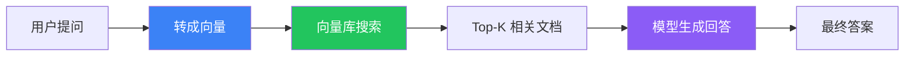
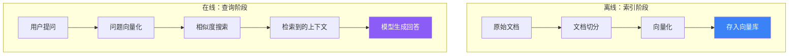

# Retrieval / RAG

## 这是什么？

RAG = **Retrieval-Augmented Generation**（检索增强生成）。

> Agent 不是凭空回答，而是先从你的知识库中找到相关资料，再结合这些资料回答。

> 类比：就像开卷考试——不靠死记硬背，而是先翻书找答案，再用自己的话写出来。



## 完整示例

```typescript
import { createAgent } from "langchain";
import { OpenAIEmbeddings } from "@langchain/openai";
import { MemoryVectorStore } from "langchain/vectorstores/memory";
import { RecursiveCharacterTextSplitter } from "langchain/text_splitter";

// ① 准备文档
const docs = [
  "LangChain 是一个 Agent 开发框架...",
  "Deep Agents 是开箱即用的 Agent 框架...",
  "LangGraph 是底层编排运行时...",
];

// ② 切分文档
const splitter = new RecursiveCharacterTextSplitter({ chunkSize: 500 });
const chunks = await splitter.createDocuments(docs);

// ③ 向量化存储
const embeddings = new OpenAIEmbeddings();
const vectorStore = await MemoryVectorStore.fromDocuments(chunks, embeddings);

// ④ 创建带检索的 Agent
const agent = createAgent({
  model: "openai:gpt-4o",
  retrieval: {
    vectorStore,
    topK: 3, // 返回最相关的 3 条
  },
  system: "根据检索到的资料回答用户问题。",
});
```

## RAG 完整流程



## 常用向量库

| 向量库 | 说明 | 适用场景 |
|--------|------|---------|
| `MemoryVectorStore` | 内存中，开发测试用 | 快速原型 |
| `Chroma` | 轻量本地向量库 | 小型项目 |
| `Pinecone` | 云端向量库 | 生产环境 |
| `Weaviate` | 开源向量搜索引擎 | 自建集群 |
| `Qdrant` | 高性能向量库 | 大规模数据 |

## 最佳实践

| 做法 | 说明 |
|------|------|
| ✅ chunkSize 500-1000 | 太小丢失上下文，太大检索不准 |
| ✅ chunkOverlap 50-100 | 避免切分处丢失语义 |
| ✅ topK 3-5 | 太多会稀释重点 |
| ✅ system 提示要写清楚 | 告诉模型"根据资料回答，没有就说不知道" |

## 下一步

- [RAG Agent 实战教程](/langchain/tutorials/rag-agent)
- [语义搜索引擎](/langchain/tutorials/semantic-search)
- [集成 - 向量库](/integrations/stores)
