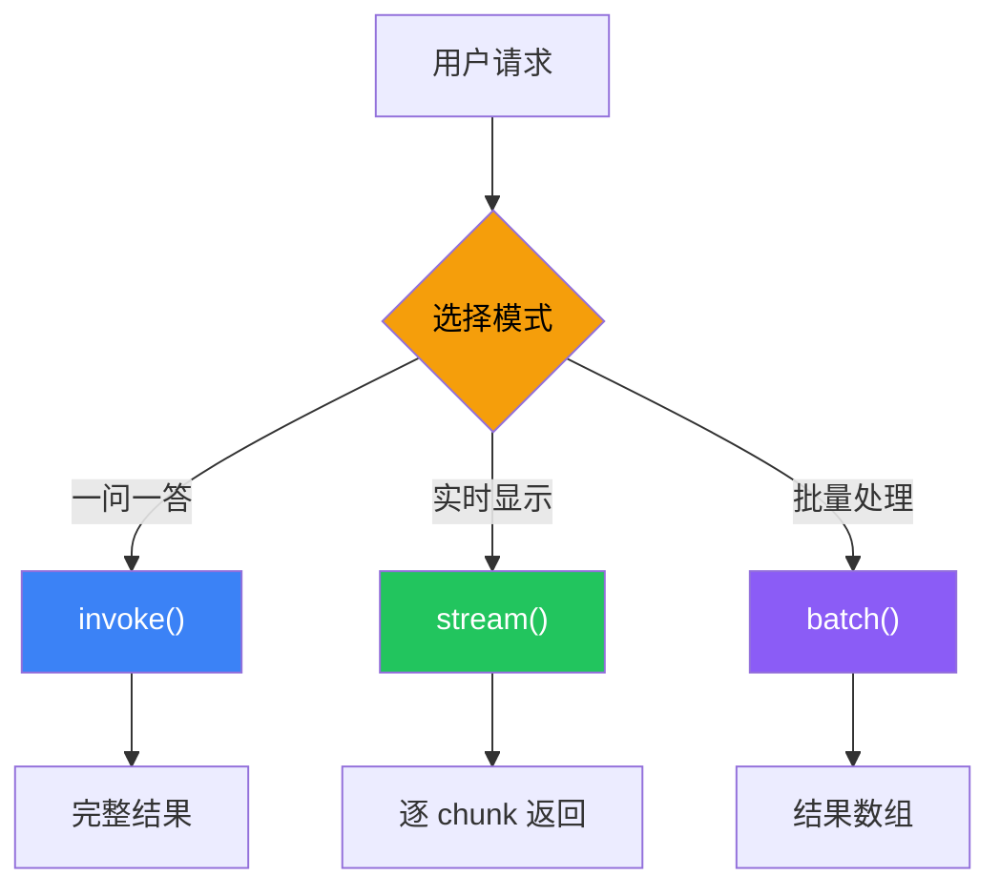
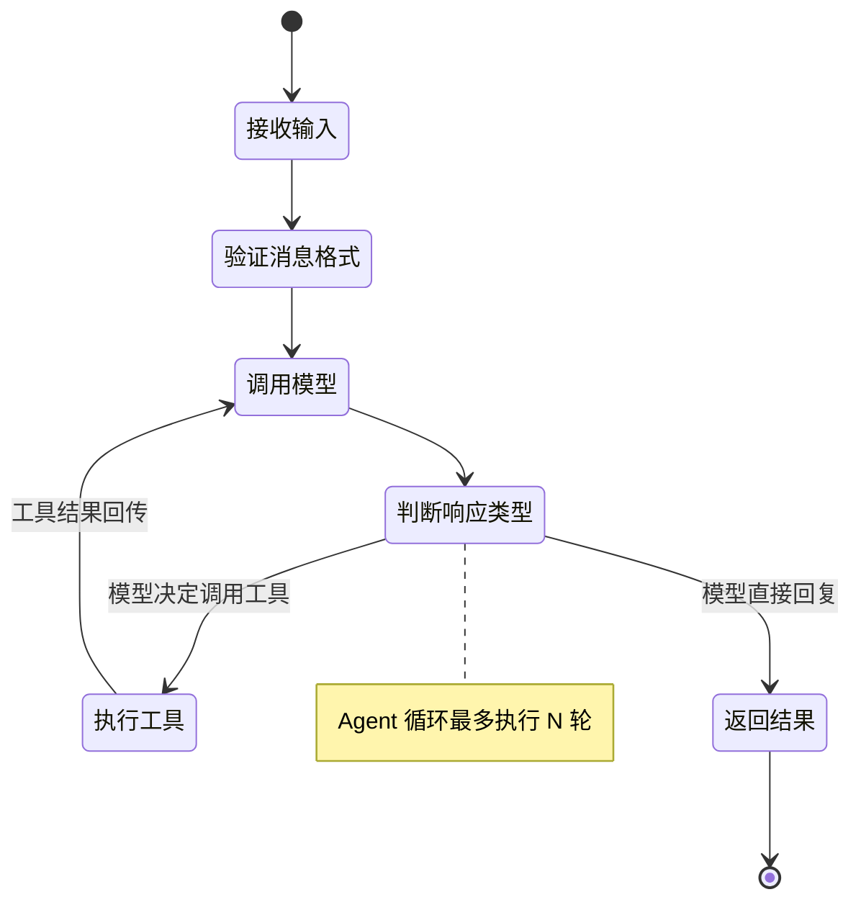

# 运行时（Runtime）

## 这是什么？

LangChain 的"执行引擎"——负责管理 Agent 的生命周期、状态流转和错误处理。

> 类比：运行时就像汽车的发动机——你踩油门（调用 invoke），发动机（运行时）负责点火、换挡、输出动力。

## 三种执行模式

| 模式 | 方法 | 说明 | 适用场景 |
|------|------|------|---------|
| **同步调用** | `invoke()` | 等执行完再返回结果 | 简单的一问一答 |
| **流式调用** | `stream()` | 边执行边返回 chunk | 前端逐字显示 |
| **批量调用** | `batch()` | 一次处理多个请求 | 批量数据处理 |



## 代码示例

```typescript
import { createAgent } from "langchain";

const agent = createAgent({
  model: "openai:gpt-4o",
  tools: [getWeather],
});

// ① 同步调用——等结果
const result = await agent.invoke({
  messages: [{ role: "user", content: "北京天气怎么样？" }],
});
console.log(result);

// ② 流式调用——边执行边返回
const stream = await agent.stream({
  messages: [{ role: "user", content: "北京天气怎么样？" }],
});
for await (const chunk of stream) {
  if (chunk.type === "text") {
    process.stdout.write(chunk.content);
  }
}

// ③ 批量调用——一次处理多个
const results = await agent.batch([
  { messages: [{ role: "user", content: "北京天气？" }] },
  { messages: [{ role: "user", content: "上海天气？" }] },
  { messages: [{ role: "user", content: "广州天气？" }] },
]);
console.log(results); // [北京结果, 上海结果, 广州结果]
```

## 执行生命周期



## 状态管理

运行时自动管理 Agent 的内部状态：

| 状态 | 说明 |
|------|------|
| `messages` | 对话消息历史 |
| `step` | 当前执行步骤 |
| `toolCalls` | 待执行的工具调用 |
| `usage` | Token 消耗统计 |

## 常见问题

| 问题 | 原因 | 解决方案 |
|------|------|---------|
| `invoke` 很慢 | 模型响应慢或工具执行慢 | 用 `stream` 让用户看到进度 |
| `batch` 内存爆炸 | 批量太大 | 分批处理，每批 10-50 个 |
| 流式中断 | 网络问题 | 加重试中间件 `retryOnError` |

## 下一步

- [创建 Agent](/langchain/agents/creation)
- [流式输出](/langchain/agents/streaming)
- [中间件](/langchain/middleware) — 限流、重试、缓存
